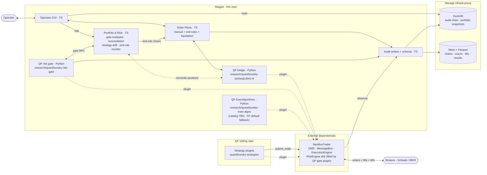
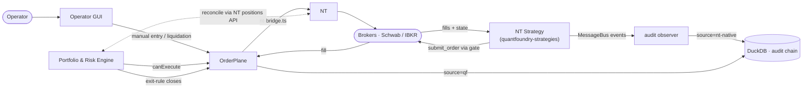
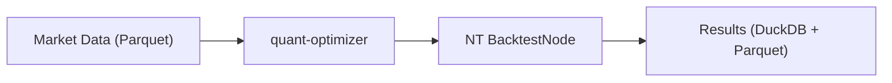
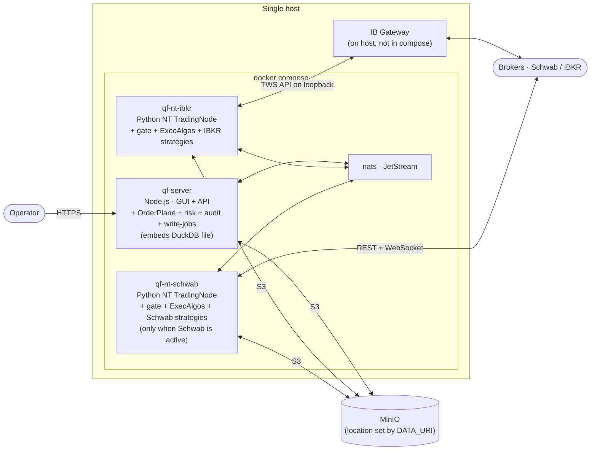

# Top-Level TDD: Trading System (Magpie)

**Backtest & Review mode** — strategy authors and operators iterate on strategies offline. quant-optimizer drives parameter sweeps + walk-forward over the QF data lake using NT's `BacktestEngine`; its localhost dashboard is the canonical human-review surface for sweep results and the read-side bridge to live deploys (which pinned run is currently running, what trades it's producing). Full architecture diagram + component spec lives in `quant-optimizer/docs/BACKTESTING-TDD.md` — kept single-source there so this top-level doc doesn't drift.

**Prod mode** — one NT TradingNode per broker, co-hosting the QF bridge, the QF risk-gate plugin, and every enabled strategy. Used for live trading.



In **prod**, every strategy `submit_order` call is intercepted **inside NT** by QF's custom `RiskEngine` plugin (`research/quantfoundry-risk-gate/`), which makes a synchronous NATS-RPC call to QF's Portfolio & Risk for approve/reject. The gate evaluates **once per parent intent at full impact** — semantic checks (cross-strategy aggregates, portfolio halts, operator-halt state, concentration) fire once; child orders submitted by an `ExecAlgorithm` within the approved envelope pass NT's mechanical floor (rate, notional, account balance) but skip the QF RPC. When QF is unreachable the gate falls back to **strict closes-only** mode (allow only orders that reduce existing positions; reject all opening or mixed orders) with NT's built-in `RiskEngine` config as a local floor. Approved intents are then handled by a QF `ExecAlgorithm` (catalog TBD; defaults to NT's behavior — submit as-specified) which owns concrete pricing, slicing, repeg, and working-order management. Strategies that need pricing logic the algo catalog doesn't cover override by submitting fully-shaped orders without an `exec_algorithm_id`. Full specs: [tdd/risk-gate-architecture.md](tdd/risk-gate-architecture.md), [tdd/exec-algorithms.md](tdd/exec-algorithms.md). Order Plane is scoped exclusively to QF-side intent origination: manual operator entry, operator manual liquidation, and strategy-declared exit rules tripped by the framework's exit-rule monitor (see [tdd/order-execution.md §5](tdd/order-execution.md#5-position-exit-controls)). Strategies never flow through OPL.

In **backtest**, the same NT `Strategy` subclass runs under `BacktestEngine` instead of `LiveTradingNode` (the gate plugin is not loaded — backtest sweeps need to run unconstrained for parameter exploration). QO drives parameter sweeps and walk-forward folds, and its dashboard is the human-review surface for the resulting Optuna studies + WFO outputs. QF does not initiate backtests; the boundary is the shared MinIO data lake. Deployment-topology spec for live (paper / smoke-test vs prod): [tdd/strategy-deployment-topology.md](tdd/strategy-deployment-topology.md).

> **Not depicted in the diagrams** (cross-cutting concerns + components that touch every box):
>
> - **NATS** — message bus on every cross-process arrow (TS ↔ Python NT bridges, MD bridges, observer). Subjects per [tdd/broker-integration.md §3](tdd/broker-integration.md#3-nats-subject-grammar).
> - **Shared math libraries** — [`core/qf-quant/`](../core/qf-quant/) (Greeks, vol surface, BL) and [`core/qf-optimizer/`](../core/qf-optimizer/) (LP) are Rust crates with PyO3 bindings (used by Python NT strategies) + WASM bindings (used by the GUI Greek Builder). TS originals in [`src/lib/`](../src/lib/) remain load-bearing; migration in progress.
> - **Structured logging** — distributed, not centralized. Every runtime (TS / Python / Rust) emits JSON to stdout with a common schema + `correlation_id` propagated across NATS / HTTP / PyO3 boundaries. Spec: [tdd/observability.md](tdd/observability.md). A central log destination (OTLP / Tempo) is deferred to a Phase-4 revisit.
> - **Live market data via per-broker NT bundles** — every broker bundle hosts an NT MD client alongside its NT execution client. IBKR uses NT's native `InteractiveBrokersDataClient`; Schwab uses a QF-authored `SchwabMarketDataClient` that wraps the Schwab REST + Streamer code in NT's data-client interface. The MD client feeds NT strategies via NT's `DataEngine` in-bundle and publishes to NATS `marketdata.*` subjects for TS-side consumption. Spec: [tdd/broker-integration.md](tdd/broker-integration.md) + [data/data-plane.md §2](data/data-plane.md#2-live-broker-market-data).
> - **Prometheus metrics + Grafana / Alertmanager** — `/metrics` endpoint per component; ops-side observability. Per-component metrics in each component TDD.

Magpie is a TypeScript + Rust + Python polyglot trading platform whose **live trading loop runs inside NautilusTrader** (sibling `quantfoundry-strategies` repo). QF is the platform around NT: data lake, audit, risk + portfolio engine, operator GUI, and the QF-side order path (manual entry, manual liquidation, framework-enforced exit rules — see [tdd/order-execution.md §5](tdd/order-execution.md#5-position-exit-controls)).

This document is the **top-level system design** — components, interfaces (especially across the NT boundary), deployment, and pointers for cross-project standards. Component-level detail lives in the linked [Component TDDs](#component-tdds).

---

## Purpose & Scope

Magpie maintains a Parquet + DuckDB data lake (via scheduled ingestion of market data + macro series — see [`data/CRON.md`](../data/CRON.md)), evaluates portfolio risk continuously, and provides the operator GUI, audit trail, and exit authority over live trading. NT strategies (in `quantfoundry-strategies/`) run the live trading loop; QF observes and audits them, enforces strategy-declared exit rules, and surfaces operator-driven exits (manual liquidation, per-strategy halt-new) per [tdd/order-execution.md §5](tdd/order-execution.md#5-position-exit-controls). Backtests are run by operators directly in the sibling `quant-optimizer` repo against the shared MinIO data lake; QF surfaces archived results in the GUI but does not initiate backtests.

---

## Glossary

In-house terms and acronyms used throughout the doc set. Listed once here so component TDDs can use the short forms without re-defining at every use site.

| Term                        | Meaning                                                                                                                                                                                                                                                                                                                                                                                                                                                                                                                                                                                          |
| --------------------------- | ------------------------------------------------------------------------------------------------------------------------------------------------------------------------------------------------------------------------------------------------------------------------------------------------------------------------------------------------------------------------------------------------------------------------------------------------------------------------------------------------------------------------------------------------------------------------------------------------ |
| **QF**                      | Magpie — this project (the TypeScript server + GUI + audit + risk layer).                                                                                                                                                                                                                                                                                                                                                                                                                                                                                                                        |
| **NT**                      | [NautilusTrader](https://github.com/nautechsystems/nautilus_trader) — the per-broker Python trading engine that runs strategies and connects to brokers.                                                                                                                                                                                                                                                                                                                                                                                                                                         |
| **QO**                      | quant-optimizer — sibling repo owning offline backtesting (walk-forward, Optuna sweeps). Not part of QF; the GUI surfaces its results.                                                                                                                                                                                                                                                                                                                                                                                                                                                           |
| **OPL** (Order Plane)       | The QF-side order-lifecycle module ([`server/order/plane.ts`](../server/order/plane.ts)). Scoped to operator manual entry, operator manual liquidation, and framework-fired exit rules — see [tdd/order-execution.md](tdd/order-execution.md). Strategy submissions bypass OPL.                                                                                                                                                                                                                                                                                                                  |
| **P&R Engine**              | The QF Portfolio & Risk Engine ([`server/portfolio/engine.ts`](../server/portfolio/engine.ts)) — maintains canonical positions projector + risk recompute + `canExecute` + drift monitoring. **Distinct from NT's `RiskEngine` class**: when this doc set says "P&R Engine" it always means QF's engine; "NT RiskEngine" or "QF risk-gate plugin" means the NT-side plugin (see "gate" below).                                                                                                                                                                                                   |
| **gate** / **QF risk gate** | The NT-side risk-gate plugin (`research/quantfoundry-risk-gate/`) — a custom NT `RiskEngine` subclass intercepting `Strategy.submit_order` and calling out to the P&R Engine over NATS-RPC. Canonical name: "QF risk gate" or "the gate". "Gate evaluator" specifically means the QF-side handler that responds to gate-RPC requests; see [risk-gate-architecture.md](tdd/risk-gate-architecture.md).                                                                                                                                                                                            |
| **MD**                      | Market data. Live MD flows through per-broker NT bundles per [data-plane.md](data/data-plane.md).                                                                                                                                                                                                                                                                                                                                                                                                                                                                                                |
| **bundle** / **NT bundle**  | A `qf-nt-<broker>` container — one per active broker (Schwab, IBKR). Hosts a NautilusTrader `TradingNode` with the strategies bound to that broker, plus the QF risk-gate plugin and audit observer.                                                                                                                                                                                                                                                                                                                                                                                             |
| **full impact**             | In the gate's parent-budget model: the **worst-case position delta and notional a strategy might submit within this intent's envelope**. The gate evaluates once per parent intent at full impact — child orders within the approved envelope skip QF semantic checks. See [risk-gate-architecture.md §3](tdd/risk-gate-architecture.md).                                                                                                                                                                                                                                                        |
| **closes-only**             | The gate's documented fail-open mode: when QF is unreachable, the gate degrades to a posture where **only orders that reduce existing positions** are admitted (and only pass NT's mechanical floor). New opening orders are rejected. See [risk-gate-architecture.md §4](tdd/risk-gate-architecture.md).                                                                                                                                                                                                                                                                                        |
| **drift** (three meanings)  | The word "drift" is used for three distinct concerns: **(1) strategy drift** — live behavior vs pinned backtest baseline (z-score on fill rate / P&L curve / hit rate); see [portfolio-risk-engine.md §"Strategy drift monitoring"](tdd/portfolio-risk-engine.md). **(2) reconciliation drift** — QF's audit-derived positions don't match the broker's reported positions; see [tdd/order-execution.md §5.4](tdd/order-execution.md#54-reconciliation-drift-handling). **(3) out-of-band drift** — broker has fills QF never recorded (e.g., manual trade in the broker UI); a sub-case of (2). |
| **composite position**      | A strategy's bundle of atomic positions tagged with the same `strategy_id` — e.g., a short straddle is two atomic option positions; an iron condor is four. Not a separate store; a SQL view over the canonical per-instrument projector. See [portfolio-risk-engine.md §"Per-strategy composite positions"](tdd/portfolio-risk-engine.md).                                                                                                                                                                                                                                                      |
| **`source` discriminator**  | The `source` column on `audit_intents` / `audit_orders` / `audit_fills`: `qf` (OPL-mediated), `qf-gated` (strategy submission via the gate), `nt-native` (orders / fills written by the audit observer). Model A — writer-identity sourcing. See [order-flow.md §4.2](tdd/order-flow.md#42-writer-mapping-model-a-writer-identity-sourcing).                                                                                                                                                                                                                                                     |
| **bridge** / **NT bridge**  | The `nt-bridge.ts` TS-side NATS-RPC client + the per-broker Python `LiveExecutionClient` it talks to. Carries OPL's submitted orders to the broker and exec reports back. See [broker-integration.md](tdd/broker-integration.md).                                                                                                                                                                                                                                                                                                                                                                |
| **correlation_id**          | ULID stamped at the lifecycle anchor (intent submission or first wire-event of an operator action). Threaded through every audit row + every NATS message header. The framework's primary observability acceptance test: reconstruct a full position lifecycle by querying a single `correlation_id`. See [observability.md §4.2](tdd/observability.md#42-correlation-id-propagation).                                                                                                                                                                                                           |

---

## System Components

Components are grouped by container tier — NT-side plugins (live inside a `qf-nt-<broker>` TradingNode), QF server modules (inside the `qf-server` Node process), and cross-cutting glue. One-liner per component; detailed contracts live in the linked TDDs.

### NT-side (Python; one per active broker)

| Component                | Lives at                                                  | Role                                                                                                                                                                                                                                                                                                                                  | Spec                                                                   |
| ------------------------ | --------------------------------------------------------- | ------------------------------------------------------------------------------------------------------------------------------------------------------------------------------------------------------------------------------------------------------------------------------------------------------------------------------------- | ---------------------------------------------------------------------- |
| **QF risk gate**         | [`research/quantfoundry-risk-gate/`](../research/)        | Custom NT `RiskEngine` subclass. Intercepts `Strategy.submit_order`, consults QF's Portfolio & Risk over NATS-RPC, per-intent (parent-budget) evaluation, closes-only fail-open.                                                                                                                                                      | [risk-gate-architecture.md](tdd/risk-gate-architecture.md)             |
| **QF ExecAlgorithms**    | [`research/quantfoundry-exec-algos/`](../research/)       | Stateless `ExecAlgorithm` plugins handling concrete pricing, repeg, slicing within the gate-approved envelope. Catalog deliberately empty; default = NT pass-through.                                                                                                                                                                 | [exec-algorithms.md](tdd/exec-algorithms.md)                           |
| **Per-broker NT bundle** | [`research/quantfoundry-{schwab,ibkr}-nt/`](../research/) | One Python process per broker, holding broker credentials. Hosts NT execution client + NT MD client + risk-gate + ExecAlgos + every NT strategy bound to that broker. Uniform pattern across brokers (Schwab uses QF-authored `SchwabExecutionClient` + `SchwabMarketDataClient`; IBKR uses NT-native `InteractiveBrokers*` clients). | [broker-integration.md](tdd/broker-integration.md)                     |
| **Strategy plugins**     | sibling `quantfoundry-strategies` repo                    | NT `Strategy` subclasses; per-broker uv project loaded into the per-broker TradingNode in prod, run standalone in paper-live / smoke-test.                                                                                                                                                                                            | [strategy-deployment-topology.md](tdd/strategy-deployment-topology.md) |

### QF server (TypeScript; in the `qf-server` container)

| Component                         | Lives at                                                                         | Role                                                                                                                                                                                                                                                                                                                                                                                                                                                                                                                                                                                                                                                                                                                                                 |
| --------------------------------- | -------------------------------------------------------------------------------- | ---------------------------------------------------------------------------------------------------------------------------------------------------------------------------------------------------------------------------------------------------------------------------------------------------------------------------------------------------------------------------------------------------------------------------------------------------------------------------------------------------------------------------------------------------------------------------------------------------------------------------------------------------------------------------------------------------------------------------------------------------- |
| **Order Plane**                   | [`server/order/`](../server/order/)                                              | Lifecycle state machine + audit writers (`audit_orders`, `audit_fills`) + restart recovery + trade inspector + trade journal. Scoped to **QF-side intent origination**: manual operator entry, operator manual liquidation, and strategy-declared exit-rule closes (see [tdd/order-execution.md §5](tdd/order-execution.md#5-position-exit-controls)); strategy submissions bypass OPL entirely.                                                                                                                                                                                                                                                                                                                                                     |
| **Portfolio & Risk Engine**       | [`server/portfolio/`](../server/portfolio/) + [`server/risk/`](../server/risk/)  | Live portfolio state, Greeks, scenario P&L, margin. Two entry points: gate-evaluator RPC handler (for NT-plugin submissions) and `canExecute()` (for OPL). Reconciles broker positions via the QF↔NT bridge. Owns the **exit-rule monitor** that watches per-strategy positions against declared `stop_loss` / `target` / `max_hold` / `max_drawdown` rules and emits closing intents through OPL when a rule trips ([tdd/order-execution.md §5.1](tdd/order-execution.md#51-strategy-declared-exit-rules)). Also monitors **per-strategy drift** — compares live behavior (P&L curve, fill rate, position turnover, hit rate) against the pinned QO backtest baseline for each strategy; alerts on soft drift, halts-new-submissions on hard drift. |
| **Strategy lifecycle registry**   | [`server/strategy/`](../server/strategy/)                                        | Operator-managed state (`registered → enabled → running → paused → halted → retired`) per strategy + per-strategy config. QF tracks state for GUI + audit; the bundle launcher / operator owns process spawning.                                                                                                                                                                                                                                                                                                                                                                                                                                                                                                                                     |
| **Audit writers + DuckDB schema** | [`server/store/`](../server/store/) + writers in `server/order/`, `server/risk/` | Append-only writers for `audit_intents`/`audit_orders`/`audit_fills` (with `source` discriminator: `qf`, `qf-gated`, `nt-native`) + portfolio snapshots. Query API for the Trade Inspector + the GUI.                                                                                                                                                                                                                                                                                                                                                                                                                                                                                                                                                |
| **Data Plane (live MD)**          | [`server/market-data/`](../server/market-data/)                                  | TS-side NATS consumer of broker MD published by Python NT bridges over `marketdata.*` subjects. Serves operator-GUI quotes, P&R Greeks recompute, OPL manual-entry price validation. Full design: [data-plane.md §2](data/data-plane.md). Distinct from NT strategies' MD path (which uses NT's `DataEngine` fed by the same bridges over a separate subscription).                                                                                                                                                                                                                                                                                                                                                                                  |
| **Data Plane (batch ingestion)**  | [`server/orchestrator/adapters/`](../server/orchestrator/adapters/)              | Per-source adapters (FRED / EIA / CFTC / FMP / Databento / OFAC / yfinancial / AIS / PortWatch / GFW / MarineCadastre) invoked through the write-jobs runner; scheduled by [`scripts/scheduler.ts`](../scripts/scheduler.ts) (the `quantfoundry-scheduler` container). Writes Parquet to MinIO. NT strategies read MinIO directly at runtime. Schedule + ownership: [`data/CRON.md`](../data/CRON.md). Full design: [data-plane.md §3-4](data/data-plane.md).                                                                                                                                                                                                                                                                                        |
| **Write-dispatch queue**          | [`server/writeJobs/`](../server/writeJobs/)                                      | Bearer-auth funnel for long-running data writes. Jobs persist in DuckDB, survive restarts, one-in-flight-per-kind. MinIO IAM rotation enforces single-writer at the storage layer.                                                                                                                                                                                                                                                                                                                                                                                                                                                                                                                                                                   |
| **Downloads / backfill**          | [`server/downloads/`](../server/downloads/)                                      | Historical-data backfill orchestration (parsers + source adapters). Submitted through the write-jobs queue.                                                                                                                                                                                                                                                                                                                                                                                                                                                                                                                                                                                                                                          |
| **Operator GUI**                  | [`src/`](../src/)                                                                | React + Vite; six workspaces (Operate / Investigate / Build / Signals / Strategies / Settings). Kill switch + live order submit are gated by typed-confirmation primitives (`HALT`, `FIRE`).                                                                                                                                                                                                                                                                                                                                                                                                                                                                                                                                                         |
| **Alerts router**                 | [`server/alerts/`](../server/alerts/)                                            | Single fan-out for alert events → log + GUI banner (via state WebSocket) + optional Slack webhook + recent-alerts ring. Rules in `config/alerts.yaml`.                                                                                                                                                                                                                                                                                                                                                                                                                                                                                                                                                                                               |

### Cross-cutting (TS + Python + Rust)

| Component              | Lives at                                                                                                                                                                                                                                                                                  | Role                                                                                                                                                                                                     |
| ---------------------- | ----------------------------------------------------------------------------------------------------------------------------------------------------------------------------------------------------------------------------------------------------------------------------------------- | -------------------------------------------------------------------------------------------------------------------------------------------------------------------------------------------------------- |
| **Structured logging** | `server/logger.ts` + [`research/quantfoundry-logging/`](../research/quantfoundry-logging/) + [`core/qf-logging/`](../core/qf-logging/)                                                                                                                                                    | One JSON schema; `correlation_id` propagates across NATS / HTTP / PyO3 boundaries.                                                                                                                       |
| **Math libraries**     | [`core/qf-quant/`](../core/qf-quant/), [`core/qf-optimizer/`](../core/qf-optimizer/)                                                                                                                                                                                                      | Greeks / vol surface / BL / LP. Rust crates with PyO3 (Python NT strategies) and WASM (GUI Greek Builder) bindings. TS originals in [`src/lib/`](../src/lib/) still load-bearing; migration in progress. |
| **Glue services**      | [`server/auth/`](../server/auth/), [`server/calendar/`](../server/calendar/), [`server/exports/`](../server/exports/), [`server/fundamentals/`](../server/fundamentals/), [`server/db/`](../server/db/), [`server/symbols/`](../server/symbols/), [`server/catalog/`](../server/catalog/) | Auth middleware, market calendar, data exports, fundamentals enrichment, DuckDB init, symbol conversion, Parquet catalog.                                                                                |

---

## NautilusTrader Integration

NautilusTrader is the **trading engine** the live loop runs inside. It is not "a library QF imports" — it is its own multi-process system in sibling repos that QF integrates with over NATS. This section names the four interfaces and where they live.

### Why NT

NT owns the live trading loop; QF is the platform around it — data lake, audit, risk + portfolio engine, GUI, exit authority. One contract (a Python NT `Strategy` subclass) covers both live and backtest.

### Process boundaries

| Where                                     | What                                                                                                                                                                                                                                                           | QF connects via                                                                                                                                                                                     |
| ----------------------------------------- | -------------------------------------------------------------------------------------------------------------------------------------------------------------------------------------------------------------------------------------------------------------- | --------------------------------------------------------------------------------------------------------------------------------------------------------------------------------------------------- |
| `quantfoundry-strategies/` (sibling repo) | NT `Strategy` subclasses (cl_scalp, soxx-rotation). Each is a uv project; operator runs `uv run` or systemd.                                                                                                                                                   | None directly — QF tracks lifecycle state only.                                                                                                                                                     |
| `research/quantfoundry-schwab-nt/`        | Schwab NT bundle. One TradingNode hosting `SchwabExecutionClient` (Schwab REST + ACCT_ACTIVITY) + `SchwabMarketDataClient` (Schwab REST + Streamer) + risk-gate plugin + ExecAlgos + Schwab-bound strategies. Both clients share a single `SchwabAuth` helper. | NATS: `orders.{submit,cancel,status,positions}.schwab` + `orders.exec_reports.schwab` + `marketdata.*.schwab.*` (per [broker-integration.md §3](tdd/broker-integration.md#3-nats-subject-grammar)). |
| `research/quantfoundry-ibkr-nt/`          | IBKR NT bundle. One TradingNode hosting `InteractiveBrokersExecutionClient` + `InteractiveBrokersDataClient` (shared TWS-API client-id; IB Gateway permits only one per session) + risk-gate plugin + ExecAlgos + IBKR-bound strategies.                       | NATS: `orders.{submit,cancel,status,positions}.ibkr` + `orders.exec_reports.ibkr` + `marketdata.*.ibkr.*`.                                                                                          |

### The three QF↔NT interfaces

| Interface                                | QF side                                                                                                                                    | Wire                                                                                                                                               | NT side                                                                                                                |
| ---------------------------------------- | ------------------------------------------------------------------------------------------------------------------------------------------ | -------------------------------------------------------------------------------------------------------------------------------------------------- | ---------------------------------------------------------------------------------------------------------------------- |
| **Outgoing orders (QF → NT)**            | [`server/order/adapters/nt-bridge.ts`](../server/order/adapters/nt-bridge.ts) — NATS-RPC client; thin wrapper implementing `BrokerAdapter` | NATS request/reply on `orders.{submit,cancel,status,positions}.<broker>`                                                                           | The bundle's NT execution client (`SchwabExecutionClient` or `InteractiveBrokersExecutionClient`)                      |
| **Incoming observation (NT → QF audit)** | Audit observer (`server/order/adapters/nt-observer-consumer.ts`)                                                                           | NATS subscription on `orders.exec_reports.<broker>`; writes `audit_intents/orders/fills` with `source='nt-native'`                                 | NT MessageBus events emitted by NT strategies + by OPL-originated orders flowing back through the same bundle          |
| **NT-native market data**                | `server/market-data/service.ts` — NATS consumer; cache + freshness + quality gate                                                          | NATS subjects `marketdata.*.{schwab,ibkr}.*` (per [broker-integration.md §3.3](tdd/broker-integration.md#33-market-data-md-bridge--ts-md-service)) | The bundle's NT MD client (`SchwabMarketDataClient` or `InteractiveBrokersDataClient`) publishes in-bundle and to NATS |

### Strategy registry contract

QF tracks `registered → enabled → running → paused → halted → retired` in [`server/strategy/lifecycle.ts`](../server/strategy/lifecycle.ts). The operator clicks "enable" / "halt" in the GUI; QF persists the state and reflects it in audit. **QF does not launch, monitor, or restart NT processes** — that's the operator's responsibility via systemd or `uv run`. "Running" means the NT process is up by operator action; "halted" means QF refuses to admit new orders for that strategy (gate rejects with `reason: "strategy_halted"`); existing positions are unaffected and the operator decides whether to liquidate them via the per-strategy position view ([tdd/order-execution.md §5.2](tdd/order-execution.md#52-operator-manual-liquidation)).

---

## Component Interactions



**Two live loops + reconciliation:**

- **NT-native trading.** NT strategy decides + submits via NT broker adapter (gated by the QF risk-gate plugin); QF observes via the MessageBus → audit-observer bridge and writes the `nt-native` audit rows.
- **QF-mediated trading.** Three intent sources, all flowing through the same OPL path: operator manual entry (GUI), operator manual liquidation (multi-select on the per-strategy position view + typed `LIQUIDATE`), and framework-enforced exit rules (strategy-declared `stop_loss` / `target` / `max_hold` / `max_drawdown` tripped by the exit-rule monitor in Portfolio & Risk). Fill returns through both NT's path (observer catches it) and OrderPlane's own fill handler. See [tdd/order-execution.md §5](tdd/order-execution.md#5-position-exit-controls).
- **Reconciliation.** Portfolio/Risk Engine periodically fetches broker positions via NT's positions API and diffs against the internal ledger. Mismatch → alert + halt-new-submissions for the affected strategy/portfolio; **never** auto-close (per [tdd/order-execution.md §5.4](tdd/order-execution.md#54-reconciliation-drift-handling)).

The backtest replay path is shown separately below.

### Backtest data flow



The same NT `Strategy` subclass runs live and in backtest. No Order Plane, no broker, no approval queue — `OrderIntent` → simulated fill is synchronous inside `BacktestNode`. QO is operator-initiated and runs outside QF; it reads the shared lake and writes archives that QF's catalog collector ingests for the GUI Backtests tab.

### Startup sequence

[`server/index.ts`](../server/index.ts) mounts components in dependency order. This list is canonical; the code points back here as source-of-truth.

1. DuckDB + table init ([`server/db/init.ts`](../server/db/init.ts))
2. Market calendar ([`server/calendar/`](../server/calendar/))
3. Config loaders (risk limits, quality thresholds, risk policies, brokers, portfolios)
4. Storage (`createStorage` resolves `DATA_URI`)
5. Store query + API ([`server/store/`](../server/store/))
6. Catalog service + API ([`server/catalog/`](../server/catalog/))
7. Downloads service + API ([`server/downloads/`](../server/downloads/))
8. NATS connection + publisher
9. Portfolio Engine (per-portfolio init from `portfolios.json`)
10. Order Plane (fill log, NT-bridge adapter, audit writers, trade inspector, trade journal, metrics)
11. Strategy lifecycle + config store + risk stores + halts + alerts router
12. Write-jobs runtime ([`server/writeJobs/`](../server/writeJobs/))
13. State WebSocket + HTTP routes
14. Scheduled jobs (quality evaluator, retention)

If any dependency fails to initialize, the server exits — no degraded-state startup at v1.

---

## Language Allocation

| Surface                                                                                                       | Language                | Lives in                                                                                                                                                                   |
| ------------------------------------------------------------------------------------------------------------- | ----------------------- | -------------------------------------------------------------------------------------------------------------------------------------------------------------------------- |
| Operator GUI                                                                                                  | TypeScript / React      | [`src/`](../src/)                                                                                                                                                          |
| HTTP server, audit, OrderPlane, lifecycle, risk, write-jobs, alerts, catalog, downloads                       | TypeScript / Node.js    | [`server/`](../server/)                                                                                                                                                    |
| NT strategies (live + backtest)                                                                               | Python (NautilusTrader) | **Sibling repo:** `quantfoundry-strategies` (separate git)                                                                                                                 |
| Per-broker NT bundles (each hosts exec client + MD client + risk-gate + ExecAlgos + that broker's strategies) | Python (NautilusTrader) | **In-tree** (research/ uv workspace): [`research/quantfoundry-{schwab,ibkr}-nt/`](../research/)                                                                            |
| Backtest sweep + walk-forward driver + review dashboard                                                       | Python                  | **Sibling repo:** `quant-optimizer` (separate git)                                                                                                                         |
| Risk math (Greeks, vol surface, BL) + LP optimizer                                                            | Rust + PyO3 / WASM      | [`core/qf-quant/`](../core/qf-quant/), [`core/qf-optimizer/`](../core/qf-optimizer/) — TS originals in [`src/lib/`](../src/lib/) still load-bearing; migration in progress |
| Cross-runtime structured logging                                                                              | TS + Python + Rust      | [`server/logger.ts`](../server/logger.ts); [`research/quantfoundry-logging/`](../research/quantfoundry-logging/); [`core/qf-logging/`](../core/qf-logging/)                |

**Boundary protocols.** NATS subjects (request/reply for orders; pub/sub for execution reports + market data); HTTP/JSON for GUI ↔ TS server and for QO jobs; PyO3 for in-process Rust ↔ Python.

**Storage** is external infrastructure, not QF code: **Minio** (object store for the Parquet data lake; S3-compatible service running on `your-server`) and **DuckDB** (embedded relational engine, used in-process by QF and QO for audit + catalog tables). QF owns the schemas + writers; the storage layer is run separately. Dev fallback: `file://` filesystem in place of Minio.

---

## Deployment Architecture

**v1 target:** `docker compose` on a single host. Three always-on containers plus one Python NT TradingNode container per active broker. MinIO is treated as external infrastructure with its endpoint set by config (`DATA_URI=s3://…`); it may live on the same host, on a separate server, or anywhere else reachable. IB Gateway runs on the host outside Docker — credential login is more reliable there and the resource overhead doesn't justify containerization. k8s remains an option if scale forces multi-host, but it is not v1.

### Containers

| Container        | Role                                                                                                                                                                                                                                      | When present                                            |
| ---------------- | ----------------------------------------------------------------------------------------------------------------------------------------------------------------------------------------------------------------------------------------- | ------------------------------------------------------- |
| `qf-server`      | Node.js TS server: GUI, OrderPlane, Portfolio & Risk, audit writers, write-jobs queue, catalog, alerts. Hosts the embedded DuckDB file.                                                                                                   | Always                                                  |
| `nats`           | NATS JetStream — every cross-process boundary uses it.                                                                                                                                                                                    | Always                                                  |
| `qf-nt-<broker>` | Python NT TradingNode for one broker. Hosts the broker's `ExecutionClient`, its market-data path, the QF risk-gate plugin, the QF ExecAlgorithm plugins, and every NT strategy bound to that broker. **One container per active broker.** | One per active broker (`qf-nt-ibkr`, `qf-nt-schwab`, …) |

### Out-of-Compose infrastructure

| Service        | Where it runs                                                                                                               | How QF reaches it                                                                      |
| -------------- | --------------------------------------------------------------------------------------------------------------------------- | -------------------------------------------------------------------------------------- |
| **MinIO**      | Configurable — same host, separate server, or remote. `DATA_URI=s3://…` + creds in env. `file://` is the dev-only fallback. | `qf-server` and the NT containers connect via the S3 protocol over the network.        |
| **IB Gateway** | Directly on the host OS (operator-launched, not a container).                                                               | `qf-nt-ibkr` reaches it via TWS API on a loopback port (default `localhost:4002`).     |
| **Brokers**    | External (Schwab REST + WebSocket; IBKR via IB Gateway).                                                                    | NT containers handle the broker-specific protocol; QF never talks to brokers directly. |
| **Operator**   | Browser on the operator's machine.                                                                                          | HTTPS to `qf-server` GUI on the host.                                                  |

### Topology



The v1 minimum is **three containers** (`qf-server`, `nats`, one `qf-nt-<broker>`) plus MinIO somewhere and IB Gateway on the host if IBKR is the broker. Adding a second broker means adding a second `qf-nt-<broker>` container; nothing else moves.

### Per-broker NT containers — why

NT supports multiple `ExecutionClient`s in one TradingNode in principle, but co-locating brokers creates real problems:

- **IB Gateway is single-client_id-per-session.** A TradingNode owning IB Gateway can't safely host a second broker's exec client without credential/account confusion.
- **Blast radius.** A misbehaving Schwab connection shouldn't restart IBKR strategies. Separate containers give OS-level isolation for crashes, hangs, and resource pressure.
- **Independent deploy cadence.** Updating the Schwab bundle's dependencies should not affect IBKR strategies' runtime.

Strategies declare their broker via `tool.quantfoundry.broker` in their `pyproject.toml`; the bundle launcher routes each enabled strategy into the container for its broker.

### Design principles

Cost-efficient (single operator, single host at v1); easy to operate (one `docker compose up`); portable (no vendor lock-in — MinIO can be local or remote, the same images run anywhere). When a single host stops being enough, the same container images move to k8s, ECS, or another orchestrator without code changes — the NATS-mediated process boundaries are already in place.

---

## Cross-Cutting Standards (pointer index)

This TDD indexes cross-project standards; it does not restate them. Each row points to the canonical doc.

| Concern                                    | Canonical doc                                                                                                                                                   | Notes                                                                                                                                                    |
| ------------------------------------------ | --------------------------------------------------------------------------------------------------------------------------------------------------------------- | -------------------------------------------------------------------------------------------------------------------------------------------------------- |
| Structured logging + correlation IDs       | [tdd/observability.md](tdd/observability.md)                                                                                                                    | One JSON schema; `correlation_id` propagates across NATS / HTTP / PyO3.                                                                                  |
| Auth, secrets, time, market calendar       | [tdd/cross-cutting.md](tdd/cross-cutting.md)                                                                                                                    | v1 cluster-trust; multi-host worker auth + secrets backend post-Phase-0.                                                                                 |
| TS conventions, ESM, error handling        | [CLAUDE.md](../CLAUDE.md) + [docs/CODING-STANDARDS.md](CODING-STANDARDS.md)                                                                                     | Strict mode; `noUncheckedIndexedAccess`; no `any`; structured logging only.                                                                              |
| Dependency policy + pre-commit             | [.pre-commit-config.yaml](../.pre-commit-config.yaml) + [docs/dependency-admission.md](dependency-admission.md) + [docs/dependency-pins.md](dependency-pins.md) | ESLint + Prettier + `tsc --noEmit` + `cargo fmt` + `ruff` on every commit.                                                                               |
| Config files & loaders                     | per-component TDD; configs live in [`config/`](../config/)                                                                                                      | No centralized loader pattern; each `server/<component>/` owns its own loader.                                                                           |
| NATS subject grammar                       | [tdd/broker-integration.md §3](tdd/broker-integration.md#3-nats-subject-grammar)                                                                                | No centralized `subjects.ts` registry — known gap.                                                                                                       |
| Symbol formats                             | §Glossary in this doc + [`server/symbols/symbol.ts`](../server/symbols/symbol.ts)                                                                               | Conversion only via [`server/symbols/convert.ts`](../server/symbols/convert.ts).                                                                         |
| DuckDB audit-table schemas                 | [tdd/cross-cutting.md](tdd/cross-cutting.md) §5; [tdd/order-flow.md](tdd/order-flow.md)                                                                         | `source` column (`qf` / `qf-gated` / `nt-native`) on `audit_intents/orders/fills` distinguishes operator-originated, gate-evaluated, and NT-native rows. |
| JSX → TS migration debt                    | [docs/MIGRATION-JSX-TS.md](MIGRATION-JSX-TS.md)                                                                                                                 | All new code is `.ts`; legacy `.js`/`.jsx` is tracked debt.                                                                                              |
| Write-dispatch (single-writer enforcement) | [tdd/write-jobs.md](tdd/write-jobs.md)                                                                                                                          | MinIO IAM rotation makes the write-jobs queue the only path that holds write creds.                                                                      |

---

## Model & Strategy Promotion Pipeline

A strategy progresses through two stages before trading real money.

```
Stage 1: QO Backtest                 Stage 2: QF Live
(does the strategy work?)            (does it work in real-time?)
Parquet only, full pipeline          Live market data + broker
Minutes to hours per sweep           Days/weeks of observation
```

**Stage 1 — QO Backtest.** All offline research — feature/signal exploration, strategy authoring, parameter sweeps, walk-forward validation — happens inside `quant-optimizer` against the shared MinIO data lake. Author the strategy as an NT `Strategy` subclass in `quantfoundry-strategies/`; drive it via `uv run` in the QO repo. The QO dashboard is the human-review surface for Optuna studies + WFO outputs. Gate: Sharpe > 1.0, recovery factor > 3, risk rejection rate < 20%, profit factor > 1.5, time underwater < 50%, walk-forward OOS within tolerance of IS.

**Stage 2 — QF Live.** Run the same NT `Strategy` inside a QF prod TradingNode, first under a **paper-credentialed bundle** for 1–2+ weeks of ground-truth validation (gate: results match the pinned QO baseline, zero reconciliation drift, zero unexpected errors), then promoted to a **prod-credentialed bundle** for real money. The risk-gate plugin and Portfolio & Risk Engine apply identically in both bundles; the only difference is broker credentials.

**Ongoing — production monitoring.** QF's Portfolio & Risk Engine runs per-strategy drift monitoring against the pinned QO backtest baseline — comparing live realized P&L curve, fill rate, position turnover, hit rate, and concentration on a rolling window; soft drift alerts (z > 2.0), hard drift moves the strategy to lifecycle state `halted` (blocks new submissions; existing positions stay — operator decides via [tdd/order-execution.md §5.2](tdd/order-execution.md#52-operator-manual-liquidation)). See [portfolio-risk-engine.md §Strategy drift monitoring](tdd/portfolio-risk-engine.md#strategy-drift-monitoring-design-intent) for thresholds, baseline source, and evaluation cycle. The system does not auto-disable strategies on soft drift — the operator decides.

---

## Observability

Two distinct systems, different audiences, different retention.

**System health (ops).** Prometheus + Grafana + Alertmanager. Each component exports metrics on `/metrics` via `prom-client`. Structured JSON logs to stdout. Per-component metrics live in each component's TDD.

**Business observability (trading).** DuckDB tables with longer retention:

- **Audit trail:** `audit_intents → audit_orders → audit_fills` join chain, each row tagged `source ∈ {qf, qf-gated, nt-native}`. Trade Inspector at `GET /api/trades/inspect?fill_id=…` reconstructs the chain.
- **Portfolio & P&L:** `portfolio_snapshots` table — realized + unrealized P&L per portfolio/strategy/day.

Audit-table schemas live in [tdd/cross-cutting.md](tdd/cross-cutting.md); logging framework in [tdd/observability.md](tdd/observability.md).

---

## Component TDDs

| Component                                     | TDD                                                                        |
| --------------------------------------------- | -------------------------------------------------------------------------- |
| Risk Gate                                     | [tdd/risk-gate-architecture.md](tdd/risk-gate-architecture.md)             |
| ExecAlgorithms                                | [tdd/exec-algorithms.md](tdd/exec-algorithms.md)                           |
| Strategy Deployment Topology                  | [tdd/strategy-deployment-topology.md](tdd/strategy-deployment-topology.md) |
| Broker & Market-Data Integration (NT bridges) | [tdd/broker-integration.md](tdd/broker-integration.md)                     |
| Portfolio & Risk Engine                       | [tdd/portfolio-risk-engine.md](tdd/portfolio-risk-engine.md)               |
| Order & Execution Plane                       | [tdd/order-execution.md](tdd/order-execution.md)                           |
| Order Flow (audit chain)                      | [tdd/order-flow.md](tdd/order-flow.md)                                     |
| Write-Jobs queue                              | [tdd/write-jobs.md](tdd/write-jobs.md)                                     |
| Alerts Router                                 | [tdd/alerts.md](tdd/alerts.md)                                             |
| GUI                                           | [tdd/gui.md](tdd/gui.md)                                                   |
| Cross-cutting                                 | [tdd/cross-cutting.md](tdd/cross-cutting.md)                               |
| Observability framework                       | [tdd/observability.md](tdd/observability.md)                               |

Backtests run in the sibling `quant-optimizer` repo against the shared MinIO data lake. QF surfaces the result archives in the GUI's Backtests tab via [`server/catalog/collectors/qo-runs.ts`](../server/catalog/collectors/qo-runs.ts) but does not initiate backtests.
