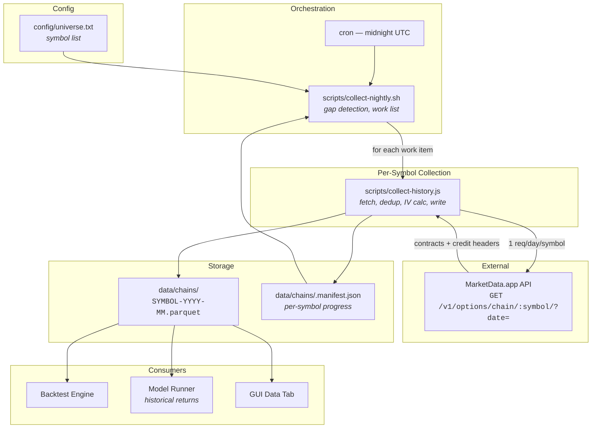

# MarketData.app Collection Pipeline — Component TDD

Parent: [TRADING-SYSTEM-TDD.md](../TRADING-SYSTEM-TDD.md)
Sibling: [Data Plane TDD](data-plane.md) (live broker MD + non-broker ingestion + runtime strategy consumption)

> This TDD covers the **offline batch ETL** for MarketData.app historical chains — populates `data/chains/*.parquet`. The live broker MD path, non-broker ingestion adapters, and runtime strategy reads are all documented in [data-plane.md](data-plane.md). MarketData.app collection runs as a standalone script because chain pulls don't fit the small-request adapter model used by the other sources.

---

## Overview

The data collection pipeline downloads historical option chain snapshots from MarketData.app and stores them as Parquet files for backtesting, model training, and the RV/IV spread model's historical returns computation. It runs nightly via cron, is fully resumable, and self-manages its API credit budget.

### Design goals

1. **Maximize data depth** — collect daily chain snapshots to the maximum limit of available data.
2. **Stay within budget** — 100,000 API credits/day. Reserve ~5,000 for daytime interactive use; the nightly job consumes the rest.
3. **Never re-fetch** — skip dates that already exist in Parquet. Every credit spent should produce new data.
4. **Crash-safe** — if the job is killed mid-run (rate limit, reboot, Ctrl-C), no data is lost and the next run picks up where it left off.
5. **Hands-off** — once the cron is installed and the universe file is populated, the pipeline runs indefinitely with no manual intervention.

---

## 1. Credit model

### MarketData.app pricing

Source: [MarketData.app Options Chain API docs](https://www.marketdata.app/docs/api/options/chain) | [Credit troubleshooting](https://www.marketdata.app/docs/api/troubleshooting/running-out-of-credits) | [Rate limits](https://www.marketdata.app/docs/api/rate-limiting)

| Request type                | Credit cost                    | Notes                                                                                                                                   |
| --------------------------- | ------------------------------ | --------------------------------------------------------------------------------------------------------------------------------------- |
| Historical chain (`?date=`) | 1 per 1,000 contracts returned | At strikeLimit=50 this is typically 1 credit per request (~30-100 contracts). A request returning 2,500 contracts would cost 3 credits. |
| Live chain (no `date`)      | 1 per contract                 | Real-time data is expensive. 100 contracts = 100 credits.                                                                               |
| 15-min delayed chain        | 1 per contract                 | Same as live pricing.                                                                                                                   |
| Stock quote                 | 1                              |                                                                                                                                         |
| Expirations list            | 1                              |                                                                                                                                         |

Historical chains are cheap because of the 1-per-1,000 bulk rate. At our typical response size (~50-100 contracts at strikeLimit=50), each request costs 1 credit. This is confirmed by the `X-Api-Ratelimit-Consumed` response header — the collect script reads these headers for accurate tracking.

**Cost implication for live data:** Real-time chains cost 1 credit per contract, not per 1,000. A single SPY live chain with 100 contracts costs 100 credits. Polling live chains every 5 minutes for 10 symbols across a 6.5-hour session would consume ~78,000 credits/day — nearly the entire budget. This is why live market data flows through the broker bridges (Schwab streamer, IBKR `InteractiveBrokersDataClient`) instead of MarketData.app; MarketData.app is reserved for the historical/batch path documented here.

### Plan limits and lookback

Source: [Plan Limits](https://www.marketdata.app/docs/account/plan-limits)

| Plan    | Historical lookback | Credits/day | Notes                                |
| ------- | ------------------- | ----------- | ------------------------------------ |
| Free    | 1 year              | 100         | Not viable for backfill              |
| Starter | 5 years             | 10,000      | Current minimum for daily collection |
| Trader  | **No limit**        | 100,000     | **Current plan.** Data back to 2005. |
| Quant   | No limit            | 500,000     |                                      |
| Prime   | No limit            | Unlimited   |                                      |

Our Trader plan has no lookback limit — MarketData.app has options data back to **~2005** (21 years). We currently target 2019-01-02 as the start date, but can extend to 2005 for deeper historical analysis (regime changes, GFC, etc.).

### Collection schedule estimates

| Scope                               | Symbols | Trading days | Credits     | Nights at 95k/night |
| ----------------------------------- | ------- | ------------ | ----------- | ------------------- |
| Daily forward-fill                  | 541     | 1            | 541         | <1                  |
| 5-year backfill (2021–2026)         | 541     | ~1,260       | ~681,000    | ~8                  |
| 7-year backfill (2019–2026)         | 541     | ~1,764       | ~953,000    | ~11                 |
| Full history (2005–2026)            | 541     | ~5,292       | ~2,863,000  | ~31                 |
| Full history + R2K (~2,000 symbols) | 2,000   | ~5,292       | ~10,584,000 | ~112                |

Once backfill is complete, daily maintenance is ~541 credits/night (trivial).

### Budget math

- 100,000 credits/day, reset at 9:30 AM Eastern (America/New_York per API docs)
- Reserve 5,000 for daytime use → 95,000 available per nightly run
- No artificial delay — the pipeline runs as fast as the API responds
- At 1 credit/request (typical for historical chains <1,000 contracts), throughput is limited by network latency, not credits
- **Concurrent request limit: 50** (per API docs). The bulk collector's `CONCURRENCY` setting must stay at or below this. Default is 8; can safely increase to ~40 for faster throughput without risking 429s from concurrency violations

### Credit tracking

Every API response includes headers:

| Header                      | Description                         |
| --------------------------- | ----------------------------------- |
| `X-Api-Ratelimit-Consumed`  | Credits consumed by this request    |
| `X-Api-Ratelimit-Remaining` | Credits remaining in current window |
| `X-Api-Ratelimit-Limit`     | Total credits for current window    |
| `X-Api-Ratelimit-Reset`     | Reset time (UTC epoch seconds)      |

The `getLastCredits()` function in `src/lib/marketdata-api.js` parses these from every response. The collect script logs consumed and remaining after each request.

---

## 2. Architecture



### Components

**`config/universe.txt`** — Plain text symbol list. One symbol per line. Lines starting with `#` are comments. Currently contains ~541 symbols (S&P 500, NASDAQ-100 extras, sector ETFs, thematic names). To add symbols, just add lines; the nightly collector picks them up automatically.

**`scripts/collect-nightly.sh`** — Cron orchestrator. Reads the universe, determines what date ranges are missing for each symbol (gap detection), builds a prioritized work list, then executes `collect-history.js` for each work item. Stops when rate-limited or credits drop below the reserve threshold.

**`scripts/collect-history.js`** — Per-symbol collector. Fetches one historical chain per trading day, computes IV/Greeks via bisection for contracts missing them, writes results to Parquet files (one file per symbol per month). Handles deduplication by scanning existing Parquet files before fetching. Tracks progress in the manifest.

**`data/chains/.manifest.json`** — JSON file tracking per-symbol collection state: `lastDate`, `totalContracts`, `totalCredits`. Used by `--resume` mode and by the nightly orchestrator for gap detection.

---

## 3. Collection flow

### Per-symbol flow (collect-history.js)

```
1. Parse args (symbol, from, to, strikeLimit, resume flag)
2. Load manifest
3. If --resume and lastDate exists, advance start date past lastDate
4. Generate list of weekday dates in [from, to]
5. Scan existing Parquet files for this symbol → set of already-stored dates
6. Filter out already-stored dates → only fetch missing ones
7. For each missing date:
   a. GET /v1/options/chain/{symbol}/?date={date}&strikeLimit={strikeLimit}
   b. Parse parallel-array response → contract objects
   c. Compute IV/Greeks for contracts missing them (historical data has no Greeks)
   d. Insert into in-memory DuckDB table
   e. On month boundary: flush to Parquet (merge with existing file)
   f. Read X-Api-Ratelimit-Consumed/Remaining from response headers
   g. Update manifest
   h. Sleep DELAY_MS (default 200ms) between requests
   i. On 429 (rate limit): stop, log message, exit
8. Final Parquet flush
9. Log summary: contracts fetched, credits consumed, credits remaining
```

### Parquet merge (deduplication)

When flushing to a Parquet file that already exists:

```sql
-- Read existing data, excluding dates we just fetched (dedup)
INSERT INTO chains
  SELECT * FROM read_parquet('SPY-2024-01.parquet')
  WHERE date NOT IN (SELECT DISTINCT date FROM chains);

-- Write merged result
COPY (SELECT * FROM chains ORDER BY date, expiration, strike, side)
  TO 'SPY-2024-01.parquet' (FORMAT PARQUET, OVERWRITE);
```

This ensures that re-running collection for the same date range doesn't create duplicates, and newer data overwrites older data for the same date.

### IV/Greeks computation

MarketData.app does not include Greeks for historical chain data. The collect script computes them at ingestion time using the Black-Scholes model (`src/lib/bs.js`):

1. For each contract where `iv` is null or zero:
2. Compute implied volatility via bisection: `BS.impliedVol(S, K, r, T, price, type)`
3. Derive delta, gamma, theta, vega from the computed IV
4. Risk-free rate defaults to 0.05 (configurable via `RFR` env var)

---

## 4. Nightly orchestration

### Gap detection (collect-nightly.sh)

For each symbol in the universe, the orchestrator determines what date ranges are missing:

```
For each SYMBOL:
  1. Read manifest → lastDate (latest date successfully collected)
  2. Scan parquet filenames → earliest month with data
  3. Determine gaps:
     - If no data exists: queue full range (TARGET_FROM → TARGET_TO)
     - If data exists but starts after TARGET_FROM: queue backfill (TARGET_FROM → day before earliest)
     - If lastDate < TARGET_TO: queue forward-fill (day after lastDate → TARGET_TO)
```

**Work item types:**

| Type       | Description                             | Priority                             |
| ---------- | --------------------------------------- | ------------------------------------ |
| `backfill` | Dates before the earliest existing data | Processed first (depth over breadth) |
| `forward`  | Dates after the latest existing data    | Processed second                     |
| `full`     | No data exists for this symbol          | Processed when encountered           |

### Stopping conditions

The nightly job stops when any of these occur:

1. **Rate limited (429)** — API returns HTTP 429. Log and exit. Next run picks up where it left off.
2. **Credits low** — `X-Api-Ratelimit-Remaining` drops below 5,000. Reserves credits for daytime interactive use.
3. **All work complete** — every symbol has data covering TARGET_FROM through TARGET_TO.

### Known limitation: gap detection granularity

The current gap detection operates at the range level (earliest file, lastDate) rather than the individual date level. This means:

- If a symbol has data for Jan–Mar and Jul–Dec but is missing Apr–Jun, the nightly script only sees "lastDate is Dec" and won't detect the Apr–Jun gap.
- The fix (implemented in collect-history.js but not yet in the nightly script): scan existing Parquet files for actual stored dates and skip them. This means even if the nightly script queues a redundant range, collect-history.js won't waste credits re-fetching dates that exist.

**Future improvement:** The nightly script should query the Parquet files directly for per-date coverage rather than relying on filenames and the manifest.

---

## 5. Storage format

### Parquet schema

```sql
CREATE TABLE chains (
  date DATE,              -- trading day
  underlying VARCHAR,     -- ticker (e.g. "SPY")
  underlyingPrice DOUBLE, -- spot price at EOD
  expiration DATE,        -- option expiration
  side VARCHAR,           -- "call" or "put"
  strike DOUBLE,          -- strike price
  dte INTEGER,            -- days to expiration
  bid DOUBLE,
  ask DOUBLE,
  mid DOUBLE,
  last DOUBLE,
  volume INTEGER,
  openInterest INTEGER,
  iv DOUBLE,              -- implied volatility (computed at ingestion)
  delta DOUBLE,           -- computed at ingestion
  gamma DOUBLE,
  theta DOUBLE,
  vega DOUBLE,
  source VARCHAR          -- "marketdata" or "ibkr"
)
```

### File naming

```
data/chains/{SYMBOL}-{YYYY-MM}.parquet
```

One file per symbol per calendar month. Examples:

- `SPY-2024-01.parquet` — all SPY chain data for January 2024
- `AAPL-2023-06.parquet` — all AAPL chain data for June 2023

### Size

- ~2 KB per contract per day (Parquet columnar compression)
- ~100 contracts per symbol per day (at strikeLimit=50)
- ~200 bytes per contract after compression
- 541 symbols × 1,260 days × 100 contracts × 200 bytes ≈ **13 GB** at full depth
- Current: ~360 MB across ~4,300 files (partial collection)

### Manifest

`data/chains/.manifest.json` — tracks per-symbol progress:

```json
{
  "SPY": {
    "lastDate": "2026-04-09",
    "totalContracts": 89400,
    "totalCredits": 894
  }
}
```

`lastDate` is the most recent date successfully collected. `totalCredits` is tracked from API response headers.

---

## 6. Cron schedule

```
0 0 * * * cd ~/Magpie && ./scripts/collect-nightly.sh >> data/chains/.nightly.log 2>&1
```

- **When:** midnight UTC = 8 PM ET, every day
- **Why 8 PM ET:** market closes at 4 PM ET; by 8 PM the EOD chain snapshots are stable. Also maximizes the credit window before reset at 9:30 AM Eastern (America/New_York) next day.
- **Weekends:** full 200,000 credits available across Saturday + Sunday with no competing live usage. Ideal for backfill catch-up.
- **Log:** `data/chains/.nightly.log` — append-only, contains per-symbol progress and credit tracking

### Monitoring

```bash
# Watch live progress
tail -f data/chains/.nightly.log

# Check manifest
cat data/chains/.manifest.json | python3 -m json.tool

# Summary stats
cat data/chains/.manifest.json | python3 -c "
import json, sys
m = json.load(sys.stdin)
print(f'Symbols: {len(m)}')
print(f'Credits: {sum(v[\"totalCredits\"] for v in m.values()):,}')
print(f'Contracts: {sum(v[\"totalContracts\"] for v in m.values()):,}')
"

# Disk usage
du -sh data/chains/

# Dry-run: see what would be collected without collecting
DRY_RUN=1 ./scripts/collect-nightly.sh

# Check cron is installed
crontab -l
```

The GUI Data tab also shows stored data: symbols, date ranges, trading days, contract counts, and strike depth per date.

---

## 7. Configuration

### Environment variables

| Variable      | Default      | Description                                        |
| ------------- | ------------ | -------------------------------------------------- |
| `MD_TOKEN`    | (required)   | MarketData.app API bearer token. Set in `.env`.    |
| `RFR`         | `0.05`       | Risk-free rate for IV computation                  |
| `DELAY_MS`    | `200`        | Delay between API requests (ms)                    |
| `TARGET_FROM` | `2019-01-02` | Earliest date to collect (nightly script)          |
| `TARGET_TO`   | yesterday    | Latest date to collect (nightly script)            |
| `DRY_RUN`     | `0`          | Set to `1` to preview work list without collecting |

### Universe file

`config/universe.txt` — one symbol per line, `#` for comments. Sections:

- Broad market ETFs (SPY, QQQ, IWM, DIA)
- Sector/thematic ETFs (XLE, XOP, USO, DBA, MOO, JETS, BDRY)
- S&P 500 constituents (~496 symbols)
- NASDAQ-100 extras not in S&P 500 (~20 symbols)
- Additional thematic names (oil adjacent, fertilizers, airlines, ocean freight)

---

## 8. Failure modes

| Failure                          | Effect                                       | Recovery                                                                                                                       |
| -------------------------------- | -------------------------------------------- | ------------------------------------------------------------------------------------------------------------------------------ |
| Rate limited (429)               | Collect script stops mid-symbol              | Next nightly run resumes. Dates already fetched are in Parquet; unfetched dates detected by dedup scan.                        |
| Network error                    | Single date skipped with warning             | Logged. The date will be retried on next run (not in existing Parquet → not skipped).                                          |
| Market closed (holiday)          | API returns 404, logged as "Market closed"   | 0 contracts logged, manifest updated, moves to next date.                                                                      |
| Process killed (SIGTERM, reboot) | Current month's data in memory not flushed   | Data for completed months is safe in Parquet. In-progress month is lost but will be re-fetched (not in Parquet → not skipped). |
| Manifest corruption              | `--resume` starts from beginning             | Parquet dedup scan prevents duplicate API calls regardless of manifest state.                                                  |
| Parquet file corruption          | `flushToParquet` fails to read existing file | Catch block logs error. Worst case: one month of data for one symbol is re-fetched.                                            |

---

## 9. Files

```
config/
  universe.txt                  # Symbol list for collection

scripts/
  collect-history.js            # Per-symbol collector (Node.js)
  collect-nightly.sh            # Cron orchestrator (bash)
  collect-universe.sh           # One-shot batch collector
  backfill-universe.sh          # One-shot backfill

data/chains/
  {SYMBOL}-{YYYY-MM}.parquet    # Chain data files
  .manifest.json                # Per-symbol progress tracking
  .nightly.log                  # Nightly cron log (append-only)
  .collect.log                  # Batch collection log
  .backfill.log                 # Backfill log

src/lib/
  marketdata-api.js             # API client (fetch, parse, credit tracking)
  bs.js                         # Black-Scholes IV solver + Greeks

server/
  storage.js                    # Parquet read/write (DuckDB-based)
```

---

## 10. Test plan

| Test                   | What it covers                                                                                              |
| ---------------------- | ----------------------------------------------------------------------------------------------------------- |
| Dedup scan correctness | Run collect for a date range, re-run same range, verify 0 API calls on second run                           |
| Credit header parsing  | Mock API response with `X-Api-Ratelimit-*` headers, verify `getLastCredits()` returns correct values        |
| Parquet merge          | Write data for Jan 1-15, then Jan 10-20; verify final file has Jan 1-20 with no duplicates                  |
| Rate limit handling    | Mock 429 response mid-collection; verify clean exit, manifest updated, Parquet flushed for completed months |
| Market closed handling | Mock 404 "Market closed" response; verify date skipped, no crash, collection continues                      |
| IV computation         | Feed known option prices; verify computed IV matches expected values within tolerance                       |
| Nightly gap detection  | Create partial data for a symbol; run dry-run; verify correct backfill and forward-fill ranges              |
| Credit reserve         | Set remaining credits to 4,999; verify nightly script stops with "Credits low" message                      |
| Universe parsing       | Test universe.txt with comments, blank lines, Windows line endings; verify correct symbol list              |
