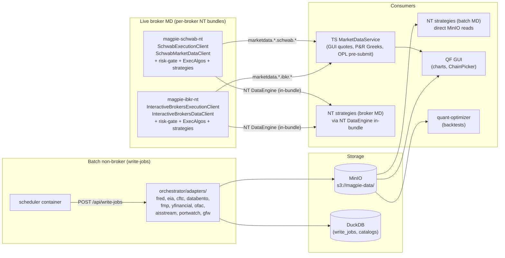

# Data Plane — Component TDD

Parent: [TRADING-SYSTEM-TDD.md](../TRADING-SYSTEM-TDD.md)
Siblings: [broker-integration.md](../tdd/broker-integration.md) (NATS wire contract for broker MD), [write-jobs.md](../tdd/write-jobs.md) (ingestion runner), [collection.md](collection.md) (offline batch ETL for options chains), [sources.md](sources.md) (per-source costs, limits, auth)

---

## 1. Overview

The Data Plane is everything that gets data **into** Magpie. Three flows feed the system:

1. **Live broker market data** — quotes, chains, trades, book updates from Schwab and IBKR. Each broker has one NT bundle whose in-bundle NT MD client feeds NT strategies via NT's `DataEngine` and publishes the same data to NATS `marketdata.*` subjects for the TS-side `MarketDataService`.
2. **Batch non-broker ingestion** — macro (FRED, EIA, CFTC), fundamentals (FMP, yfinancial), futures (Databento), reference data (OFAC), maritime (AIS, PortWatch, GFW, MarineCadastre). Pulled by orchestrator adapters, submitted to the [write-jobs queue](../tdd/write-jobs.md), written as Parquet to MinIO.
3. **Runtime strategy consumption** — NT strategies read Parquet directly from MinIO at startup and on a refresh timer. No intermediate service.

The plane has no single runtime — it's a contract surface across three sites: the TS-side consumer for live broker MD, the TS-side ingestion runner for batch sources, and the NT strategy code for runtime reads.



Notice that broker MD has **two consumer paths from a single source** (the bundle's NT MD client): in-bundle via NT's `DataEngine` for NT strategies, and over NATS for everything TS-side. There is no separate data publisher per consumer — one source, dual exposure.

---

## 2. Live broker market data

Every broker has one NT bundle that hosts both the NT execution client and the NT MD client (uniform per-broker pattern — see [broker-integration.md §1 Runtime topology](../tdd/broker-integration.md#1-runtime-topology)). The bundle's MD client:

1. Feeds NT's `DataEngine` in-bundle — every NT strategy bound to that broker consumes via NT's standard data API. This is the primary consumer for trading decisions.
2. Publishes to NATS `marketdata.*` subjects (per [broker-integration.md §3.3](../tdd/broker-integration.md#33-market-data-md-bridge--ts-md-service)) for non-NT consumers — the TS-side `MarketDataService` (`server/market-data/service.ts`) is one of them.

The TS-side `MarketDataService` is a **NATS consumer** of those subjects. It owns caching, per-(broker, symbol) freshness tracking, the data quality gate, and consumer fan-out to GUI / Portfolio & Risk / Order Plane. The bundle owns broker authentication, stream parsing, and reconnection.

### 2.1 Service interface

```ts
// server/market-data/service.ts
export interface MarketDataService {
  // Snapshot (RPC to bridge over NATS request/reply)
  getQuote(broker: BrokerId, symbol: string): Promise<Quote>;
  getExpirations(broker: BrokerId, underlier: string): Promise<string[]>;
  getChain(broker: BrokerId, underlier: string, expiration: string): Promise<Contract[]>;
  getCandles(broker: BrokerId, symbol: string, opts: CandleOpts): Promise<Candle[]>;

  // Streaming (NATS subscriptions)
  subscribeQuotes(broker: BrokerId, symbols: string[], cb: QuoteCallback): Subscription;
  subscribeTrades(broker: BrokerId, symbols: string[], cb: TradeCallback): Subscription;

  // Freshness
  getFreshness(broker: BrokerId, symbol: string): FreshnessState;
}

interface Quote {
  symbol: string; // canonical: "EQ:SPY" / "OPT:..." / "FUT:..."
  bid: number;
  ask: number;
  mid: number;
  last: number;
  volume: number;
  source_timestamp: string; // ISO 8601 from bridge
  _meta: MetaTag;
}
```

Symbols on the wire are **canonical QF symbols** (parsed by [`server/symbols/symbol.ts`](../../server/symbols/symbol.ts)). The bundle's MD client handles the conversion from broker-native symbols (OCC option codes, IBKR conids) at the source.

### 2.2 Consumers

| Consumer                    | What it needs                                           | How it consumes                                          |
| --------------------------- | ------------------------------------------------------- | -------------------------------------------------------- |
| **GUI**                     | Live quote displays, ChainPicker, payoff diagrams       | `subscribeQuotes` for live tickers; `getChain` on demand |
| **Portfolio & Risk Engine** | Recompute Greeks on price moves                         | `subscribeQuotes` for held positions                     |
| **Order Plane**             | Pre-submit quote sanity check on operator manual orders | `getQuote` synchronously inside the submit path          |

NT strategies do **not** consume through this service — they use NT's `DataEngine`, fed in-bundle by the same MD client that publishes to NATS. The TS-side service exists for QF surfaces (GUI, P&R, OPL) that are outside the NT runtime.

### 2.3 Caching

In-memory LRU cache with TTL per RPC method. Subscriptions write through to the cache on each update so synchronous reads after a recent stream tick return the latest value without a round-trip.

| Method           | TTL | Why                                                                            |
| ---------------- | --- | ------------------------------------------------------------------------------ |
| `getQuote`       | 5s  | Deduplicates concurrent OPL + P&R reads during a single decision cycle         |
| `getExpirations` | 1h  | Expiration lists change at most once per session                               |
| `getChain`       | 30s | Chain reads are expensive (many contracts); 30s suits operator-paced decisions |
| `getCandles`     | 60s | Bar reads for charting; refresh on next minute boundary                        |

Eviction: max 10k entries (configurable). Bypass: `{noCache: true}` option per call, used by GUI manual-refresh and tests. No proactive invalidation — streaming updates handle freshness for subscribed symbols; TTLs handle the rest.

### 2.4 Source-quality metadata

Every response carries a `_meta` object so consumers can inspect freshness without a side-call:

```ts
interface MetaTag {
  source: "schwab-bridge" | "ibkr-bridge";
  source_timestamp: string; // from bridge
  fetched_at: string; // when MDS received
  freshness_ms: number; // fetched_at - source_timestamp
  latency_ms: number; // round-trip RPC or stream-to-callback
  from_cache: boolean;
  cache_age_ms: number; // 0 if not from cache
}
```

### 2.5 Freshness tracking

Per-(broker, symbol) state, updated on every RPC response or stream tick:

```ts
interface FreshnessState {
  last_quote_ts: string | null;
  last_chain_ts: string | null;
  last_heartbeat_ts: string | null; // from marketdata.<broker>.heartbeat
  bridge_alive: boolean; // last_heartbeat_ts within 30s
}
```

`marketdata.<broker>.heartbeat` (per [broker-integration.md §3.3](../tdd/broker-integration.md#33-market-data-md-bridge--ts-md-service)) fires every 10s; the service marks `bridge_alive=false` after 30s without a heartbeat and surfaces this in the GUI Settings → Data → Brokers screen.

### 2.6 Bridge unavailability

When `bridge_alive=false`:

- RPC calls (`getQuote`, `getChain`, etc.) reject with `BridgeUnavailableError` after a 5s timeout.
- Streaming subscriptions remain registered; if the bridge reconnects, ticks flow again without re-subscribing.
- The OPL quote-sanity check treats `BridgeUnavailableError` as a hard reject — manual orders against an unavailable broker bridge fail at submit time.
- The P&R Engine treats `BridgeUnavailableError` as `data_stale=true` for affected positions; halt decision is policy-driven (configurable per portfolio).

No cross-broker fallback. Each broker bridge is independent. There is no IBKR→Schwab fallback at the MD layer; if a broker bridge is down, that broker's positions can't be re-Greek'd until it recovers.

### 2.7 Data quality gate

Quality is enforced at the consumption site, not centrally. The service exposes the freshness state; consumers enforce thresholds.

| Consumer                    | Threshold                          | Action on stale                                                                         |
| --------------------------- | ---------------------------------- | --------------------------------------------------------------------------------------- |
| **Portfolio & Risk Engine** | `max_quote_age_ms: 120000` (2 min) | Compute with available data; flag `data_stale=true`; halt decision per portfolio policy |
| **Order Plane**             | `max_quote_age_ms: 30000` (30s)    | Reject manual order submission; surface error to GUI                                    |

Thresholds live in `config/data-plane.json`. Market-hours awareness: the gate accepts a `marketOpen: boolean` from [`server/calendar/`](../../server/calendar/); outside hours, age thresholds relax (last close is the best available).

---

## 3. Non-broker batch ingestion

Macro, fundamentals, futures, reference, and maritime data flow through a uniform adapter pattern. The orchestrator adapter registry ([`server/orchestrator/adapter.ts`](../../server/orchestrator/adapter.ts)) holds one adapter per source. Each adapter exposes a `fetch(requests)` method that handles auth, rate limits, pagination, and incremental fetch. Outputs are merged into Parquet at MinIO.

### 3.1 Adapter contract

```ts
// server/orchestrator/adapter.ts
export interface DataAdapter {
  id: string; // "fred" | "eia" | "cftc" | ...
  capabilities: AdapterCapabilities;
  fetch(requests: DataRequest[]): Promise<DataResult[]>;
  supportsRequest?(args: Record<string, unknown>): boolean;
}

export interface DataRequest {
  args: Record<string, unknown>; // source-specific (e.g. {series: "VIXCLS"})
  output?: string; // path relative to DATA_URI for persistent feeds
  since?: string; // incremental start (YYYY-MM-DD)
}

export interface DataResult {
  request: DataRequest;
  ok: boolean;
  dataThrough?: string; // max date in result — drives freshness
  data?: unknown; // in-memory for live data
  error?: string;
}

export interface AdapterCapabilities {
  batch: boolean;
  streaming: boolean;
  maxConcurrent: number;
}
```

Adapters are registered into a single global registry at boot via `bootstrapAdapters()` ([`server/orchestrator/lifecycle.ts`](../../server/orchestrator/lifecycle.ts)). Duplicate registration throws — adapters can't shadow each other.

### 3.2 Adapter catalog

| Source               | Adapter file                 | Output                         | Auth                | Cost / limits                             |
| -------------------- | ---------------------------- | ------------------------------ | ------------------- | ----------------------------------------- |
| FRED                 | `adapters/fred.ts`           | `macro/fred/*.parquet`         | `FRED_API_KEY`      | Free, generous                            |
| EIA                  | `adapters/eia.ts`            | `macro/eia/*.parquet`          | `EIA_API_KEY`       | Free, 5k req/hr                           |
| CFTC                 | `adapters/cftc.ts`           | `macro/cftc/*.parquet`         | None (public)       | Free                                      |
| FMP                  | `adapters/fmp.ts`            | `fundamentals/fmp/*.parquet`   | `FMP_API_KEY`       | Paid tier                                 |
| yfinancial           | `adapters/yfinancial.ts`     | `fundamentals/yf/*.parquet`    | None                | Yahoo Finance limits                      |
| Databento            | `adapters/databento.ts`      | `futures/databento/*.parquet`  | `DATABENTO_API_KEY` | Paid by GB                                |
| OFAC                 | `adapters/ofac.ts`           | `reference/ofac/*.parquet`     | None                | Free, large file pull                     |
| AIS Stream           | `adapters/aisstream.ts`      | `maritime/ais/*.parquet`       | `AISSTREAM_KEY`     | Free tier, rate-limited                   |
| PortWatch            | `adapters/portwatch.ts`      | `maritime/portwatch/*.parquet` | None                | Free                                      |
| Global Fishing Watch | `adapters/gfw.ts`            | `maritime/gfw/*.parquet`       | `GFW_API_KEY`       | Free tier                                 |
| MarineCadastre       | `adapters/marinecadastre.ts` | `maritime/mcadastre/*.parquet` | None                | Free                                      |
| MarketData.app       | (collection script only)     | `chains/*.parquet`             | `MD_TOKEN`          | Paid — see [collection.md](collection.md) |

Per-source costs, rate limits, and auth setup live in [sources.md](sources.md). MarketData.app is the only source NOT in the orchestrator adapter registry — it runs as a standalone collection script (per [collection.md](collection.md)) because chain pulls don't fit the small-request adapter model.

### 3.3 Submission paths

- **Cron (default)** — the `magpie-scheduler` container submits jobs through the [write-jobs runner](../tdd/write-jobs.md) using a server-host token. Schedule is in [`data/CRON.md`](../../data/CRON.md).
- **On-demand from GUI** — operator clicks "Backfill X" in Settings → Activity; the page posts to `/api/write-jobs` with the appropriate `kind` (`ingest`, `orchestrate-refresh`, `fmp-backfill`, etc.).
- **In-process** — server code can call `runner.submit({kind, params}, {actor: "server:..."})` directly without going through HTTP. Same audit, no token check.

The write-jobs runner serializes per-`kind` (one in-flight FMP backfill at a time) and persists every submission to the `write_jobs` DuckDB table with status, timestamps, and output paths.

### 3.4 Storage layout

`DATA_URI` selects local-fs or MinIO:

| Mode  | Value                             | Use                  |
| ----- | --------------------------------- | -------------------- |
| Local | `file:///abs/path/to/Magpie/data` | Single-machine dev   |
| MinIO | `s3://magpie-data`          | Home server, default |

MinIO mode requires `S3_ENDPOINT_URL` (`https://s3.example.com`), `S3_REGION`, `S3_ACCESS_KEY`, `S3_SECRET_KEY`. See `.env.example`.

Top-level layout under `DATA_URI`:

```
chains/                              — options chains (collect-bulk, per-symbol-per-month)
macro/{fred,eia,cftc}/               — macro series
fundamentals/{fmp,yf}/               — fundamentals
futures/databento/                   — futures bars + options chains
reference/ofac/                      — sanctions list
maritime/{ais,portwatch,gfw,mcadastre}/ — maritime / shipping
fills/                               — execution fills (written by OPL)
results/                             — backtest results (written by QO into shared MinIO)
```

The `audit_intents`, `audit_orders`, `audit_fills` DuckDB tables are embedded in the QF server (not in MinIO); their schemas live in [cross-cutting.md](../tdd/cross-cutting.md).

---

## 4. Runtime consumption by NT strategies

NT strategies read non-broker data **directly from MinIO** (or local `file://` in dev). No intermediate service.

### 4.1 Pattern

```python
# strategy/<name>/strategies/cl_scalp.py
import duckdb

class ClScalp(Strategy):
    def on_start(self):
        # Load static reference data once at strategy start
        self._vix = self._load_macro("macro/fred/vixcls.parquet")
        self._inventories = self._load_macro("macro/eia/weekly_petroleum.parquet")
        # Schedule refresh
        self.clock.set_time_alert("macro-refresh", interval=timedelta(hours=1))

    def on_time_alert(self, event):
        if event.name == "macro-refresh":
            self._vix = self._load_macro("macro/fred/vixcls.parquet")
            self._inventories = self._load_macro("macro/eia/weekly_petroleum.parquet")

    def _load_macro(self, path: str) -> pl.DataFrame:
        uri = f"{os.environ['DATA_URI']}/{path}"
        return duckdb.sql(f"SELECT * FROM read_parquet('{uri}')").pl()
```

DuckDB handles `s3://` URIs natively when given the `S3_*` env vars; the same code works against local `file://` paths for dev.

### 4.2 Refresh cadence

The strategy decides its own refresh cadence based on the underlying data's update frequency:

| Source cadence | Strategy refresh         | Example                      |
| -------------- | ------------------------ | ---------------------------- |
| Intraday tick  | (use live MD, not batch) | Quotes                       |
| Daily          | Every 1–4 hours          | FRED VIX, daily EIA          |
| Weekly         | Every 6 hours            | Weekly petroleum inventories |
| Monthly        | Daily at session start   | CFTC COT positions           |

There is no central refresh coordinator. Each strategy is responsible for its own freshness. The trade-off: simple architecture, but if many strategies all refresh the same dataset on the same schedule, MinIO sees a thundering herd. Today's scale (single-digit strategies) absorbs this comfortably; if profiling later shows MinIO saturation, the answer is local per-strategy cache (read once, mtime-check on refresh) or a small TS-side fan-out service — not part of v1.

### 4.3 Reading partitioned parquet

For large multi-year datasets, strategies should use DuckDB predicate pushdown to read only the rows they need:

```python
duckdb.sql("""
    SELECT date, value
    FROM read_parquet('s3://magpie-data/macro/fred/vixcls.parquet')
    WHERE date >= '2025-01-01'
""").pl()
```

Adapter outputs partition by source convention (FMP partitions by ticker; Databento partitions by contract month). Strategies should know their data's partition layout and exploit it.

### 4.4 MinIO scaling

Single-node MinIO comfortably serves dozens of concurrent readers at current QF scale. Bottlenecks at higher scale: network bandwidth and disk IOPS, not connection count. Mitigations if needed: local per-strategy parquet caching with mtime check, DuckDB predicate pushdown to reduce transfer, eventual MinIO sharding. Resource-scaling concern, not architectural.

---

## 5. Quality and freshness across both flows

**Live (broker MD).** Per-(broker, symbol) freshness state in MarketDataService (§2.5); per-consumer staleness gate (§2.7); bridge-heartbeat alerting via Settings → Data → Brokers.

**Batch (non-broker).** Per-job state in the `write_jobs` DuckDB table. The `dataThrough` field on each `DataResult` is persisted as part of the job's `output_paths` metadata. The catalog scanner derives "last successful ingest per source" from the most recent completed `write_jobs` row per `kind`. Exposed via:

- `GET /api/write-jobs?status=completed&limit=N` — list recent successes.
- `GET /api/catalog/freshness` — derived view: per source, last ingest timestamp, `dataThrough`, age vs expected cadence. Surfaced in GUI Settings → Data → Market data health.

Stale-ingest alerting fires through the [alerts router](../tdd/alerts.md) when a source's last successful ingest exceeds 2× its expected cadence.

---

## 6. Metrics and config

### 6.1 Live MD metrics

| Metric                                | Type      | Labels                          | Description                                                           |
| ------------------------------------- | --------- | ------------------------------- | --------------------------------------------------------------------- |
| `marketdata_rpc_total`                | counter   | `method`, `broker`, `result`    | RPC call result (`success`, `error`, `timeout`, `bridge_unavailable`) |
| `marketdata_rpc_latency_seconds`      | histogram | `method`, `broker`              | RPC round-trip                                                        |
| `marketdata_stream_updates_total`     | counter   | `broker`, `subject`             | Streaming ticks received                                              |
| `marketdata_bridge_alive`             | gauge     | `broker`                        | 1 if heartbeat within 30s, else 0                                     |
| `marketdata_cache_hits_total`         | counter   | `method`                        | Cache hit                                                             |
| `marketdata_cache_misses_total`       | counter   | `method`                        | Cache miss → RPC                                                      |
| `marketdata_quality_gate_stale_total` | counter   | `consumer`, `broker`, `symbol`  | Stale data blocked an action                                          |
| `marketdata_freshness_age_seconds`    | gauge     | `broker`, `symbol`, `data_type` | Current data age                                                      |

### 6.2 Batch ingestion metrics

Per [write-jobs.md §12](../tdd/write-jobs.md#12-metrics-emitted) for `write_jobs_*` counters. Per-source freshness gauges:

| Metric                            | Type  | Labels   | Description                                            |
| --------------------------------- | ----- | -------- | ------------------------------------------------------ |
| `ingest_last_success_seconds`     | gauge | `source` | Seconds since last successful ingest per source        |
| `ingest_data_through_age_seconds` | gauge | `source` | Age of newest data row per source (lag from real-time) |

### 6.3 Config: `config/data-plane.json`

```jsonc
{
  // Live broker MD
  "live": {
    "nats_url": "nats://localhost:4222",
    "rpc_timeout_ms": 5000,
    "bridge_heartbeat_timeout_ms": 30000,
    "cache": {
      "quote_ttl_ms": 5000,
      "expirations_ttl_ms": 3600000,
      "chain_ttl_ms": 30000,
      "candles_ttl_ms": 60000,
      "max_entries": 10000,
    },
    "quality_gate": {
      "portfolio_risk_engine": { "max_quote_age_ms": 120000 },
      "order_plane": { "max_quote_age_ms": 30000 },
    },
  },

  // Per-adapter enable + per-source freshness expectations
  "ingestion": {
    "fred": { "enabled": true, "expected_cadence_hours": 24 },
    "eia": { "enabled": true, "expected_cadence_hours": 168 },
    "cftc": { "enabled": true, "expected_cadence_hours": 168 },
    "fmp": { "enabled": true, "expected_cadence_hours": 168 },
    "yfinancial": { "enabled": true, "expected_cadence_hours": 24 },
    "databento": { "enabled": true, "expected_cadence_hours": 24 },
    "ofac": { "enabled": true, "expected_cadence_hours": 168 },
    "aisstream": { "enabled": false, "expected_cadence_hours": 4 },
    "portwatch": { "enabled": true, "expected_cadence_hours": 24 },
    "gfw": { "enabled": false, "expected_cadence_hours": 24 },
    "marinecadastre": { "enabled": true, "expected_cadence_hours": 24 },
  },
}
```

API keys and broker credentials stay in `.env`, not config. The config file is reloadable via `fs.watch`; the live cache TTLs and quality-gate thresholds pick up changes without a restart.

---

## 7. Files

```
server/market-data/
  service.ts              — TS-side NATS consumer for broker MD; cache + quality gate + subscriptions
  cache.ts                — LRU + TTL
  quality-gate.ts         — isDataFresh()
  subscriptions.ts        — Subscription manager (NATS fan-out + bookkeeping)
  __tests__/

server/orchestrator/
  adapter.ts              — DataAdapter interface + registry
  adapters/*.ts           — Per-source adapters (fred, eia, cftc, ...)
  lifecycle.ts            — bootstrapAdapters() at boot
  __tests__/

server/writeJobs/handlers/
  ingest.ts               — Per-source batch ingest handler
  orchestrate-refresh.ts  — Per-(source, args, output) tuple handler
  fmp-backfill.ts         — FMP-specific multi-endpoint backfill
  databento-pull.ts       — Databento subprocess wrapper
  collect-bulk.ts         — MarketData.app chain bulk pull subprocess

scripts/
  scheduler.ts            — magpie-scheduler container daemon (cron)
  _collect-bulk-impl.ts   — collect-bulk subprocess body
  _databento-pull-impl.ts — databento-pull subprocess body

config/
  data-plane.json         — Live MD + per-adapter ingestion config
```
