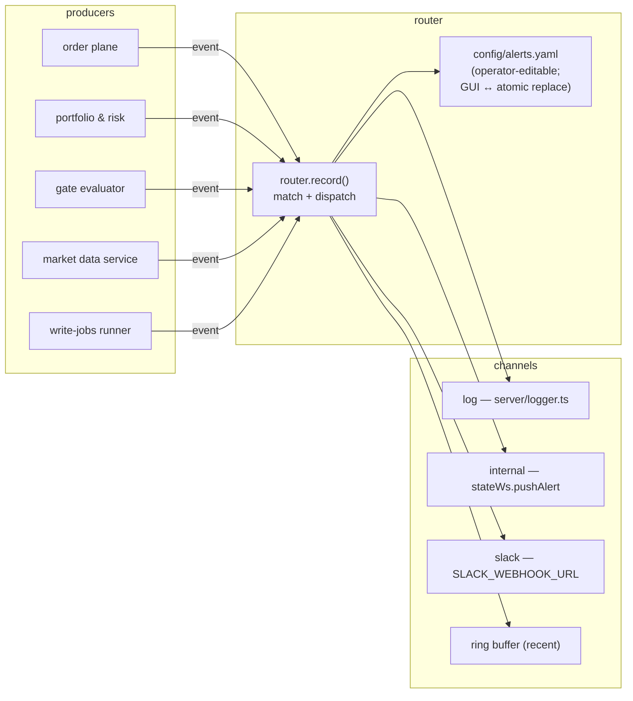

# Alerts — Component TDD

Parent: [TRADING-SYSTEM-TDD.md](../TRADING-SYSTEM-TDD.md). Sibling: [observability.md](observability.md).

## 1. Purpose

The alerts router is the single point at which application alert events fan out to operator-visible channels. It centralises routing, exposes an operator-editable rule set, and surfaces a recent-alerts buffer. Producers across the system (Order Plane, Portfolio & Risk, gate evaluator, market data service, write-jobs runner) call `router.record()` at the moment a noteworthy event occurs. Slack is opt-in via `SLACK_WEBHOOK_URL`; the dispatch is a no-op when the env var is unset.

## 2. Architecture



All callers go through one entry point — `router.record({type, level, message, payload})`. Rules in `config/alerts.yaml` decide which channels fire for which events.

## 3. Schema

### 3.1 `AlertEvent`

```ts
interface AlertEvent {
  ts: string; // ISO-8601, auto-stamped if omitted
  type: string; // dot-namespaced category, e.g. "quote_unavailable.spx"
  level: "info" | "warning" | "critical";
  message: string; // operator-facing summary
  payload?: Record<string, unknown>; // event-specific structured fields
}
```

`type` is dot-namespaced so prefix matching is natural; producers should pick a stable prefix per concern (`quote_unavailable.<broker>.<symbol>`, `strategy.drift.<strategy_id>`, `bridge.unavailable.<broker>`, `ingest.failed.<source>`, …).

### 3.2 `AlertRule`

```ts
interface AlertRule {
  id: string; // unique within the file
  description?: string; // shown in the Settings UI
  match: {
    type_prefix?: string; // empty/omitted = match all types
    levels?: AlertLevel[]; // empty/omitted = match all levels
  };
  channels: ("log" | "internal" | "slack")[]; // non-empty
}
```

### 3.3 `config/alerts.yaml`

```yaml
version: 1
rules:
  - id: quote_unavailable_banner
    description: Show an in-app banner when market-data is unavailable for a quoting attempt.
    match:
      type_prefix: quote_unavailable
    channels:
      - log
      - internal
```

Validation runs at both YAML load and PUT time, via the same `normalize()` path — invalid rules reject with `400 AlertsValidationError`. Unsupported `version` values reject; missing file is treated as `{version: 1, rules: []}`.

## 4. Channels

| Channel    | Effect                                                                                                                                                    | Activation                                                                                           |
| ---------- | --------------------------------------------------------------------------------------------------------------------------------------------------------- | ---------------------------------------------------------------------------------------------------- |
| `log`      | `logger.error` (critical), `logger.warn` (warning), `logger.info` (info). Event is logged as `event: "alert"` with the full `AlertEvent` under `payload`. | Always wired.                                                                                        |
| `internal` | `stateWs.pushAlert({type, message, level, ts, payload?})` — surfaces in the in-app banner area via the existing `/ws/state` push.                         | Wired at boot once stateWs exists (`alertRouter.setInternalSink(...)`).                              |
| `slack`    | POST to `SLACK_WEBHOOK_URL` (resolved at dispatch time so `.env` edits take effect without a restart).                                                    | Opt-in via env. If `SLACK_WEBHOOK_URL` is unset, the channel logs a warning once per fire and skips. |

Channel de-duplication runs **within a single rule** (a rule listing `slack` twice fires once). De-duplication does **not** run across rules — two rules that both match an event independently each contribute their channels (unioned for that dispatch).

### 4.1 Slack message format

`server/alerts/channels/slack.ts` — single-file, no SDK. Renders:

````
{emoji} *[{LEVEL}] {type}*
_{ts}_
{message}
```json
{payload, pretty-printed}
````

Emoji map: 🔵 info / 🟡 warning / 🔴 critical. The payload block is omitted when `payload` is empty or undefined.

## 5. Lifecycle: record → match → dispatch

1. `router.record(input)` stamps `ts` if missing and builds the canonical `AlertEvent`.
2. Event is appended to the recent-alerts ring (capacity 200, oldest dropped first).
3. Rules are filtered by `matchesRule(event, rule)`:
   - `type_prefix` check — `event.type.startsWith(rule.match.type_prefix)` if set.
   - `levels` check — `rule.match.levels.includes(event.level)` if set.
4. If zero rules match, the event still fires on the `log` channel — alerts are never silent.
5. If one or more rules match, the union of their `channels` is dispatched (with per-rule dedup, no cross-rule dedup).
6. Dispatch is sequential within a single `record()` call but per-channel failures are isolated (Slack failure logs a warning and continues).

## 6. Recent-alerts ring

In-memory, capacity 200 events. Surface: `router.recent(limit?: number) → AlertEvent[]` (newest first). Exposed via `GET /api/alerts/recent?limit=N`. Polled by the Settings → Alerts screen every 5s. Not persisted — restart clears the ring.

## 7. Producer callsites

Producers route alerts through `router.record()` at the moment a noteworthy event occurs. The catalog below names the producer module, the trigger, and the canonical event type. Each producer owns its own per-event dedup window; the router itself is stateless.

| Producer                                                    | Trigger                                                                                           | Event type                                        | Notes                                                                                                                                                                                            |
| ----------------------------------------------------------- | ------------------------------------------------------------------------------------------------- | ------------------------------------------------- | ------------------------------------------------------------------------------------------------------------------------------------------------------------------------------------------------ |
| **Order Plane** (`server/order/`)                           | Pre-submit quote sanity check fails (bridge unavailable or quote stale beyond OPL gate threshold) | `quote_unavailable.<broker>.<symbol>`             | 5-minute dedup per `(broker, symbol, reason)` lives in OPL; router sees at most one event per outage per symbol.                                                                                 |
| **Order Plane**                                             | Next successful quote after an outstanding `quote_unavailable`                                    | `quote_recovered.<broker>.<symbol>`               | Companion auto-dismiss; the internal-channel banner consumer clears its UI on this type.                                                                                                         |
| **Order Plane**                                             | Broker rejects an OPL-submitted order                                                             | `broker.reject.<broker>`                          | Payload includes `order_id`, `reason`.                                                                                                                                                           |
| **Order Plane**                                             | Reconciliation drift detected (broker positions ≠ `audit_orders`)                                 | `recon.drift.<portfolio>`                         | Per-portfolio; fired on each reconciliation tick that finds drift.                                                                                                                               |
| **Order Plane**                                             | Operator manual liquidation invoked (per-position or multi-select)                                | `position.manual_liquidation.<strategy_id>`       | Payload includes `position_ids`, `actor`. See [order-execution.md §5.2](order-execution.md#52-operator-manual-liquidation).                                                                      |
| **Portfolio & Risk**                                        | Strategy-declared exit rule trips (stop_loss / target / max_hold / max_drawdown)                  | `position.exit_rule_tripped.<rule>.<strategy_id>` | Payload includes `position_id`, `rule`, current vs. threshold. See [order-execution.md §5.1](order-execution.md#51-strategy-declared-exit-rules).                                                |
| **Portfolio & Risk** (`server/portfolio/`, `server/risk/`)  | Risk limit breached                                                                               | `risk.limit_violation.<portfolio>.<limit_id>`     | Payload includes current vs. limit values.                                                                                                                                                       |
| **Portfolio & Risk**                                        | Strategy drift soft threshold breached (z > 2)                                                    | `strategy.drift.soft.<strategy_id>`               | Per [portfolio-risk-engine.md drift monitoring](portfolio-risk-engine.md#strategy-drift-monitoring-design-intent).                                                                               |
| **Portfolio & Risk**                                        | Strategy drift hard threshold breached (z > 3)                                                    | `strategy.drift.hard.<strategy_id>`               | Strategy moves to lifecycle `halted` (block new submissions); existing positions stay — operator decides via [order-execution.md §5.2](order-execution.md#52-operator-manual-liquidation).       |
| **Portfolio & Risk**                                        | Drawdown limit breached                                                                           | `drawdown.breach.<portfolio>`                     |                                                                                                                                                                                                  |
| **Gate evaluator** (`server/risk/`)                         | QF unreachable; closes-only fail-open mode engaged                                                | `gate.fail_open.engaged`                          | Single fire on transition into fail-open; companion `gate.fail_open.cleared` on recovery.                                                                                                        |
| **Gate evaluator**                                          | Repeated rejections from same `strategy_id`                                                       | `gate.reject_burst.<strategy_id>`                 | Dedup window per gate-evaluator config.                                                                                                                                                          |
| **Market Data service** (`server/market-data/`)             | Bridge heartbeat lapsed > 30s                                                                     | `bridge.unavailable.<broker>`                     | Companion `bridge.recovered.<broker>`.                                                                                                                                                           |
| **Write-jobs runner** (`server/writeJobs/`)                 | Adapter ingestion failed                                                                          | `ingest.failed.<source>`                          | Payload includes job_id, error.                                                                                                                                                                  |
| **Write-jobs runner**                                       | Last successful ingest exceeds 2× expected cadence                                                | `ingest.stale.<source>`                           | Per [data-plane.md §5](../data/data-plane.md).                                                                                                                                                   |
| **Write-jobs runner**                                       | Job orphaned at startup                                                                           | `job.orphaned.<kind>`                             | Fired once per orphaned row on runner init.                                                                                                                                                      |
| **Schwab auth helper** (`research/quantfoundry-schwab-nt/`) | Refresh-token within 24h of expiry (TTL is 7d; the helper polls each broker heartbeat)            | `schwab.token_expiring`                           | Payload includes `refresh_token_expires_in_s`. Companion `schwab.token_renewed` on successful rotation. See [sources.md](../data/sources.md) for the 7-day TTL constraint.                       |
| **Order Plane**                                             | Cancel RPC timed out and order remained in `cancel_unknown` for > 30s                             | `order.cancel_timed_out`                          | Payload includes `order_id`, `broker_order_id`, `reason`. Clears when `cancel_unknown` resolves to `cancelled` / `filled` / `partial_filled` via subsequent exec report.                         |
| **Order Plane**                                             | Exec report arrived with unknown `broker_order_id` (no `audit_orders` match)                      | `broker.exec_report_orphan.<broker>`              | Companion metric: `broker_exec_report_orphan_total`. Indicates a missing audit row (audit chain leak) or an out-of-band broker action; investigate per [order-execution.md](order-execution.md). |
| **Settings → Alerts → Fire test**                           | `POST /api/alerts/test`                                                                           | configurable per call                             | End-to-end validation surface; used during channel wiring.                                                                                                                                       |

Producers should pick a stable `type` prefix per concern; the prefix is the routing key operators bind rules to.

## 8. HTTP API

| Method | Path                         | Effect                                                                                                                                                                     |
| ------ | ---------------------------- | -------------------------------------------------------------------------------------------------------------------------------------------------------------------------- |
| `GET`  | `/api/alerts/rules`          | Return the current `AlertsConfig`.                                                                                                                                         |
| `PUT`  | `/api/alerts/rules`          | Replace the full rule set. Body: `{rules: AlertRule[]}`. Atomic — writes via tmp + rename. Returns the persisted config.                                                   |
| `GET`  | `/api/alerts/recent?limit=N` | Return up to `N` recent events (capped at 200), newest first. Default 50.                                                                                                  |
| `POST` | `/api/alerts/test`           | Fire a synthetic event. Body: `{type?, level?, message?, payload?}` (all optional with defaults). Useful for verifying channel wiring without waiting for a real producer. |

## 9. Currently shipped rules

| Rule ID                    | Channels          | Match                            | Source                                                                                                         |
| -------------------------- | ----------------- | -------------------------------- | -------------------------------------------------------------------------------------------------------------- |
| `quote_unavailable_banner` | `log`, `internal` | `type_prefix: quote_unavailable` | Operator-visible banner when OPL's pre-submit quote sanity check fails (bridge unavailable or quote stale).    |
| `quote_recovered_dismiss`  | `log`, `internal` | `type_prefix: quote_recovered`   | Companion rule — fires from OPL on the next successful quote; the banner consumer auto-dismisses on this type. |

Neither default rule lists `slack` as a channel. Operators add a `slack`-listing rule themselves when they wire `SLACK_WEBHOOK_URL`.

## 10. UI surface — Settings → Alerts

`src/screens/AlertsScreen.tsx`. Operator-editable rule table + recent-alerts viewer + "fire test" button.

- Rule edits are local (`draft` state) until **Save** persists via `PUT /api/alerts/rules`.
- Recent-alerts panel polls `GET /api/alerts/recent?limit=100` every 5s; the in-flight draft is not clobbered on poll.
- Test-fire posts a synthetic event so operators can verify channel wiring without waiting on a real producer.
- Per-rule channel selection is a multi-checkbox (`log` / `internal` / `slack`).

## 11. Deferred / out of scope (v1)

- **Mute rules** — TTL'd suppressions so an alert that's already known-bad doesn't keep firing during incident response.
- **Email + Discord channels** — Slack is the only webhook channel today; email needs an SMTP relay decision; Discord is the same shape as Slack but with different payload formatting.
- **Cross-event dedup windows beyond per-producer** — OPL has its own 5-minute dedup on `quote_unavailable`; the router doesn't. A general-purpose dedup window (e.g., "don't fire `slack` for the same `type` within 60s") would belong here.
- **Grafana alerting integration** — Grafana's own alert rules will fan out to the same Slack webhook (once configured) as a separate producer with the `service: grafana-alerts` label; no router-level integration today.
- **Multi-channel-per-rule fallback / chains** — every channel listed on a rule fires; no "try slack first, fall back to email" semantics.
- **Producer-side dedup of identical events within the router** — relying on producer dedup keeps the router stateless and the contract simple.

## 12. Cross-references

- [observability.md §3](observability.md#3-common-json-log-schema) — log-channel events match the common log schema; `payload.event = AlertEvent`.
- [order-execution.md](order-execution.md) — producer migration owner for order/exec alerts.
- [portfolio-risk-engine.md](portfolio-risk-engine.md) — producer migration owner for risk/halt/drift alerts.
- [gui.md §"Settings → Alerts"](gui.md) — UI surface details.

## 13. References

- `server/alerts/router.ts` — router implementation.
- `server/alerts/channels/slack.ts` — Slack webhook channel.
- `src/screens/AlertsScreen.tsx` — Settings UI.
- `config/alerts.yaml` — operator-editable ruleset.
