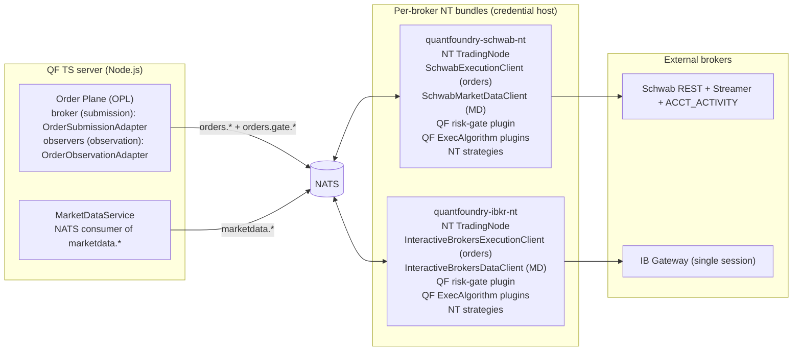

# Broker & Market-Data Integration — Component TDD

Parent: [TRADING-SYSTEM-TDD.md](../TRADING-SYSTEM-TDD.md). Companions: [Order Plane](order-execution.md), [Order Flow](order-flow.md), [Risk Gate](risk-gate-architecture.md), [Data Plane](../data/data-plane.md).

---

## Overview

Magpie is **broker-agnostic** — a broker is a plug-in module that conforms to a uniform pattern. The TS server is the policy / risk / audit / GUI layer; broker access (orders + market data) flows through per-broker **NautilusTrader bundles** that run on a credential host. The TS server reaches them over NATS — typed JSON, request/reply for RPC, publish/subscribe for streams. The TS server never holds broker credentials and never speaks broker protocols directly.

The uniform per-broker bundle:

- One NT `TradingNode`.
- One NT execution client (`LiveExecutionClient` for Schwab — a QF-authored client; `InteractiveBrokersExecutionClient` for IBKR — NT-native).
- One NT market-data client. IBKR uses NT's `InteractiveBrokersDataClient` directly; Schwab uses a QF-authored `SchwabMarketDataClient` that wraps the bespoke Schwab REST + Streamer + auth code in NT's data-client interface.
- The QF risk-gate plugin (NT `RiskEngine` slot — intercepts every `submit_order`).
- The QF `ExecAlgorithm` plugins (catalog deliberately empty today; default = NT pass-through).
- Every NT strategy bound to that broker, as in-process plugins.

The architectural commitments:

- **All broker MD flows through NT data clients** inside the broker bundle. NT strategies consume via NT's `DataEngine` (uniform NT-native data API). The bundle's MD client also publishes to NATS `marketdata.*` subjects so the TS-side `MarketDataService` can consume the same data for non-NT use (Order Plane pre-submit quote checks, Portfolio & Risk Greeks recompute, GUI live displays).
- **The Order Plane (OPL) is broker-agnostic.** Operator manual entry from the GUI submits through whichever broker the portfolio is configured against — Schwab and IBKR are both first-class. OPL's `nt-bridge.ts` adapter is the TS-side wire; the bundle's NT execution client is the receiver. Adding a new broker is "ship a new NT execution client + MD client in a new bundle, list it in `config/brokers.json`" — no OPL or service-layer code change.
- **The TS-side `BrokerAdapter` is split** into a submission half and an observation half. Every broker bundle implements both; nothing is observation-only by design.
- **No cross-broker fallback.** Each broker bundle is independent; if it's unavailable, that broker's positions can't be traded or re-Greek'd until it recovers. The TS-side service layer surfaces this as `BridgeUnavailableError`, not a silent failover.

In prod, each broker bundle is one Python process. See [strategy-deployment-topology.md](strategy-deployment-topology.md) for launcher + lifecycle.

---

## 1. Runtime topology



The TS server and per-broker bundles communicate exclusively over NATS — no shared filesystem, no PyO3, no HTTP. NATS is already a hard dependency of QF; the bundles add subjects, not infrastructure. Each bundle is one Python process that holds its broker's credentials.

---

## 2. Per-broker capability matrix

| Broker | Order submission                       | Order observation                     | Market data                       |
| ------ | -------------------------------------- | ------------------------------------- | --------------------------------- |
| Schwab | NT `SchwabExecutionClient`             | (same client, fans exec reports back) | NT `SchwabMarketDataClient`       |
| IBKR   | NT `InteractiveBrokersExecutionClient` | (same client, fans exec reports back) | NT `InteractiveBrokersDataClient` |

Every broker bundle implements submission + observation + market data with the same NT-client pattern. Adding a third broker is: ship a new NT bundle with that broker's NT execution + MD clients, drop it in `config/brokers.json`, restart. No TS-side service or OPL code change.

Paper-vs-live is a **deploy-target / credentials distinction** handled by each bundle's auth, not a separate code path. A paper-credentialed Schwab bundle submits to Schwab's paper REST endpoints; the TS-side adapter doesn't know the difference. See [order-execution.md §3](order-execution.md#3-brokeradapter-interface).

Operator-initiated trades made directly in the broker's own UI / TWS (outside both the gate path and the OPL path) are intentionally invisible to QF's audit chain. Reconciliation diffs broker positions against `audit_orders`; truly out-of-band activity surfaces only as a reconciliation drift event (see [portfolio-risk-engine.md §3](portfolio-risk-engine.md#3-position-reconciliation)).

---

## 3. NATS subject grammar

Three subject families. The system-wide canonical index of every subject (including signals and any future families) lives in [nats-subjects.md](nats-subjects.md); this section documents only the broker-adjacent subjects with direction, pattern, and payload pointer.

### 3.1 Orders (OPL ↔ broker bridge)

| Subject                        | Direction   | Pattern       | Purpose                                            |
| ------------------------------ | ----------- | ------------- | -------------------------------------------------- |
| `orders.submit.<broker>`       | TS → Python | request/reply | Submit a new order from OPL                        |
| `orders.cancel.<broker>`       | TS → Python | request/reply | Cancel an existing order                           |
| `orders.status.<broker>`       | TS → Python | request/reply | Query current status (restart-reconciliation hook) |
| `orders.positions.<broker>`    | TS → Python | request/reply | Query positions (restart-reconciliation hook)      |
| `orders.exec_reports.<broker>` | Python → TS | pub/sub       | Execution reports — fills, cancels, rejections     |

Every broker bundle uses every subject — Schwab and IBKR are symmetric.

### 3.2 Risk gate (NT plugin ↔ QF gate evaluator)

| Subject                | Direction   | Pattern       | Purpose                                                                                           |
| ---------------------- | ----------- | ------------- | ------------------------------------------------------------------------------------------------- |
| `orders.gate.<broker>` | Python → TS | request/reply | Strategy `submit_order` interception. See [risk-gate-architecture.md](risk-gate-architecture.md). |

Emitted by the QF risk-gate `RiskEngine` plugin inside the per-broker TradingNode on every strategy submission. The TS-side handler is the unified `canExecute()` / gate-evaluator described in [portfolio-risk-engine.md](portfolio-risk-engine.md).

### 3.3 Market data (MD bridge ↔ TS MD service)

**RPC (request/reply):**

| Subject                                    | Direction   | Purpose                                       |
| ------------------------------------------ | ----------- | --------------------------------------------- |
| `marketdata.rpc.quote.<broker>`            | TS → Python | Snapshot top-of-book                          |
| `marketdata.rpc.expirations.<broker>`      | TS → Python | Available option expirations for an underlier |
| `marketdata.rpc.chain.<broker>`            | TS → Python | Option chain for one expiration               |
| `marketdata.rpc.historical_chain.<broker>` | TS → Python | Option chain as-of a past date                |
| `marketdata.rpc.candles.<broker>`          | TS → Python | OHLCV bars (daily or minute)                  |

**Streaming (publish; no reply expected):**

| Subject                               | Direction   | Purpose                    |
| ------------------------------------- | ----------- | -------------------------- |
| `marketdata.quotes.<broker>.<symbol>` | Python → TS | Per-symbol quote ticks     |
| `marketdata.trades.<broker>.<symbol>` | Python → TS | Per-symbol trade prints    |
| `marketdata.book.<broker>.<symbol>`   | Python → TS | Per-symbol L2 book updates |

**Liveness:**

| Subject                         | Direction   | Purpose                                             |
| ------------------------------- | ----------- | --------------------------------------------------- |
| `marketdata.<broker>.heartbeat` | Python → TS | Every 10s; includes last upstream success timestamp |

`<broker>` ∈ {`schwab`, `ibkr`}. `<symbol>` is the canonical QF symbol (`EQ:AAPL`, `OPT:SPY:2026-06-20:C:500`, `FUT:CLN6`).

---

## 4. Wire format

Schemas live in TS (`src/types/order.ts`, `src/types/market-data.ts`). Python mirrors are maintained in the bridge packages and validated against shared JSON fixtures.

### 4.1 Order types

`OrderIntent` — defined in [order-execution.md §1](order-execution.md#1-orderintent-schema). The `intent_id` (ULID) is the cross-runtime correlation token.

**Broker-side idempotency (QF-310).** `OrderIntent.client_order_id` (optional; OPL derives `= intent_id` when absent) and `Order.client_order_id` (required; populated by OPL at order construction) carry the broker's native idempotency contract. The Python NT bridge forwards `client_order_id` on `orders.submit.<broker>` to the broker's REST `clientOrderId` field (Schwab) or the equivalent IBKR primitive. A 504-window retry (broker accepted the order but the reply was lost) carries the same `client_order_id` on the second attempt; the broker recognizes the duplicate and returns the existing `broker_order_id` rather than creating a new order. `client_order_id` is INSERT-only on `audit_orders` — retries that create a new `order_id` reuse the same `client_order_id` (deterministic from `intent_id` at v1), giving the append-only audit chain a record of each attempt and the broker a stable dedup key across them. See [cross-cutting.md §5](cross-cutting.md#5-database-schema-consolidated) for the column.

`BrokerExecReport`:

```ts
interface BrokerExecReport {
  broker: "schwab" | "ibkr";
  broker_order_id: string;
  event: "submitted" | "fill" | "partial_fill" | "cancelled" | "rejected";
  ts: string; // ISO 8601 from the bridge
  fill?: {
    fill_id: string; // ULID assigned at the bridge
    price: number;
    quantity: number;
    fees: number | null;
  };
  rejection_reason?: string;
  intent_id: string | null; // null = NT-internal order with no QF audit_orders row
}
```

`BrokerOrderStatus`:

```ts
interface BrokerOrderStatus {
  broker_order_id: string;
  status: "working" | "filled" | "partial_fill" | "cancelled" | "rejected" | "unknown";
  filled_quantity: number;
  average_fill_price: number | null;
  rejection_reason: string | null;
}
```

### 4.2 Market-data types

`Quote`, `Contract`, `Candle`, `TradePrint`, `L2Level`, `L2Book`, `DataMeta` — defined in `src/types/market-data.ts`. RPC reply envelopes carry either a typed payload or an error frame:

```ts
interface ErrorFrame {
  error: { code: ErrorCode; message: string };
}

type ErrorCode =
  | "not_supported"
  | "upstream_unavailable"
  | "auth_failed"
  | "rate_limited"
  | "internal";
```

### 4.3 Correlation

- **Orders:** `OrderIntent.intent_id` is included in every `orders.submit.*` request and echoed in every `BrokerExecReport`. NT-internal orders carry `intent_id: null` and the TS observation handler drops them on the floor.
- **MD RPC:** NATS request/reply correlation via the `Reply-To` inbox is sufficient; no per-request ID needed.
- **MD streams:** the subject path itself (`marketdata.quotes.schwab.OPT:SPY:…`) is the identifier; there is no per-tick correlation ID.
- **Cross-runtime trace IDs:** the standard `X-Correlation-Id` log-propagation pattern carries on NATS message headers. Bridges propagate it bidirectionally so a single trace spans `OPL.submit → bridge → broker → exec report → bridge → OPL.onFill → audit write`.

---

## 5. TS-side adapter contracts

### 5.1 Order adapter — split into submission + observation

```ts
interface OrderSubmissionAdapter {
  readonly name: string;
  available(): Promise<boolean>;
  submitOrder(intent: OrderIntent): Promise<{ broker_order_id: string }>;
  cancelOrder(broker_order_id: string, reason: string): Promise<void>;
}

interface OrderObservationAdapter {
  readonly name: string;
  available(): Promise<boolean>;
  getOrderStatus(broker_order_id: string): Promise<BrokerOrderStatus>;
  getPositions(): Promise<BrokerPosition[]>;
  onFill(callback: (fill: Fill) => void): void;
  onRejection(callback: (rej: BrokerRejection) => void): void;
}
```

OPL wiring (per portfolio):

```ts
interface OrderPlaneDeps {
  brokers: Record<BrokerId, OrderSubmissionAdapter & OrderObservationAdapter>;
  // One entry per enabled broker bundle. The portfolio config names
  // which broker a given portfolio's operator manual entries submit to;
  // observation flows from every enabled broker into the same audit
  // writer path.
}
```

Each enabled broker contributes both halves — submission for operator manual entry routed to that broker, observation for fills + cancellations originating either from QF (OPL or NT strategies) or out-of-band (operator trades placed directly in the broker's UI). The audit observer dedups against `order_id` so OPL-originated fills and the corresponding NT-MessageBus echo don't double-count (see [order-flow.md §4.3](order-flow.md#43-observer-dedup-contract)).

### 5.2 Market-data service — NATS consumer

The TS-side `MarketDataService` is a NATS consumer of `marketdata.*` subjects. It is not a stack of swappable adapters with fallback — each broker bundle's NT MD client is the single source for that broker's data, and there is no cross-broker fallback (see §1 — broker bundles are independent).

Interface lives in [data-plane.md §2.1](../data/data-plane.md#21-service-interface):

```ts
interface MarketDataService {
  getQuote(broker: BrokerId, symbol: string): Promise<Quote>;
  getExpirations(broker: BrokerId, underlier: string): Promise<string[]>;
  getChain(broker: BrokerId, underlier: string, expiration: string): Promise<Contract[]>;
  getCandles(broker: BrokerId, symbol: string, opts: CandleOpts): Promise<Candle[]>;
  subscribeQuotes(broker: BrokerId, symbols: string[], cb: QuoteCallback): Subscription;
  subscribeTrades(broker: BrokerId, symbols: string[], cb: TradeCallback): Subscription;
  getFreshness(broker: BrokerId, symbol: string): FreshnessState;
}
```

Every method takes an explicit `broker` parameter — consumers ask for "Schwab's quote for AAPL" or "IBKR's chain for SPY". A request to a broker whose bundle is unavailable (no heartbeat in `heartbeat_stale_ms`, default 30s) rejects with `BridgeUnavailableError` rather than silently routing to another broker.

When a broker's NT MD client doesn't natively expose a method (e.g. historical chain RPC), the bundle responds with the `not_supported` error frame (§4.2) and the TS-side method rejects. Historical chain reads happen against MinIO/Parquet via the offline collection pipeline (see [collection.md](../data/collection.md)), not against live broker MD.

---

## 6. Configuration

### 6.1 `config/brokers.json` (orders)

Per-broker block with `enabled`, NATS subject prefix (default `<broker>`), and per-operation timeouts. The TS-side `brokers-config.ts` loader is the canonical reader. OPL refuses to start a portfolio whose broker is enabled in config but whose bundle `available()` returns false at boot — this is intentional; silent failure on the order path is dangerous.

### 6.2 `config/data-plane.json` `live` block

Live broker MD config lives in [data-plane.md §6.3](../data/data-plane.md#63-config-configdata-planejson):

```jsonc
{
  "live": {
    "nats_url": "nats://localhost:4222",
    "rpc_timeout_ms": 5000,
    "bridge_heartbeat_timeout_ms": 30000,
    "cache": {
      "quote_ttl_ms": 5000,
      "expirations_ttl_ms": 3600000,
      "chain_ttl_ms": 30000,
      "candles_ttl_ms": 60000,
      "max_entries": 10000,
    },
    "quality_gate": {
      "portfolio_risk_engine": { "max_quote_age_ms": 120000 },
      "order_plane": { "max_quote_age_ms": 30000 },
    },
  },
}
```

Cache keys in the MarketDataService LRU are namespaced by `(broker, symbol, method)` so concurrent Schwab + IBKR consumers don't collide.

---

## 7. Failure handling

### 7.1 Order RPC timeouts

| RPC                                              | Default | Configurable in                            |
| ------------------------------------------------ | ------- | ------------------------------------------ |
| `orders.submit.*`                                | 5s      | `config/brokers.json` `timeouts.submit_ms` |
| `orders.cancel.*` / `.status.*` / `.positions.*` | 2s      | (same loader)                              |

On `orders.submit.*` timeout: the TS adapter throws on `submitOrder`. OPL transitions the order to `submission_failed`; the existing retry path (3 attempts, exponential backoff) applies — see [order-execution.md §3](order-execution.md#3-brokeradapter-interface).

### 7.2 MD RPC timeouts (default in §6.2)

On timeout: the MarketDataService rejects the call with a timeout error. No retry inside the service — the caller (OPL pre-submit check, Greeks recompute, GUI panel) handles the failure per their own policy. No cross-broker fallback: a Schwab MD timeout doesn't route to IBKR.

### 7.3 Common failures

| Failure                                     | TS-side surface                        | Handling                                                                                                                                             |
| ------------------------------------------- | -------------------------------------- | ---------------------------------------------------------------------------------------------------------------------------------------------------- |
| Broker bundle down at startup               | adapter `available()` returns `false`  | OPL refuses to start the affected portfolio; MarketDataService surfaces `BridgeUnavailableError` to callers. Visible to operator.                    |
| Reply payload validation fails              | adapter throws (orders) / rejects (MD) | Logged; metric incremented. Orders → `submission_failed`.                                                                                            |
| Exec report for unknown `broker_order_id`   | observation handler logs and drops     | No audit write; `broker_exec_report_orphan_total` increments.                                                                                        |
| Exec report for `intent_id: null`           | observation handler drops silently     | NT-internal-orders case; expected behavior.                                                                                                          |
| MD heartbeat stale (> `heartbeat_stale_ms`) | service marks `bridge_alive=false`     | RPC calls reject with `BridgeUnavailableError`; streaming subscriptions stay registered and resume when heartbeats return. No cross-broker fallback. |
| Error frame from MD bundle                  | service rejects the call + logs        | Caller handles per-method (e.g. OPL rejects manual order submit). Codes per §4.2.                                                                    |

---

## 8. Restart reconciliation (order side)

OPL on boot rehydrates open orders from `audit_orders` (DuckDB). For every order in `submitted` / `partial_filled` / `submission_failed` state, OPL calls `getOrderStatus(broker_order_id)` on the relevant observation adapter and reconciles:

| QF state                    | Broker state                           | Action                                                                                                           |
| --------------------------- | -------------------------------------- | ---------------------------------------------------------------------------------------------------------------- |
| `submitted`                 | `working`                              | Leave alone — both agree.                                                                                        |
| `submitted`                 | `filled` / `partial_fill`              | Synthesize the missing `audit_fills` row from the status reply; transition order to `filled` / `partial_filled`. |
| `submitted`                 | `cancelled` / `rejected`               | Transition with `cancel_reason: "reconciled_at_startup"` or echo the broker's rejection reason.                  |
| `submitted`                 | `unknown`                              | Leave in `submitted`; alert via `broker_reconcile_unknown_total`.                                                |
| order missing in QF's chain | (n/a — QF doesn't iterate broker side) | Invisible to QF. See §2 — out-of-band activity surfaces only as a reconciliation drift event.                    |

MD has no equivalent reconciliation surface — caches refill from the next request, and heartbeats re-establish liveness on bridge restart.

---

## 9. Bundle composition

Every broker bundle follows the same shape — one Python process, one `TradingNode`, broker-specific NT clients plus uniform QF plugins.

**IBKR bundle.** IB Gateway permits one TWS-API client per client-id; the IBKR execution client and MD client therefore share one TradingNode (a second client-id would conflict). Composition:

- One `TradingNode`.
- One `InteractiveBrokersExecutionClient` — submits orders + fans exec reports.
- One `InteractiveBrokersDataClient` — MD source.
- The QF risk-gate plugin loaded as the `RiskEngine`.
- The QF `ExecAlgorithm` plugins (catalog deliberately empty today).
- Every NT strategy bound to IBKR (cl_scalp, soxx-rotation, …) as strategy-plugin co-tenants.

**Schwab bundle.** No single-session constraint (Schwab orders go through REST, MD through the streamer), but the bundle shape is identical for uniformity. Composition:

- One `TradingNode`.
- One `SchwabExecutionClient` (QF-authored NT execution client wrapping the Schwab REST + ACCT_ACTIVITY auth).
- One `SchwabMarketDataClient` (QF-authored NT MD client wrapping the Schwab REST + Streamer + auth code).
- The QF risk-gate plugin loaded as the `RiskEngine`.
- The QF `ExecAlgorithm` plugins.
- Every NT strategy bound to Schwab as strategy-plugin co-tenants.

Both clients share a single `SchwabAuth` helper (token rotation, refresh-token persistence — see [data/sources.md](../data/sources.md#schwab)).

In both bundles, all actors subscribe to the node's `MessageBus`. NT strategies consume broker MD through NT's `DataEngine`, fed by the in-bundle MD client. The same MD client publishes to NATS `marketdata.*` subjects so the TS-side `MarketDataService` can consume the same data for non-NT use. Operators launch each bundle via the per-broker launcher (see [strategy-deployment-topology.md](strategy-deployment-topology.md)).
