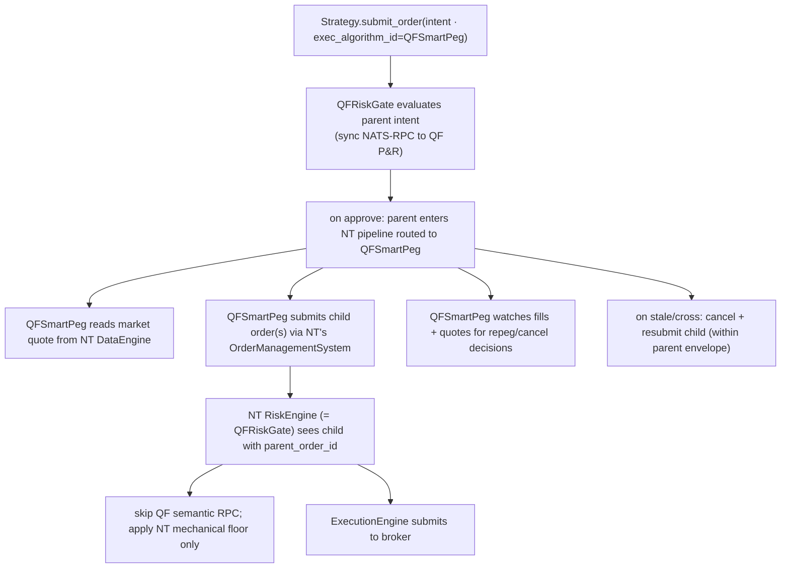
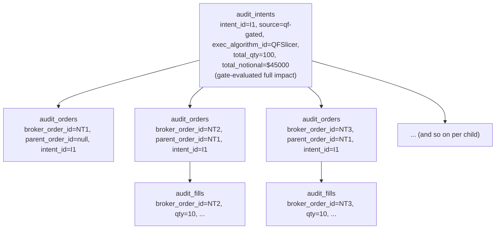

# ExecAlgorithms — Component TDD

Parent: [TRADING-SYSTEM-TDD.md](../TRADING-SYSTEM-TDD.md). Companions: [risk-gate-architecture.md](risk-gate-architecture.md), [strategy-deployment-topology.md](strategy-deployment-topology.md), [broker-integration.md](broker-integration.md).

## 1. Purpose

The risk gate ([risk-gate-architecture.md](risk-gate-architecture.md)) decides **whether** a strategy intent is allowed. This doc decides **how** an approved intent becomes one or more concrete orders on the wire — pricing (peg-to-mid / peg-to-touch / snap-to-tick), repeg-on-stale, working-order TTL, slicing, time-distribution. With strategies running inside NT, the natural home for this logic is NT's `ExecAlgorithm` plugin slot.

This is QF's analog of the risk-gate work: another supported NT plugin point, owned by QF, parallel to (but independent of) the gate.

## 2. Position in the stack

`ExecAlgorithm` is an NT-supported extension point with the same plugin pattern as `RiskEngine`. The bundle launcher registers algos in `LiveTradingNodeConfig.exec_algorithms`:

```python
config = LiveTradingNodeConfig(
    trader_id="QF-PROD",
    strategies=[...],
    risk=RiskEngineConfig(risk_module_path="quantfoundry_risk_gate.gate:QFRiskGate", ...),
    exec_algorithms=[
        ImportableExecAlgorithmConfig(
            exec_algorithm_path="quantfoundry_exec_algos.smart_peg:QFSmartPeg",
            config={...},
        ),
        # ... more algo entries ...
    ],
    ...
)
```

Strategies select per order via the intent's `exec_algorithm_id` and `exec_algorithm_params` fields:

```python
strategy.submit_order(
    LimitOrder(
        instrument_id=...,
        order_side=OrderSide.BUY,
        quantity=Quantity(100),
        price=Price(450.00),                              # the "indicative" price
        exec_algorithm_id=ExecAlgorithmId("QFSmartPeg"),  # opt in
        exec_algorithm_params={"peg_to": "mid", "stale_ms": 500},
    )
)
```

If `exec_algorithm_id` is omitted, NT's default behavior applies (submit the order as the strategy shaped it, no algo wrapping). This is the current state of the system and remains the fallback.

## 3. Flow



The strategy sees a single `submit_order` call succeed or fail; if the algo splits one intent into ten children, the strategy doesn't notice (it queries `cache.position_for_strategy()` for its position view, not its own private submission log).

## 4. Per-intent evaluation (not per-order)

This is the load-bearing decision around the gate + algo interaction. **The gate evaluates parent intents at full impact, once.** Child orders submitted by the algo do not re-trigger the gate's QF semantic checks; they pass NT's mechanical floor only.

Rationale: a sliced order whose children get partially rejected mid-execution is worse than the gate either fully approving or fully rejecting the parent. Evaluating each child would re-introduce the partial-fill-then-blocked failure mode this architecture is meant to prevent. So the gate prices the worst-case impact at the parent — full quantity, full notional, full delta — and the algo gets a clean envelope to work within.

`QFRiskGate._check_order` distinguishes by `parent_order_id`:

| Order shape                          | Gate behavior                                                                                                                           |
| ------------------------------------ | --------------------------------------------------------------------------------------------------------------------------------------- |
| Parent intent (no `parent_order_id`) | Full QF semantic eval via NATS-RPC + NT mechanical floor (rate, notional, account balance). Writes `audit_intents` row source=qf-gated. |
| Child of approved parent             | NT mechanical floor only. No QF RPC. No new `audit_intents` row — the child's `audit_orders` row references the parent's `intent_id`.   |

This keeps algo bugs (e.g. spammed cancel-replaces) bounded by NT's per-order safety floor without re-litigating QF's portfolio-shape decisions every child.

## 5. Strategy view of algo'd orders · stateless algos · no recovery contract

**During normal operation,** the strategy is not blind to what the algo did on its behalf. NT propagates the parent intent's `strategy_id` down to every child order the algo submits, so the strategy receives the standard `on_order_accepted` / `on_order_filled` / `on_order_canceled` / `on_order_rejected` callbacks for each child as they progress. The strategy can confirm that an order was placed, partially filled, fully filled, or canceled by listening to these callbacks (and / or querying `cache.position_for_strategy()` for the resulting position state) — exactly the same surface it would use if it had submitted directly without an algo. Cooldown timers, post-fill state mutations, and signal half-life clocks key off these callbacks and work unchanged whether the parent was algo-wrapped or NT pass-through.

**On TradingNode restart,** algos persist **no policy state**. No last-peg-price files, no TTL deadlines on disk, no repeg counters in DuckDB. The restart sequence:

1. NT reconnects to the broker and recovers open orders into its in-memory cache (standard NT behavior — these orders live with the broker, not the algo process).
2. Any algo that was managing those orders is gone, with no state to resume from.
3. The strategy that submitted the parent intent sees positions and working orders in `cache.position_for_strategy(...)`. It decides: trust the open orders to fill on their own, or cancel-and-resubmit fresh.
4. If the strategy cancels and resubmits, the new intent goes through the gate again (fresh semantic eval) and either gets the same or a different algo handling it from scratch.

Why this is OK: by the time the algo restarts, market conditions have shifted enough that resuming partial policy state is more dangerous than restarting clean. Recovery is a **strategy-level decision** — strategies know whether their intent is still wanted; algos don't. The algo layer becomes pure policy-as-code with zero persistence contract.

Consequence: algos can be replaced or upgraded in place (hot-swap via NT's `add_exec_algorithm`/`stop_exec_algorithm`) without state-migration concerns. Operator restarts the bundle, working orders survive at the broker, strategies recover by inspecting reality.

## 6. Multi-leg orders

A multi-leg order (e.g. an iron condor) is **one intent** and gets **one gate evaluation**. The strategy submits an `OrderList` or `OptionStrategy` order through NT's native multi-leg support; the gate evaluates the package's combined risk impact; if approved, the algo (or NT default) routes it through NT's multi-leg execution.

A strategy that prefers four single-leg orders (e.g. for partial-fill tolerance) submits four separate intents and gets four gate evaluations — same as in the pre-multi-leg world. Either pattern is supported; the gate doesn't enforce one or the other.

## 7. Catalog

Empty. The default behavior is NT's pass-through: strategies submit fully-specified orders without `exec_algorithm_id` and NT routes them straight through `RiskEngine` → `ExecutionEngine` → broker. This is the no-cost fallback for strategies whose execution model is "submit a single order and let it work."

When patterns repeat across strategies, the candidate algos are (none staffed):

- **`QFSmartPeg`** — peg-to-mid or peg-to-touch (configurable), repeg when quote drifts > `stale_ms`, cancel on cross, TTL expiry.
- **`QFSlicer`** — split parent qty into N children by size policy; serial or parallel.
- **`QFTwap`** — time-weighted slicing over a configurable window.
- **`QFIceberg`** — show small visible qty, reload on fill.

These get staffed when a concrete strategy need shows up that the NT pass-through can't satisfy and that's not better handled by reshaping the strategy's submission. Until then, no catalog work.

## 8. Strategy responsibility boundary

Strategies decide **what**: instrument, side, quantity, a target / limit price, when to enter, when to exit, cooldowns and signal-state. They do not decide **how** to work that order — pricing policy, repeg cadence on stale quotes, slicing, time-distribution, working-order TTL, cancel-on-cross logic. Those belong to ExecAlgorithms.

| Strategy responsibility               | ExecAlgorithm responsibility                                         |
| ------------------------------------- | -------------------------------------------------------------------- |
| Signal → trade decision               | Translate that decision into one or more concrete orders on the wire |
| Instrument, side, quantity            | Pricing (peg-to-mid, peg-to-touch, snap-to-tick)                     |
| Target price as a starting indication | Repeg cadence on stale quotes                                        |
| When to enter and exit                | Slicing / time-distribution                                          |
| Cooldowns and signal-state            | Working-order TTL, cancel-on-cross, partial-fill handling            |

If a strategy needs an execution behavior the catalog doesn't have, the answer is to **extend the catalog** (file a new algo), not push pricing / repeg / working-order logic into the strategy's `on_bar` / `on_quote` handlers. In-strategy execution-engine behavior makes strategy code harder to reason about, splits ownership of execution mechanics across strategies, and re-introduces the per-strategy duplication this layer exists to eliminate.

The catalog default (NT pass-through, no `exec_algorithm_id`) remains the right choice for strategies whose execution model is "submit a single order and let it work."

## 9. Audit chain

One gate-approved intent maps to one `audit_intents` row. All child orders submitted by the algo within that intent reference the same `intent_id` in their `audit_orders` rows; children also carry NT's `parent_order_id` so the wire-level fan-out is reconstructable:



The Trade Inspector renders the full tree from a fill_id by walking `audit_fills → audit_orders → (parent_order_id chain) → audit_intents`. Each child order IS the audit of one pricing decision; the chain is self-documenting.

## 10. Post-fill risk handling

The gate evaluates the parent intent at full impact once (§4), before any child orders execute. After children fill — partially or fully — the gate does not re-evaluate the originating intent. The worst-case envelope at the parent is the binding constraint; realized fills can only land at ≤ that envelope:

- **Notional and quantity.** A fill at the parent's limit price is ≤ the gate-approved notional; a fill at a better price further reduces realized risk. Partial fills produce a position smaller than approved. None of these change the gate's decision retroactively.
- **Position-level risk** (portfolio-wide notional, sector concentration, Greek exposure, strategy drift) is observed continuously by [portfolio-risk-engine.md](portfolio-risk-engine.md), which consumes `audit_fills` as they land. If a fill pushes a portfolio metric across a threshold, the response is portfolio-level (strategy halt, position-flatten alert) — not a retroactive re-evaluation of the parent intent that produced the fill.
- **Broker-side slippage outside the limit** is the one case where the post-trade price could diverge from gate assumptions in a worsening direction. Treatment lives in [broker-integration.md](broker-integration.md) (broker-specific fill validation), not in the algo or gate layer.

Strategy-level cooldowns, signal-state updates, and position-based exit logic key off the strategy's `on_order_filled` callbacks (§5), which fire per-child regardless of which algo handled the parent.

## 11. What this doc does not cover

- **Specific algo behavior.** No catalog yet (§7).
- **Cross-strategy algo coordination** (e.g. one algo dispatching across multiple strategies' intents to reduce market impact). Out of scope at this design stage; algos handle one parent intent at a time.
- **Backtest algo behavior under NT `BacktestEngine`.** Algos load identically in backtest if registered in `BacktestEngineConfig.exec_algorithms`, but the closes-only-on-gate-unavailable mode is not relevant (no gate in backtest). Catalog work will spec backtest behavior per algo when written.
- **Algo-internal observability.** Each algo's per-order metrics, latency budgets, and structured-log events get speced when the algo gets speced. Cross-cutting log conventions still apply per [observability.md](observability.md).
- **NT version compatibility.** The `ExecAlgorithm` API has evolved across NT releases; the bundle's `nautilus-trader` pin in `research/pyproject.toml` determines which signature surface is available. Tracked under dependency policy ([dependency-admission.md](../dependency-admission.md), [strategy-deployment-topology.md §5](strategy-deployment-topology.md#5-dependency-policy)).
