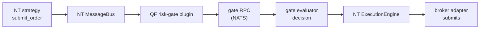
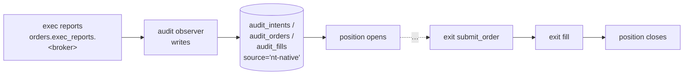
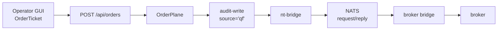
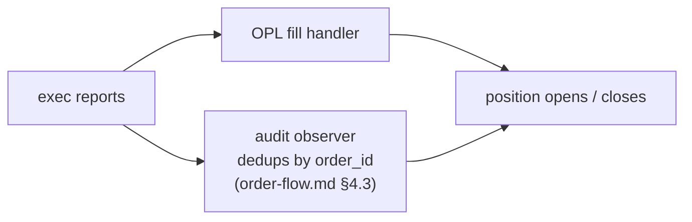

# Observability — Framework TDD

Parent: [TRADING-SYSTEM-TDD.md](../TRADING-SYSTEM-TDD.md). Companions: [broker-integration.md](broker-integration.md) (bundle topology), [strategy-deployment-topology.md](strategy-deployment-topology.md).

---

## 1. Purpose & acceptance test

Observability in this system has one primary user-facing requirement: **an operator must be able to reconstruct the full course of events for a single position lifecycle by querying a single correlation ID.**

There are two canonical trade-origin flows, and both must reconstruct cleanly under one `correlation_id`.

**NT-native flow** (strategy-initiated):



_…then `broker adapter submits` →_



**QF-mediated flow** (operator manual entry, operator manual liquidation, framework-fired exit rules — see [order-execution.md §5](order-execution.md#5-position-exit-controls)):



_…then `broker` exec reports fan out to two consumers and re-converge:_



Every event above is emitted by one of the components in [§7](#7-component-responsibilities), with the same `correlation_id`. A successful query — `correlation_id = X` against the central log destination — returns the full timeline of one position's life, in order, across both runtimes (TS-side QF server, Python-side NT bundles). The two flows share the same audit chain and are reconstructed by the same single-ID query.

This is the **framework's acceptance test**. An NT strategy's `submit_order` (or a `POST /api/orders` for operator manual entry) produces a fill; the audit chain in DuckDB joins cleanly across `audit_intents → audit_orders → audit_fills`; and the same `correlation_id` shows up on every event from the originating `gate.evaluated` through the resulting `fill.received` and `position.opened`.

Anything that breaks single-ID traceability is a framework bug. Anything that adds a new event type without conforming to the schema in [§3](#3-common-json-log-schema) is a framework bug.

---

## 2. Observable action categories

The framework recognises several categories of observable action. Each component owns one or more categories; component TDD §10 (Observability) lists the specific event names and payloads.

| Category                   | Primary owner                                                                              | Examples (illustrative, not authoritative)                                 |
| -------------------------- | ------------------------------------------------------------------------------------------ | -------------------------------------------------------------------------- |
| Data ingestion             | TS-side market-data adapters (`server/market-data/`)                                       | `ingest.started`, `ingest.completed`, `ingest.failed`                      |
| Strategy evaluations       | NT strategies inside per-broker bundles                                                    | `strategy.evaluated`, `strategy.intent_emitted`                            |
| Order intents              | [risk-gate-architecture](risk-gate-architecture.md), [order-execution](order-execution.md) | `intent.created`, `intent.routed`                                          |
| Risk decisions             | [portfolio-risk-engine](portfolio-risk-engine.md)                                          | `risk.evaluated`, `risk.reservation_acquired`                              |
| Broker interactions        | [order-execution](order-execution.md)                                                      | `broker.order_submitted`, `broker.order_acknowledged`, `broker.error`      |
| Fills                      | [order-execution](order-execution.md)                                                      | `fill.received`, `fill.persisted`                                          |
| Position-state transitions | [portfolio-risk-engine](portfolio-risk-engine.md)                                          | `position.opened`, `position.updated`, `position.closed`                   |
| Audit-chain writes         | All components                                                                             | `audit.signals_written`, `audit.intents_written`, etc.                     |
| System events              | All components                                                                             | `service.started`, `service.stopped`, `health.degraded`, `config.reloaded` |

Per-component event catalogs (exact names, payload fields, emission triggers, sampling) live in each component's `§10 Observability` section, not here. [portfolio-risk-engine.md §10](portfolio-risk-engine.md#10-observability) is the worked example.

---

## 3. Common JSON log schema

All events from all three runtimes emit the same top-level JSON shape:

| Field            | Type            | Required | Notes                                                                                                                                                                                        |
| ---------------- | --------------- | -------- | -------------------------------------------------------------------------------------------------------------------------------------------------------------------------------------------- |
| `ts`             | RFC 3339 string | yes      | UTC, microsecond precision (`2026-05-13T15:04:05.123456Z`). Server clock; never local tz.                                                                                                    |
| `level`          | enum            | yes      | One of `trace`, `debug`, `info`, `warn`, `error`. [§6.1](#61-log-levels) defines policy.                                                                                                     |
| `service`        | string          | yes      | Kebab-case component identifier (e.g. `"order-plane"`, `"gate-evaluator"`, `"nt-bridge"`, `"audit-observer"`, `"market-data"`, `"portfolio-risk-engine"`). One service per emitting process. |
| `correlation_id` | ULID string     | yes      | 26-char Crockford-base32 ULID. Propagation rules in [§4](#4-correlation-id-propagation).                                                                                                     |
| `event`          | string          | yes      | Dot-namespaced (`<category>.<action>`, e.g. `gate.evaluated`, `order.submitted`, `fill.received`, `position.opened`). Listed in the owning component's TDD.                                  |
| `payload`        | object          | yes      | Event-specific fields. Schema defined per-event in the component TDD. Always an object — never a bare value.                                                                                 |

Optional top-level fields, when present, follow these names exactly so log queries are uniform:

| Field       | When emitted                                                                                                                                                                        |
| ----------- | ----------------------------------------------------------------------------------------------------------------------------------------------------------------------------------- |
| `error`     | On `level >= warn`. Shape: `{type, message, stack?}`. `stack` only at `level = error`.                                                                                              |
| `host`      | Worker-emitted events that may run on multiple hosts. Free-form short string.                                                                                                       |
| `process`   | When the same `service` runs as multiple processes (e.g. parallelised backtest workers).                                                                                            |
| `parent_id` | When an event is logically the child of another (e.g. a risk evaluation triggered by an intent). The `parent_id` is the `correlation_id` of the parent — same value, semantic role. |

**No other top-level keys.** Anything component-specific lives inside `payload`. This rule exists so log-aggregation queries can rely on a fixed key set; new component fields don't bloat the index.

`level`, `service`, `event` are low-cardinality — safe to index. `correlation_id` is high-cardinality but the lookup key — also indexed. `payload.*` is not indexed by default; components that want a payload field indexed (e.g. `payload.portfolio`, `payload.position_id`) declare it in their TDD and the central destination's index config adds it.

---

## 4. Correlation-ID propagation

The `correlation_id` is a 26-char ULID generated at the **point of origin** — either (a) the NT-side risk-gate plugin when it makes the first RPC for a strategy intent (NT-native flow), or (b) the OPL HTTP handler on `POST /api/orders` for operator manual entry (QF-mediated flow). Both anchors generate a ULID and propagate it through every downstream hop, in-process and across the wire.

### 4.1 Generation

- Generated only when entering the system from outside (HTTP POST, NATS publish from an external worker, scheduled job firing).
- Generated using a ULID library matching the runtime: `ulid` (TS, already a dependency), `ulid-py` or stdlib equivalent (Python).
- ULIDs are time-ordered → log destinations can sort by `correlation_id` alone for chronological traversal of a single lifecycle.

### 4.2 Across-process propagation

The two processes that need to share an ID are the TS-side QF server and each per-broker Python NT bundle (see [broker-integration.md §1](broker-integration.md#1-runtime-topology) for the bundle topology). Both run on the same NATS bus.

| Transport           | Mechanism                                                                                                        |
| ------------------- | ---------------------------------------------------------------------------------------------------------------- |
| **NATS messages**   | Header: `X-Correlation-Id`. Set on every `publish`; read on every `subscribe`/`request`.                         |
| **HTTP requests**   | Header: `X-Correlation-Id`. Set on outbound, read on inbound. GUI WebSocket upgrade carries it as a query param. |
| **Database writes** | Audit-chain rows include `correlation_id` as a column. Joins on the chain reconstruct the lifecycle.             |

The QF risk-gate RPC (`orders.gate.<broker>`, see [risk-gate-architecture.md](risk-gate-architecture.md)) is the highest-traffic correlation-bearing path. The NT-side gate plugin emits the request with the strategy-supplied `correlation_id` in the header; the TS-side gate evaluator reads it, propagates it through its own logs and audit writes, and includes it on the reply. The full chain `strategy.submit_order → gate RPC → gate decision → broker submit → exec report → audit write` therefore shares one ID end-to-end.

A subscriber that receives a message **without** an `X-Correlation-Id` header must generate one and log a `system.correlation_id.missing` warn-level event with the inbound subject. The event is rare in steady state and would point at either a buggy emitter or a legitimate origin point.

### 4.3 In-process propagation

In-process plumbing varies by runtime:

- **TypeScript** (server / GUI). Use [`AsyncLocalStorage`](https://nodejs.org/api/async_context.html#class-asynclocalstorage) on the server. The logger reads from the current async context; explicit `correlation_id` arguments are accepted but discouraged once context is established.
- **Python** (per-broker NT bundles: risk-gate plugin, ExecAlgorithm plugins, NT strategies, MD bridges, broker bridges). Use [`contextvars.ContextVar`](https://docs.python.org/3/library/contextvars.html). The `magpie_logging` helper ([§5.2](#52-python--magpie_logging)) reads from the ContextVar; explicit `correlation_id=` kwargs are accepted and override.

### 4.4 Backtest mode

Backtests run inside `quant-optimizer` (QO) as a separate process; QO uses NT's `BacktestNode` and generates deterministic `correlation_id`s per replayed bar/event so a backtest is reproducible at the log-trace level. QF itself doesn't run backtests, but the audit-chain inspector accepts QO-generated `correlation_id`s the same as live ones.

---

## 5. Per-runtime helper packages

Two small packages, one per runtime. Their only job is to emit the schema in [§3](#3-common-json-log-schema), read/write the correlation ID per [§4](#4-correlation-id-propagation), and stay out of the way.

### 5.1 TypeScript — logger extension

The existing `server/logger.ts` is extended in place (single-file module; the prospective `server/logging/` directory split was not necessary). Caller API: `createLogger("service-name")` returns a `Logger` whose `.info/.warn/.error/.debug/.trace` methods take an event name and an optional payload object. The output JSON conforms to the framework schema, and `correlation_id` is auto-attached from `AsyncLocalStorage` when present.

```ts
import { createLogger, withCorrelationId } from "server/logger.js";

const logger = createLogger("order-plane");

await withCorrelationId(req.headers["x-correlation-id"] ?? newUlid(), async () => {
  logger.info("order.submitted", { intent_id, strategy_id, portfolio });
  // every nested log call inherits the correlation_id via AsyncLocalStorage
});
```

The `withCorrelationId` wrapper is mandatory at every external entry point (HTTP handler, NATS subscriber, scheduled job). Outbound calls (NATS publish, HTTP fetch) read the current value via `currentCorrelationId()` and propagate it on the wire as `X-Correlation-Id`. Thin `publishWithContext` / `fetchWithContext` wrappers automate that for the common cases.

### 5.2 Python — `magpie_logging`

Package at `research/magpie-logging/` (uv workspace member). Loaded by every Python process inside a per-broker NT bundle: the QF risk-gate plugin, the QF ExecAlgorithm plugins, every NT strategy bound to that broker, the broker bridge, and the MD bridge.

Public API:

```python
from magpie_logging import (
    get_logger,
    with_correlation_id,
    current_correlation_id,
)

logger = get_logger("schwab-bundle.risk-gate")

with with_correlation_id(correlation_id):
    logger.info("strategy.evaluated", strategy="soxx-rotation", intents=3)
    # kwargs auto-bundle into the `payload` field; reserved framework
    # keys (ts, level, service, correlation_id, event, error, payload)
    # stay at the top level.
```

Implementation: `structlog` configured with a five-stage processor chain — `_add_ts` (RFC 3339 UTC microsecond), `_add_level` (normalises structlog's `warning`/`critical` to the framework's `warn`/`error`), `_add_correlation_id` (reads the module-level ContextVar), `_coerce_event_and_payload` (promotes user kwargs into `payload`), `_ordered_json_renderer` (emits keys in framework order). The package owns one `ContextVar` instance; sub-modules must not introduce their own.

NATS subscribers in the bundle use a small `subscribe_with_context` wrapper that reads the `X-Correlation-Id` header into the ContextVar before invoking the handler. The bundle launcher installs the wrapper once at boot for every subject the bundle subscribes to.

### 5.3 Cross-runtime parity

The TS and Python helpers ship with a shared golden test: each runtime emits a fixed event (`event = "parity.smoke"`, `correlation_id = "01PARITYHARNESS0000000000A"`, `payload = {answer: 42, label: "fixed"}`) and the byte-level JSON output must be identical modulo `ts`. The test is the gate that prevents schema drift between runtimes.

- **Test**: [`research/tests/test_logging_parity.py`](../../research/tests/test_logging_parity.py) — pytest, shells out to both harnesses.
- **Python harness**: `research/magpie-logging/src/magpie_logging/parity_harness.py`, runnable as `python -m magpie_logging.parity_harness`.
- **TS harness**: `scripts/log-parity-harness.ts`, runnable as `npx tsx scripts/log-parity-harness.ts`.

Locally, a missing TS toolchain (no `node_modules/.bin/tsx`) skips the corresponding assertion with a clear reason. In CI, both are present and the test must pass.

---

## 6. Logging conventions

### 6.1 Log levels

| Level   | When to use                                                                                                                                                |
| ------- | ---------------------------------------------------------------------------------------------------------------------------------------------------------- |
| `trace` | Tight-loop emissions (Greek recompute per tick, per-bar strategy evaluation). Off by default in production.                                                |
| `debug` | Full lifecycle detail — every state transition, every risk evaluation. On in paper, off in live unless investigating.                                      |
| `info`  | Operationally interesting events the operator should be able to see in steady state. **Sampled** for high-frequency categories (see [§6.4](#64-sampling)). |
| `warn`  | Recoverable anomalies — rate limits hit, drift detected, retries. Always include an `error` field.                                                         |
| `error` | Unrecoverable failures — broker disconnects, schema violations, audit-chain breakage. Always include `error` with `stack`.                                 |

### 6.2 Event naming

`<category>.<action>` where category matches [§2](#2-observable-action-categories) and action is a past-tense verb or noun describing the observed state change:

- ✅ `gate.evaluated`, `order.submitted`, `order.acknowledged`, `fill.received`, `position.opened`, `position.closed`, `recon.drift`
- ❌ `gate_evaluated` (use dot), `orderSubmissionIncoming` (camelCase), `evaluating_gate` (gerund), `gate.evaluate` (verb)

Names are stable. Renaming an event is a breaking change to operators' saved queries and dashboards; treat it as one.

### 6.3 Payload rules

- `payload` is always an object, never a bare scalar or array.
- Keys inside `payload` are `snake_case`. (Top-level keys are kebab-case via the header carriers; payload keys are snake_case via the JSON body. This is an annoying split but matches the conventions of the upstream tools.)
- Money / quantity fields are emitted as numbers in their canonical unit (USD for prices, contracts for option qty, shares for equity qty) — never as formatted strings.
- Timestamps inside `payload` are also RFC 3339 UTC (`asof`, `event_time`, etc.).
- Don't include unbounded blobs (raw market data snapshots, full position-state dumps). If a debug investigation needs that, write a one-off `payload.dump_id` reference and store the blob in DuckDB / Parquet.

### 6.4 Sampling

Most categories emit at a low enough rate that every event is logged. Three exceptions need explicit sampling discipline:

- **Greek recomputes.** Per-position; can fire every market-data tick. Rule: every recompute at `debug`; every Nth at `info`, with N chosen so steady-state is ~1 `info` line per minute per portfolio. See [portfolio-risk-engine.md §10](portfolio-risk-engine.md#10-observability) for the worked example.
- **Per-bar strategy evaluations** in backtest mode. Backtests can evaluate millions of bars. Rule: `trace` per bar; `debug` on intent emission; `info` on fold/window boundaries.
- **NATS subscriber heartbeats.** `trace` only; `info` is reserved for state changes.

Sampling decisions live in the component TDD, not here. The framework's only rule: **metrics ([component §6](portfolio-risk-engine.md#6-metrics)) carry the unsampled counts.** Logs are for traceability; metrics are for rates.

### 6.5 Redaction

- Never log secrets (API keys, refresh tokens, bearer tokens). Per [cross-cutting.md §1](cross-cutting.md#1-auth--secrets).
- Never log raw broker order parameters that include account numbers. Account numbers are replaced with the internal `portfolio` identifier.
- Operator email addresses and external user identifiers are replaced with the internal `user_id` (ULID).

Redaction happens in the helper packages, not at the call site. Adding a field name to the redaction list is a config change in the TS logger or `magpie_logging`.

---

## 7. Component responsibilities

Every component TDD listed below carries a §10 (Observability) section that names its events, payloads, and emission triggers. The framework spec here doesn't enumerate them.

| Component                                                                 | Status of §10                                                                                                          |
| ------------------------------------------------------------------------- | -------------------------------------------------------------------------------------------------------------------- |
| [order-execution.md §6](order-execution.md#6-metrics)                     | **Done** — OrderPlane metrics.                                                                                        |
| [portfolio-risk-engine.md §10](portfolio-risk-engine.md#10-observability) | **Done** — worked example.                                                                                            |
| [greek-builder.md §6](greek-builder.md#6-observability)                   | **Done** — client-side surfaces + proposed central-stream event catalog.                                             |
| [order-flow.md §8](order-flow.md#8-observability)                         | **Done** — audit-chain write events across both flows (the acceptance-test path).                                    |
| [broker-integration.md §10](broker-integration.md#10-observability)       | **Done** — TS-side MD/order adapters + Python-bundle event families.                                                 |
| [risk-gate-architecture.md §10](risk-gate-architecture.md#10-observability)| **Done** — gate-evaluator event catalog; degraded-mode logging in [§4.3](risk-gate-architecture.md#43-observability-of-degraded-mode). |
| [drift-detector.md §8](drift-detector.md#8-observability)                 | **Done** — fast/slow-tier events + metrics.                                                                          |
| [write-jobs.md §12](write-jobs.md#12-observability)                       | **Done** — runner/handler events + metrics.                                                                          |
| [gui.md §11.5](gui.md#115-observability)                                  | **Done** — server-side WS-bridge events; browser-side deferred (same constraint as greek-builder).                   |
| [alerts.md §7](alerts.md#7-producer-callsites)                            | **Done** — the alert producer catalog _is_ this component's observability surface; log-channel events match the common schema ([alerts.md §12](alerts.md#12-cross-references)). |
| [exec-algorithms.md §11](exec-algorithms.md#11-what-this-doc-does-not-cover)| Deferred by design — per-algo catalog lands as each algo is speced; cross-cutting conventions still apply.           |
| [nats-subjects.md](nats-subjects.md)                                      | N/A — a subject registry, not an emitting component; subjects are the correlation-bearing transport, not log events. |
| [backtest-gate.md](backtest-gate.md)                                      | N/A — correlation handling covered in [§4.4](#44-backtest-mode); deterministic per-bar IDs, no live log stream.      |
| [cross-cutting.md §8](cross-cutting.md#8-observability-framework)         | **Done** — documents the framework itself (this doc's self-contained summary for cross-cutting reviewers).           |

---

## 7.5 Per-strategy attribution in a shared TradingNode

In the prod deployment, multiple NT strategies share one TradingNode process per broker ([strategy-deployment-topology.md §2](strategy-deployment-topology.md#2-the-two-live-deployment-modes)). Process-level resource accounting (free in dev where each strategy is its own process) no longer attributes anything to a specific strategy. Logs and metrics need to carry that attribution explicitly.

**Structured logs.** Free. Every NT event already carries `StrategyId`; the `magpie_logging` Python helper extracts it and emits the `strategy_id` field at the top level alongside `correlation_id`. Dashboards filter by `strategy_id` the same way they filter by `component`.

**Handler-latency attribution.** The bundle launcher installs a `StrategyTimingMiddleware` on the TradingNode's MessageBus that wraps each strategy's `on_bar` / `on_quote` / `on_trade_tick` / `on_event` handler with a stopwatch:

```python
# pseudo-code; installed by the per-broker bundle launcher
def wrap_handler(strategy_id: StrategyId, handler):
    async def wrapped(event):
        start = monotonic()
        try:
            return await handler(event)
        finally:
            elapsed_ms = (monotonic() - start) * 1000
            metrics.observe("nt_strategy_handler_duration_ms",
                            elapsed_ms,
                            labels={"strategy_id": str(strategy_id),
                                    "event_type": type(event).__name__})
            if elapsed_ms > BUDGET_MS:
                logger.warn("strategy.handler_over_budget",
                            strategy_id=strategy_id,
                            elapsed_ms=elapsed_ms,
                            event_type=type(event).__name__)
    return wrapped
```

Emits one log + one metric sample per handler call. The watchdog reads the same metric stream and can take action (alert, disable strategy) when the rolling-window p99 exceeds budget.

**Memory and CPU attribution.** Not free, not fully solved in v1. The pragmatic compromise:

- The launcher uses `tracemalloc` snapshots tagged with the currently-running `strategy_id` (set from the timing middleware's context). Sampled — not every event — to keep overhead bounded.
- CPU time is approximated from the handler-latency stream above; this misses background asyncio tasks the strategy spawns but catches the common case (heavy `on_bar` work).
- Process-level `psutil` metrics (`process_resident_memory_bytes`, `process_cpu_seconds_total`) still emit, just without per-strategy labels; they're the canary that triggers a per-strategy investigation when the whole process gets fat.

**Watchdog actions.** Three configurable thresholds per strategy:

| Trigger                                    | Default action                                              | Where configured                                          |
| ------------------------------------------ | ----------------------------------------------------------- | --------------------------------------------------------- |
| Handler p99 latency > budget for N minutes | Log + alert; no auto-action                                 | `config/strategy_watchdog.yaml`                           |
| Per-strategy memory growth > threshold     | Log + alert; operator decides                               | same                                                      |
| Unhandled exception in strategy handler    | Call `stop_strategy(strategy_id)` on the TradingNode, alert | hard-coded — corrupt strategies don't get a second chance |

Auto-stop on unhandled exception is the only automatic mitigation. Everything else surfaces to the operator because resource exhaustion is rarely a one-strategy problem.

**Dev parity.** None of this runs in the per-strategy dev launcher — the OS does process accounting, exceptions crash the process, and the operator restarts. The middleware is bundle-launcher-only.

---

## 8. Out of scope (v1)

The framework deliberately does **not** include the following. They are additive choices we'd revisit once v1 is operational; pulling them in now would expand framework scope beyond a tractable bring-up.

- **OpenTelemetry spans and sampling.** The `correlation_id` is a strict subset of OTel's trace-id; adopting OTel later does not change the ID's shape on the wire. The current schema is a forward-compatible foundation, not a closed system. See [§8.1](#81-opentelemetry--tempo--phase-4-revisit) for the explicit deferral note.
- **Per-component event catalogs in this file.** They live in component TDDs and would couple this document to every component's release cadence.
- **Runtime metrics (Prometheus, OTLP).** Already covered per-component in the existing `§6 Metrics` sections of each TDD. Logs and metrics serve different audiences; this framework is logs only.
- **Audit-chain schema details.** [cross-cutting.md §3](cross-cutting.md#3-audit-chain-schema) (or equivalent) owns the DuckDB row layout. The framework only requires that audit writes emit one of the events from [§2](#2-observable-action-categories) carrying the same `correlation_id` as the row.
- **Multi-tenant / multi-workspace correlation.** Single operator workspace assumption; no `tenant_id` field. If we ever go multi-tenant, the field gets added at the top level and a back-compat reader treats missing-tenant as the default workspace.

### 8.1 OpenTelemetry / Tempo — when to revisit

**What we have today already covers the practical workflow:**

- Metrics (Prometheus) tell us _what is happening in aggregate_.
- Logs (Loki, filtered by `correlation_id`) let us reconstruct any single lifecycle.
- Across both runtimes (TS-side QF server, Python-side NT bundles), `correlation_id` is propagated explicitly through NATS headers, HTTP headers, and DuckDB audit rows per [§4](#4-correlation-id-propagation).

For the current pipeline running across one TS process and one Python NT bundle per broker, this is enough. Filtered Loki queries on a single `correlation_id` give us the equivalent of a span list — what we lose vs proper tracing is (a) parent–child structure inferred from event names instead of explicit links, and (b) per-hop timing computed via timestamp subtraction instead of read directly off span durations.

**The natural inflection point** is when we start adding more process boundaries to the live path — additional sidecars, multiple downstream consumers per intent, or a fan-out of bundles per broker. Once requests routinely cross several process boundaries, spans + their timing tree become significantly more useful than a flat log list.

**What a revisit would consider:**

1. **OpenTelemetry SDK adoption** — `@opentelemetry/api` (TS), `opentelemetry-api` (Python). The SDKs handle context propagation across `async`/`await`, NATS headers, and HTTP headers — replacing the hand-rolled per-runtime `correlation_id` plumbing in [§5](#5-per-runtime-helper-packages) with the OTel spec. Per-runtime helper packages (`server/logger.ts`, `magpie_logging`) would thin out to OTel adapters.
2. **Tempo as the trace store** — one more service in the Grafana Compose stack (`deploy/observability/`), one more datasource in Grafana. Tempo ingests OTLP directly.
3. **Whether OTel should also subsume metrics + logs.** OTel can carry all three pillars; the OTel Collector translates and forwards to Prometheus / Loki / Tempo. _Probable answer: no_ — `prom-client` and the existing JSON logger are working and the OTel logs API is still less mature than the trace + metrics APIs.

**What does NOT need to change between now and a revisit:**

- The `correlation_id` shape on the wire (NATS header `X-Correlation-Id`, HTTP header, DuckDB column). OTel trace-ids are a strict superset; the existing IDs become valid OTel trace-ids when prefixed correctly.
- The JSON log schema. OTel log records can carry the same fields.
- The metric names enumerated in component TDDs. OTel counters / gauges / histograms map 1:1 onto the Prometheus shapes already declared.

**Alternative trace stores.** Tempo is the Grafana-stack-native choice. Jaeger is the older standard; Honeycomb / Datadog APM are the SaaS options. If by then we've moved any portion of observability to SaaS (still a self-host project today), OTel makes those choices essentially free at the instrumentation layer.

---

## 9. References

- [broker-integration.md](broker-integration.md) — TS-server + per-broker Python NT bundle topology, NATS subject grammar.
- [strategy-deployment-topology.md](strategy-deployment-topology.md) — bundle launcher composition (risk-gate plugin, ExecAlgorithms, strategies in one TradingNode).
- [portfolio-risk-engine.md §10](portfolio-risk-engine.md#10-observability) — worked-example component event catalog.
- [cross-cutting.md](cross-cutting.md) — auth, secrets, clock authority.
- [TRADING-SYSTEM-TDD.md §Observability](../TRADING-SYSTEM-TDD.md#observability) — existing system-health-vs-business-observability split. The framework specified here is the business-observability evolution; the system-health (Prometheus + Grafana) leg is unchanged.
