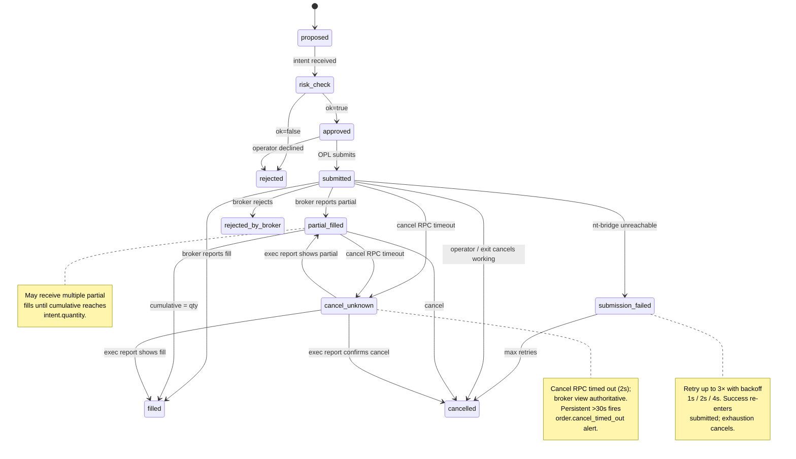

# Order & Execution Plane — Component TDD

Parent: [TRADING-SYSTEM-TDD.md](../TRADING-SYSTEM-TDD.md). Related: [Order Flow](order-flow.md), [Risk Gate Architecture](risk-gate-architecture.md), [Portfolio & Risk Engine](portfolio-risk-engine.md), [Broker Integration](broker-integration.md), [Exec Algorithms](exec-algorithms.md).

The Order Plane (OPL) is scoped exclusively to QF-originated orders: operator manual entry from the GUI, operator manual liquidation ([§5.2](#52-operator-manual-liquidation)), and strategy-declared exit rules tripped by the framework ([§5.1](#51-strategy-declared-exit-rules)). Strategy intents do not flow through OPL — they submit through the NT-side risk-gate plugin inside the per-broker TradingNode (see [risk-gate-architecture.md](risk-gate-architecture.md)) and emit fills via NT's MessageBus, which the audit observer subscribes to. Paper vs live is a deploy-target distinction handled by the Python NT bridge's credentials, not a QF-side code-path branch.

---

## Overview

OPL owns:

- The lifecycle state machine for QF-originated orders.
- The audit writers (`source='qf'`) for `audit_intents`, `audit_orders`, `audit_fills`.
- The BrokerAdapter contract to `nt-bridge.ts` (the TS-side NATS-RPC client; the Python `LiveExecutionClient` lives in the per-broker TradingNode).
- Restart recovery from DuckDB (`audit_orders` + `audit_fills`).
- Closing-intent emission for strategy-declared exit rules ([§5.1](#51-strategy-declared-exit-rules)) and operator manual liquidation ([§5.2](#52-operator-manual-liquidation)).
- The operator-confirmation primitives (`TypedConfirmation` safety words: `FIRE` for manual entry, `LIQUIDATE` for manual liquidation).

OPL does not own pricing decisions, working-order monitoring, slicing, or repeg. Those concerns live in the NT-side `ExecAlgorithm` catalog (see [exec-algorithms.md](exec-algorithms.md)), reachable from OPL via the optional `exec_algorithm_id` field on an `OrderIntent`.

See [order-flow.md](order-flow.md) for the cross-flow audit chain and the `source` writer-mapping table.

---

### 1. OrderIntent schema

```ts
interface OrderIntent {
  intent_id: string; // ULID, assigned at OPL.submit()
  portfolio: string;
  strategy_id: string | null; // null for operator manual entry; originating position's strategy_id for exit-rule or manual-liquidation closes
  // What to do
  action: "open" | "close";
  symbol: string; // canonical, e.g. "OPT:SPY:2026-05-16:C:500"
  direction: "Long" | "Short" | "close";
  quantity: number;
  // Why
  reason: string; // free-text from operator, "operator_manual" for manual liquidation, or "exit_rule_<rule>" for declared exits (stop_loss/target/max_hold/max_drawdown)
  // For close actions
  position_id: string | null; // set for action="close"
  // Execution semantics (forward-compatible; catalog deliberately empty today)
  exec_algorithm_id: string | null;
  exec_algorithm_params: Record<string, unknown> | null;
  // Lifecycle
  status: OrderIntentStatus;
  created_at: string; // ISO 8601 UTC
  source: "qf"; // OPL always writes 'qf'; see order-flow.md §4.2 for the full writer mapping
}
```

**Schema notes:**

- **`strategy_id` is nullable on operator manual entry, sentinel-valued on operator-position closes.** Operator manual entry has no strategy attribution (`null`). Closes emitted by exit rules ([§5.1](#51-strategy-declared-exit-rules)) or manual liquidation ([§5.2](#52-operator-manual-liquidation)) set `strategy_id` to the originating position's `strategy_id`, preserving per-strategy attribution. **Special case:** when manual liquidation closes a position that was _itself_ operator-originated (no strategy attribution on the entry), the close intent's `strategy_id` is set to the sentinel `"__operator__"` — not `null`. This keeps per-strategy metrics (`position_manual_liquidation_total{strategy_id}`, drift dashboards, `audit_intents`-grouped aggregates) from silently dropping the close when grouping by `strategy_id`. The sentinel is a reserved value in the lifecycle registry; it never resolves to a registered strategy, but it does keep the audit chain queryable by a known-value group key.
- **`exec_algorithm_id` is forward-compatible.** When set, OPL forwards the intent through `nt-bridge.ts` and the NT-side `ExecAlgorithm` (catalog entry referenced by id) handles pricing, slicing, repeg, and working-order management. When null (the default today), OPL submits as-typed — single-leg market or limit, no repeg, manual cancel only.
- **Multi-leg / compound intents** (a `legs[]` array, or `parent_intent_id` linkage between sibling intents) are not in scope for the current schema. When the leg-in `ExecAlgorithm` ships, the schema gains a compound shape; until then, OPL is single-leg only.
- **`source` is always `'qf'` on OPL writes.** If the intent carries an `exec_algorithm_id`, the NT-side algo's child orders and fills are written by the audit observer with `source='nt-native'`. A single chain can therefore mix `qf` (intent) and `nt-native` (orders/fills); see [order-flow.md §4.2](order-flow.md#42-writer-mapping-model-a-writer-identity-sourcing).

### 2. Order lifecycle state machine

State flow:



No `pending_approval` queue, no mode predicates. The operator-confirmation primitive (typed `FIRE` for manual entry, typed `LIQUIDATE` for manual liquidation per [§5.2](#52-operator-manual-liquidation)) is **synchronous at submit time** — there is no async approval loop, because the operator is the approver. Closing intents emitted by exit rules ([§5.1](#51-strategy-declared-exit-rules)) skip the per-intent confirmation primitive — they were authorised at rule-declaration time and again at registration / override-file activation.

| From                | To                   | Trigger                                                                                                                 | Who             |
| ------------------- | -------------------- | ----------------------------------------------------------------------------------------------------------------------- | --------------- |
| `proposed`          | `risk_check`         | Intent received by OPL                                                                                                  | Automatic       |
| `risk_check`        | `rejected`           | `canExecute()` returns `ok=false`                                                                                       | Risk evaluator  |
| `risk_check`        | `approved`           | `canExecute()` returns `ok=true`                                                                                        | Risk evaluator  |
| `approved`          | `submitted`          | OPL submits via `nt-bridge.ts`                                                                                          | OPL             |
| `submitted`         | `filled`             | Broker reports complete fill                                                                                            | nt-bridge → OPL |
| `submitted`         | `partial_filled`     | Broker reports partial fill                                                                                             | nt-bridge → OPL |
| `partial_filled`    | `partial_filled`     | Additional partial fill, cumulative still < quantity                                                                    | nt-bridge → OPL |
| `partial_filled`    | `filled`             | Cumulative quantity = intent.quantity                                                                                   | nt-bridge → OPL |
| `submitted`         | `rejected_by_broker` | Broker async rejection (post-submit)                                                                                    | nt-bridge → OPL |
| `submitted`         | `submission_failed`  | nt-bridge timeout / unreachable                                                                                         | OPL             |
| `submission_failed` | `submitted`          | Retry succeeds (up to 3, exponential backoff 1s/2s/4s)                                                                  | OPL             |
| `submission_failed` | `cancelled`          | Max retries exhausted, or operator cancels                                                                              | OPL             |
| `submitted`         | `cancelled`          | Operator cancels, or an exit rule / manual liquidation cancels this working order before its position trade closes (§5) | OPL             |
| `partial_filled`    | `cancelled`          | Cancel during partial fill (operator, exit rule, manual liquidation)                                                    | OPL             |
| `submitted`         | `cancel_unknown`     | Cancel RPC timed out (2s); broker view unknown — wait for next exec report                                              | OPL             |
| `partial_filled`    | `cancel_unknown`     | Cancel RPC timed out (2s)                                                                                               | OPL             |
| `cancel_unknown`    | `cancelled`          | Subsequent exec report confirms broker accepted the cancel                                                              | nt-bridge → OPL |
| `cancel_unknown`    | `filled`             | Subsequent exec report shows fill (too-late-cancel race; fill wins)                                                     | nt-bridge → OPL |
| `cancel_unknown`    | `partial_filled`     | Subsequent exec report shows partial fill before cancel                                                                 | nt-bridge → OPL |

Every transition writes a row to `audit_orders` with `source='qf'`. The Trade Inspector endpoint joins these rows back to the originating `audit_intents` for reconstruction.

### 3. BrokerAdapter interface

OPL's broker transport is **always** `nt-bridge.ts`. The TS-side adapter is a NATS-RPC client; the Python-side `LiveExecutionClient` lives in the per-broker NT TradingNode. The full bridge contract — subjects, payload shapes, exec-report fan-out — lives in [broker-integration.md §5.1](broker-integration.md#51-typescript-side-shape). OPL never speaks to a broker directly.

The canonical adapter contract is split in two (per QF-234), declared in [`src/types/order.ts`](../../src/types/order.ts):

```ts
// src/types/order.ts
interface OrderSubmissionAdapter {
  name: string; // "schwab" | "ibkr"
  available(): Promise<boolean>;
  submitOrder(params: SubmitOrderParams): Promise<string>; // returns broker_order_id
  cancelOrder(brokerOrderId: string): Promise<void>;
}

interface OrderObservationAdapter {
  name: string;
  available(): Promise<boolean>;
  getOrderStatus(brokerOrderId: string): Promise<BrokerOrderStatus>;
  getPositions(): Promise<BrokerPosition[]>;
  onFill(callback: (fill: Fill) => void): void;
  onRejection?(callback: (rejection: BrokerRejection) => void): void;
}

// Compat alias used by callers that hold the combined surface.
type BrokerAdapter = OrderSubmissionAdapter & OrderObservationAdapter;
```

Brokers QF actively submits to implement `OrderSubmissionAdapter`. Brokers QF only observes (IBKR via NT, per [broker-integration.md](broker-integration.md)) implement `OrderObservationAdapter`. The `BrokerAdapter` intersection alias is retained for back-compat per the QF-234 deprecation note — QF-236 removes the alias once internal references are migrated.

**Adapters:**

| Adapter    | Status                     | Implements                                           | Notes                                                                                                                                            |
| ---------- | -------------------------- | ---------------------------------------------------- | ------------------------------------------------------------------------------------------------------------------------------------------------ |
| **Schwab** | Shipped                    | `OrderSubmissionAdapter` + `OrderObservationAdapter` | `nt-bridge.ts` publishes on `orders.submit.schwab` via NATS-RPC; Python `LiveExecutionClient` submits to Schwab REST and fans exec reports back. |
| **IBKR**   | Observation-only by design | `OrderObservationAdapter` only                       | NT owns the IB Gateway session; QF receives exec reports + queries status, does not call `placeOrder` for IBKR.                                  |

**No paper adapter.** Paper-vs-live is a **deploy-target** distinction (the Python NT bridge connects to paper or live credentials; QF's TS side doesn't branch). For local development, run the paper-credentialed bundle.

**Order types:** market orders only at OPL today. Limit orders for manual entry are a follow-on (will require GUI primitives + a working-order cancel surface, since OPL itself does not repeg). Strategies wanting limit / repeg semantics submit via their NT `ExecAlgorithm`.

#### Broker-unreachable handling

`nt-bridge.ts` distinguishes two failure shapes:

| Failure                | Order state          | Operator action                                                 |
| ---------------------- | -------------------- | --------------------------------------------------------------- |
| Broker explicit reject | `rejected_by_broker` | Investigate (bad symbol, margin, market closed). Fix and retry. |
| nt-bridge unreachable  | `submission_failed`  | Check NT bridge connectivity. Retry path runs automatically.    |

On `submission_failed`:

1. Log at error level with the NATS error details.
2. Increment `order_submission_failed_total{portfolio, broker}`.
3. Retry up to 3 times with exponential backoff (1s, 2s, 4s). If `available()` returns false, skip to "max retries exceeded" without waiting.
4. If all retries fail, transition to `cancelled` with `reason: "nt_bridge_unreachable"`. The operator sees it in the GUI and can resubmit manually.

#### Cancel-order failure modes

`cancelOrder(brokerOrderId, reason)` has three real failure shapes that submit doesn't — exit-rule logic in [§5.1](#51-strategy-declared-exit-rules) depends on cancel-before-close working, so the contract has to cover them:

| Failure                              | Order final state                         | Operator action                                                                                                                                                                                                                                                                                                                                                                                                                                                                |
| ------------------------------------ | ----------------------------------------- | ------------------------------------------------------------------------------------------------------------------------------------------------------------------------------------------------------------------------------------------------------------------------------------------------------------------------------------------------------------------------------------------------------------------------------------------------------------------------------ |
| **Broker rejects cancel (too late)** | unchanged (fill / partial_filled landing) | None. Broker says "the order already filled / is filling." The fill flow takes over; the position lands as if no cancel was attempted. Race is benign.                                                                                                                                                                                                                                                                                                                         |
| **Cancel RPC times out** (2s)        | `cancel_unknown` (new transitional state) | Wait for the next exec report — broker view is authoritative. If the next exec report shows the order filled, treat as a too-late-cancel (above). If it shows the order cancelled, transition to `cancelled`. If no exec report arrives within 30s and the order was a closing intent, **investigate**: position may be doubly-affected.                                                                                                                                       |
| **Cancel succeeded; fill in-flight** | `partial_filled` or `filled` then settled | Broker accepted the cancel but a fill was already in-flight before the cancel reached the matching engine. Position lands as the fill specifies. If the cancel was emitted by an exit-rule trip, the position is now closing on entry-side AND a fresh closing intent is being prepared by the exit-rule monitor — the monitor's idempotency guard on `closing_intent_id` (set at trip time per [§5.1](#51-strategy-declared-exit-rules)) prevents a duplicate close emission. |

Cancel emits an event regardless of outcome: `order.cancel_attempted` with `(broker_order_id, reason, outcome)` where outcome ∈ `{accepted, rejected, timed_out}`. This is the signal alerts.md should wire `broker.cancel_timed_out` against.

State-machine arcs added:

```
submitted          → cancel_unknown  : RPC timeout on cancelOrder()
partial_filled     → cancel_unknown  : RPC timeout on cancelOrder()
cancel_unknown     → cancelled       : subsequent exec report confirms cancel
cancel_unknown     → filled          : subsequent exec report shows fill
cancel_unknown     → partial_filled  : subsequent exec report shows partial
```

`cancel_unknown` is its own state because it's a real lifecycle position — the operator must know that QF doesn't know whether the cancel landed, distinct from "QF knows the cancel was rejected." The state clears within ~30s in normal operation (exec reports update the order one way or the other); persistent `cancel_unknown` is the signal that something's stuck and should fire `order.cancel_timed_out` alert.

### 4. Fill feedback loop

The fill path for **QF-mediated orders** (orders OPL submitted via nt-bridge):

1. NT bridge receives the broker fill, publishes the exec report on `orders.exec_reports.<broker>`.
2. **OPL's fill handler** subscribes to that subject for orders it submitted. On receipt, it writes `audit_fills` with `source='qf'`.
3. **Audit observer** also subscribes to the same subject (broker-wide). **The observer dedups by `order_id`**: before its own `audit_fills` insert, it checks for an existing fill row with the same `order_id`. If found, it skips. This is the dedup contract — OPL writes win, observer defers.
4. OPL calls `engine.applyFill(portfolio, fill)` → updates positions, cash, P&L, Greeks, fires limit checks.
5. OPL emits the updated state to the GUI via state WebSocket.

For **NT-native orders** (strategy submissions through the gate, which OPL never sees), the observer is the only writer of `audit_orders` and `audit_fills` — both with `source='nt-native'`. See [order-flow.md §4.2](order-flow.md#42-writer-mapping-model-a-writer-identity-sourcing) for the full writer-mapping.

**Restart recovery:** OPL rebuilds in-memory state from `audit_orders` + `audit_fills` (DuckDB) on boot. Any orders in `submitted` / `partial_filled` / `submission_failed` state are rehydrated and reconciled against the broker via `nt-bridge.getPositions()`. DuckDB is the single source of truth.

Latency target: <100ms from `orders.exec_reports.<broker>` arrival to GUI update for QF-mediated fills.

### 5. Position exit controls

There is **no global kill switch** — no system-wide button, no auto-flatten of all positions, no system-halted state. Closing positions is always either (a) a strategy-declared rule firing on one position it owns, (b) the strategy's own discretionary close logic, or (c) the operator deliberately selecting which positions to liquidate.

Three exit categories, each detailed below:

| Category                        | Trigger                                                                                                                     | Path                                                                                                               |
| ------------------------------- | --------------------------------------------------------------------------------------------------------------------------- | ------------------------------------------------------------------------------------------------------------------ |
| **Strategy-declared hard exit** | Framework-monitored rule trips on a position the strategy owns (stop-loss / target / max-hold / per-strategy max-drawdown). | Framework emits closing `OrderIntent` through OPL.                                                                 |
| **Strategy-discretionary exit** | Strategy's own signal logic decides to close (regime flip, signal reversal, time-of-day).                                   | Strategy's own `submit_order` flows through the gate like any other intent — framework doesn't model it.           |
| **Operator manual liquidation** | Operator selects positions in the GUI and types the confirmation phrase.                                                    | Per-position exit button or multi-select; framework emits closing `OrderIntent` through OPL per selected position. |

All three paths terminate in the same place: a closing `OrderIntent` flowing through OPL's normal `proposed → risk_check → approved → submitted → filled` state machine ([§2](#2-order-lifecycle-state-machine)). The state machine doesn't branch by exit category — only the `reason` field on `audit_intents` differs (`exit_rule_<name>` / `strategy_discretionary` / `operator_manual`).

#### 5.1 Strategy-declared exit rules

Each strategy declares its hard exits at registration time, in code (so backtests use the same values). Operator-editable overrides at `config/strategy_overrides.yaml` win at activation time and are audit-recorded.

**Full spec.** The exit-rule monitor's evaluation, composite-position aggregation, idempotency guard, metrics, GUI surfacing, and failure modes live in [exit-rule-monitor.md](exit-rule-monitor.md). The summary table below is the rule schema only; refer to the dedicated TDD for behavior.

| Scope            | Field              | Trigger condition                                                                                                                             |
| ---------------- | ------------------ | --------------------------------------------------------------------------------------------------------------------------------------------- |
| **Per-position** | `stop_loss_pct`    | Unrealized PnL on the position ≤ `-stop_loss_pct × entry_notional`. Emits exit for that one position.                                         |
| **Per-position** | `target_pct`       | Unrealized PnL on the position ≥ `target_pct × entry_notional`. Emits exit for that one position.                                             |
| **Per-position** | `max_hold_seconds` | Position has been open ≥ `max_hold_seconds`. Emits exit for that one position.                                                                |
| **Per-strategy** | `max_drawdown_pct` | Strategy's realised + unrealised drawdown from its high-water mark ≥ `max_drawdown_pct`. Emits exits for **all** positions the strategy owns. |

**Declaration site** ([`server/strategy/registration.ts`](../../server/strategy/registration.ts)):

```ts
interface StrategyExitPolicy {
  per_position: {
    stop_loss_pct?: number; // e.g. 0.10 = close at -10% unrealised
    target_pct?: number; // e.g. 0.20 = close at +20% unrealised
    max_hold_seconds?: number; // e.g. 86400 = close after 24h
  };
  per_strategy: {
    max_drawdown_pct?: number; // e.g. 0.15 = close all if strategy DD > 15%
  };
}
```

All fields are optional; an omitted field means "this rule does not apply." A strategy with no exit policy declared has no framework-enforced exits — only its own discretionary logic + operator manual liquidation can close its positions.

**Override file** (`config/strategy_overrides.yaml`):

```yaml
# Override stops without redeploying the strategy. Values here win
# over what the strategy's registration declares. Activation is
# audit-recorded; mid-trading-day changes are intentional friction.
soxx_rotation:
  per_position: { stop_loss_pct: 0.08 } # tighter than the declared 0.10
  per_strategy: { max_drawdown_pct: 0.12 }
```

**Framework enforcement.** The Portfolio & Risk engine (see [portfolio-risk-engine.md](portfolio-risk-engine.md)) holds per-strategy position state ([§5.5](#55-per-strategy-position-state)) and runs the exit-rule monitor on every position update + every market-data tick. When a rule trips:

1. Emit a closing `OrderIntent` through OPL with:
   - `position_id` = the position triggering the rule
   - `strategy_id` = the position's owning strategy
   - `reason` = `exit_rule_<rule_name>` (e.g. `exit_rule_stop_loss`, `exit_rule_max_drawdown`)
   - `source` = `qf` (OPL writes it)
2. Cancel any in-flight working orders for the same position via `nt-bridge.cancelOrder()`, so the close doesn't race a stale entry order.
3. Emit `position.exit_rule_tripped` event ([observability.md §2](observability.md#2-observable-action-categories)) with the rule + current values.

Rule evaluation survives strategy crashes — the monitor runs in QF's TS process, watching positions reconstructed from `audit_fills`. A hung strategy can't suppress its own stop.

#### 5.2 Operator manual liquidation

Two entry points in the GUI:

**Per-position exit button.** Each position row in the per-strategy position view ([gui.md](gui.md)) has a `Liquidate` button. One click → confirmation modal: "Liquidate `<position_id>` (`<strategy>` / `<symbol>` / qty `<n>`)? Type `LIQUIDATE` to confirm." Framework emits one closing `OrderIntent` with `reason="operator_manual"` and cancels any working orders on that position.

**Multi-select liquidation.** Position-list rows have checkboxes. Operator selects N positions across one or more strategies → clicks `Liquidate selected` → confirmation modal: "Liquidate `<N>` positions across `<M>` strategies (`<list>`)? Type `LIQUIDATE` to confirm." On confirmation, framework emits N closing `OrderIntent`s in parallel, each with `reason="operator_manual"`, and cancels working orders on each selected position.

The typed `LIQUIDATE` phrase is fixed (not dynamic) so operators can act under stress without re-reading. Confirmation primitive shape matches the manual order-entry primitive used by [order-flow.md](order-flow.md).

The operator never has a "liquidate everything" affordance — selection is always explicit. The closest thing to a "close everything" is "select all" in the position list followed by typed confirmation; that's still two deliberate actions and operator-driven.

#### 5.3 Per-strategy operator-halt (block new submissions)

Already exists in [`server/strategy/lifecycle.ts`](../../server/strategy/lifecycle.ts) (`registered → enabled → running → paused → halted → retired` — see §5.7 for `retired` semantics). Operator marks a strategy `halted` to **block new submissions** from that strategy — the gate evaluator rejects with `reason: "strategy_halted"` ([risk-gate-architecture.md §3.3](risk-gate-architecture.md#33-response-payload)). **Open positions are unaffected.** To close them, the operator uses §5.2 manual liquidation or waits for declared exit rules to trip.

This is the lowest-blast-radius lever: stop the strategy from opening new positions, then decide what to do with existing ones at leisure.

#### 5.4 Reconciliation drift handling

The Portfolio & Risk engine reconciles broker positions against the audit-derived state on a continuous cadence (positions polled from `nt-bridge.getPositions()`). On drift detection:

1. Alert at warn level via [alerts.md](alerts.md) with the drifted `strategy_id`, `position_id`, broker view vs audit view.
2. Move the affected strategy to `halted` ([§5.3](#53-per-strategy-operator-halt-block-new-submissions)) — block new submissions until the drift is resolved.
3. **Do not auto-close.** Open positions stay. Operator inspects, fixes the bookkeeping, and either resumes or manually liquidates via §5.2.

Auto-closing on drift was the old kill-switch behavior and is removed: if our accounting is wrong, blindly flattening makes the resolution worse, not better.

#### 5.5 Per-strategy position state

**Framework-side view** — `portfolio-risk-engine.md` maintains a single canonical positions projector ([portfolio-risk-engine.md §1](portfolio-risk-engine.md#1-portfolio-state)); the per-strategy "composite" position is a SQL filter on `strategy_id` over that projector, not a separate store ([portfolio-risk-engine.md §"Per-strategy composite positions"](portfolio-risk-engine.md#per-strategy-composite-positions--exit-rule-monitor)). One canonical row per atomic position (`position_id` PK), tagged with `strategy_id` for filtering. This is the source for:

- The GUI per-strategy position list ([§5.2](#52-operator-manual-liquidation) surface).
- The exit-rule monitor ([§5.1](#51-strategy-declared-exit-rules)).
- Recon comparison against broker positions ([§5.4](#54-position-reconciliation-drift)).

**Strategy-side state** (inside the strategy's own NT plugin code). Strategies that implement discretionary exits ([§5 intro, category 2](#5-position-exit-controls)) hold their own view of which positions they own and the signals driving exit decisions. The framework-side projector is the source of truth for QF's risk + GUI; the strategy-side state is the source of truth for the strategy's own logic. The two diverge only if a fill never lands in `audit_fills` or vice versa — the same condition that flags recon drift ([§5.4](#54-position-reconciliation-drift)).

#### 5.6 What is explicitly removed

Compared to earlier drafts of this TDD:

- ❌ Global kill switch (cancel-all + close-all).
- ❌ System-halted state.
- ❌ Auto-close on framework triggers (risk-limit breach, reconciliation drift, strategy-drift). Triggers now alert + halt-new-submissions for the affected strategy; the operator decides whether to liquidate.
- ❌ `halt_action: cancel | close` config knob in `risk_limits.yaml`.
- ❌ GUI full-width red "SYSTEM HALTED" banner.

The deliberate trade-off: removing the big red button raises the floor on operator effort during a real emergency (must select positions, type the phrase). It removes the cliff where an auto-halt can blindly flatten a healthy portfolio because of a buggy drift check or a noisy alert. Per-strategy `halted` + §5.2 multi-select liquidation cover the legitimate "stop trading now" case with deliberate, scoped actions.

#### 5.7 Strategy retirement

The `retired` state at the end of the lifecycle (`registered → enabled → running → paused → halted → retired`) is a **terminal hard-retire**: the strategy is no longer trading, has no open positions, and its `strategy_id` survives only as an audit-chain foreign key. The transition is deliberate and operator-only; there is no resume from `retired`.

**Preconditions enforced by the lifecycle registry at `transition: 'retired'`:**

1. Strategy must already be `halted` (no new submissions).
2. No open positions tagged with the strategy's `strategy_id` (atomic count = 0 in the canonical positions projector per [portfolio-risk-engine.md §1](portfolio-risk-engine.md#1-portfolio-state)).
3. No in-flight `audit_intents` with this `strategy_id` (status in `proposed` / `risk_check` / `submitted` / `partial_filled`).

If any precondition fails, the registry rejects the transition with a structured reason; the operator's workflow is then "halt → manually liquidate via §5.2 → re-attempt retire."

**Effects of the transition:**

- **Exit-rule monitor** stops evaluating the strategy. The strategy's `StrategyExitPolicy` is unloaded from the monitor's working set.
- **Pinned QO baseline** is unpinned. The drift monitor stops comparing the strategy's live behavior against any baseline; subsequent fills attributed to its `strategy_id` (from late-arriving execution reports) are still recorded but produce no drift signal.
- **GUI Strategies workspace** moves the row from the active list to a "Retired" tab. The detail page is still reachable for audit / history view.
- **Audit chain** preserves the `strategy_id` foreign key on all historical `audit_intents`, `audit_orders`, `audit_fills` rows. Joins against `strategy_id` continue to resolve; there is no NULL fan-out, no FK rewrite. The retired strategy entity itself is retained in the lifecycle registry (state = `retired`, `retired_at` populated, rest of the record frozen).
- **NT bundle** receives a `node.stop_strategy(strategy_id)` event over NATS via the bundle launcher's lifecycle-change subscription per [strategy-deployment-topology.md §8](strategy-deployment-topology.md#8-rollback-and-hot-swap). The strategy's NT instance is destroyed; redeploying the bundle does not bring it back.

**Late-arriving exec reports.** If the broker emits an exec report after the strategy is retired (e.g., a delayed fill arriving 30 seconds after the close-and-retire window), the audit observer still writes the row — the order is referenced in the chain. The fill flows into the canonical positions projector and produces a position with `strategy_id=<retired_strategy>`. Operator must manually liquidate via [§5.2](#52-operator-manual-liquidation) (multi-select) since the exit-rule monitor is no longer evaluating retired strategies. The recon drift alert in [§5.4](#54-position-reconciliation-drift) fires on this state to surface it; the retire transition is not undone.

**Reviving a retired strategy.** Not supported via state transition. To re-deploy what was a retired strategy, register a new `strategy_id` (typically `<old_id>_v<n>`) in the lifecycle registry. This keeps the old strategy's audit chain isolated from the new one's behavior.

### 6. Metrics

| Metric                              | Type      | Labels                                                                          | Description                                                                                                              |
| ----------------------------------- | --------- | ------------------------------------------------------------------------------- | ------------------------------------------------------------------------------------------------------------------------ |
| `order_intents_received_total`      | counter   | `portfolio`, `source`                                                           | OPL intents received (source always `qf` here)                                                                           |
| `order_intents_rejected_total`      | counter   | `portfolio`, `reason`                                                           | Rejections (risk violation, strategy halted, operator)                                                                   |
| `order_submitted_total`             | counter   | `portfolio`, `broker`                                                           | Orders sent via nt-bridge                                                                                                |
| `order_filled_total`                | counter   | `portfolio`, `broker`                                                           | Fills received                                                                                                           |
| `order_fill_latency_seconds`        | histogram | `portfolio`, `broker`                                                           | `submitted` → `filled`                                                                                                   |
| `order_submission_failed_total`     | counter   | `portfolio`, `broker`                                                           | nt-bridge unreachable events                                                                                             |
| `position_exit_rule_tripped_total`  | counter   | `strategy_id`, `rule` (`stop_loss` \| `target` \| `max_hold` \| `max_drawdown`) | Strategy-declared exit rule fired ([§5.1](#51-strategy-declared-exit-rules)). Closing intent emitted.                    |
| `position_manual_liquidation_total` | counter   | `strategy_id`, `mode` (`single` \| `multi_select`)                              | Operator manual liquidation invoked ([§5.2](#52-operator-manual-liquidation)). One increment per closed position.        |
| `position_recon_drift_total`        | counter   | `strategy_id`                                                                   | Reconciliation drift detected; affected strategy halted-for-new-submissions ([§5.4](#54-reconciliation-drift-handling)). |

Strategy-side end-to-end timing lives in NT's strategy-side observability (per-strategy histograms in the TradingNode log stream), not in OPL.

### 7. Files

- `server/order/plane.ts` — lifecycle state machine, audit writers, restart recovery, exit-rule closing-intent emission, manual-liquidation handler.
- `server/order/adapters/nt-bridge.ts` — TS-side NATS-RPC client.
- `server/order/adapters/ibkr-observer.ts` — IBKR observation-only adapter (exec-report subscription + status queries; not an order-submission path).
- `server/order/adapters/schwab-rest.ts` — Schwab REST plumbing for positions + account discovery (consumed by the market-data side, not OPL submission).

**Future** (when scoped):

- `server/order/adapters/nt-bridge-multileg.ts` (working name) — compound intent submission with `exec_algorithm_id`, when the leg-in `ExecAlgorithm` ships.
