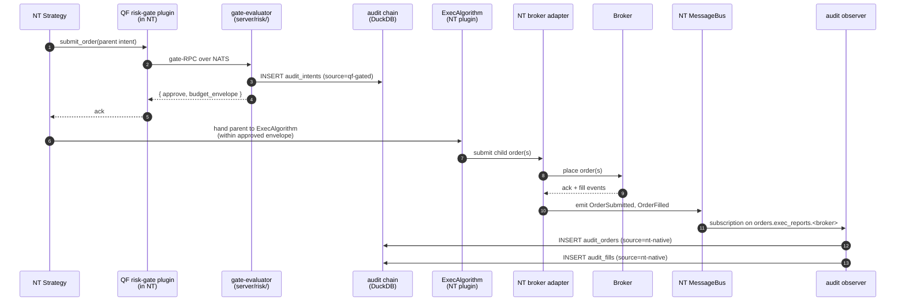
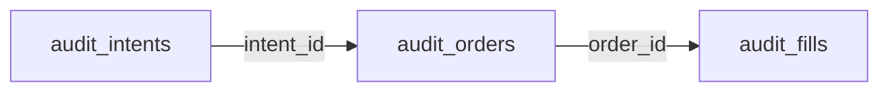

# Order Flow — Two Flows, One Audit Chain

Parent: [TRADING-SYSTEM-TDD.md](../TRADING-SYSTEM-TDD.md). Related: [Order & Execution Plane](order-execution.md), [Risk Gate Architecture](risk-gate-architecture.md), [Portfolio & Risk Engine](portfolio-risk-engine.md), [Cross-Cutting (audit schemas)](cross-cutting.md), [Exec Algorithms](exec-algorithms.md).

Two order flows feed one audit chain: **NT-native** (strategy submissions intercepted by the NT-side QF risk-gate plugin) and **QF-mediated** (operator manual entry, operator manual liquidation, and framework-fired exit rules — all through OPL; see [order-execution.md §5](order-execution.md#5-position-exit-controls)).

---

## 1. Overview

Two flows reach the broker. Each emits rows into the same three audit tables (`audit_intents → audit_orders → audit_fills`), distinguished by a `source` column that identifies which surface wrote the row.

```mermaid
flowchart TD
  subgraph NT["NT-native flow"]
    direction TD
    NTStrat["NT Strategy"]
    NTGate["QF risk-gate plugin (in NT)"]
    NTEval["gate-evaluator (server/risk/)<br/>writes audit_intents (source=qf-gated)<br/>returns { approve, budget_envelope }"]
    NTAdapter["NT broker adapter"]
    NTBroker["Broker"]
    NTMB["NT MessageBus"]
    NTObs["audit observer<br/>subscribes to orders.exec_reports.&lt;broker&gt;<br/>writes audit_orders (source=nt-native)<br/>writes audit_fills (source=nt-native)"]
    NTStrat -->|submit_order()| NTGate
    NTGate -->|NATS-RPC| NTEval
    NTEval --> NTAdapter
    NTAdapter --> NTBroker
    NTBroker -->|fills| NTMB
    NTMB --> NTObs
  end

  subgraph QF["QF-mediated flow"]
    direction TD
    QFOp["Operator GUI"]
    QFOPL["OPL (server/order/plane.ts)<br/>writes audit_intents (source=qf)<br/>risk_check via canExecute()<br/>writes audit_orders (source=qf)"]
    QFBridge["nt-bridge.ts (NATS-RPC)"]
    QFPy["Python NT bridge"]
    QFBroker["Broker"]
    QFExec["orders.exec_reports.&lt;broker&gt;"]
    QFFill["OPL fill handler<br/>writes audit_fills (source=qf)<br/>updates portfolio, emits to GUI"]
    QFObs["audit observer<br/>dedups by order_id; skips<br/>(qf row already exists)"]
    QFOp -->|POST /api/orders/manual<br/>+ typed confirmation| QFOPL
    QFOPL --> QFBridge
    QFBridge --> QFPy
    QFPy --> QFBroker
    QFBroker -->|fills| QFExec
    QFExec --> QFFill
    QFExec --> QFObs
  end
```

The two flows share the audit chain shape and the table DDLs, but the **writer** of each row depends on which flow produced it. This is **Model A — writer-identity sourcing**: `source` identifies which surface wrote the row, not which architectural flow the chain belongs to. A single chain can mix `qf` (intent written by OPL) and `nt-native` (orders/fills written by the observer for OPL intents that carried an `exec_algorithm_id`); the chain still joins cleanly on `intent_id` and `order_id`.

To identify the **architectural flow** that produced a chain, look at `audit_intents.source`: `qf` = OPL-mediated, `qf-gated` = strategy submission through the gate. The value `nt-native` is **reserved** for a future flow where an NT-side actor writes the intent row directly (bypassing the gate) — there is no producer in the current architecture, so the value is **not yet observed in production data**. The schema accepts it so the future flow can land without a DDL migration; until then, queries for `audit_intents.source = 'nt-native'` always return zero rows.

---

## 2. Sequence diagrams

### 2.1 NT-native flow (strategy submission via the gate)



**Notes:**

- Gate fires **once per parent intent at full impact**. Child orders emitted by an `ExecAlgorithm` within the approved envelope skip the gate-RPC. If the strategy submits a fully-shaped order without an `exec_algorithm_id`, NT's default path applies (submit as-specified) — still gated once at the parent.
- The gate-RPC handler writes only `audit_intents`. Order and fill rows come from the observer. This is the source delta within a single chain: intent is `qf-gated`, orders + fills are `nt-native`.
- Gate fail-open is **closes-only**: when QF is unreachable, the gate allows orders that reduce existing positions and rejects opening or mixed orders. See [risk-gate-architecture.md](risk-gate-architecture.md).

### 2.2 QF-mediated flow (operator manual entry, manual liquidation, framework-fired exit rules)

```mermaid
sequenceDiagram
  autonumber
  participant Op as Operator GUI
  participant OPL as OPL<br/>(server/order/plane.ts)
  participant Eval as risk evaluator<br/>(canExecute)
  participant DB as audit chain<br/>(DuckDB)
  participant Bridge as nt-bridge.ts<br/>(NATS-RPC client)
  participant NT as Python NT bridge
  participant Br as Broker
  participant Obs as audit observer

  Op->>OPL: POST /api/orders/manual<br/>(intent + typed confirmation)
  OPL->>DB: INSERT audit_intents (source=qf)
  OPL->>Eval: canExecute(intent)
  Eval-->>OPL: { ok: true }
  OPL->>DB: INSERT audit_orders status=submitted (source=qf)
  OPL->>Bridge: submitOrder(intent)
  Bridge->>NT: NATS-RPC<br/>orders.submit.<broker>
  NT->>Br: place order
  Br-->>NT: fill
  NT->>Bridge: orders.exec_reports.<broker>
  Bridge->>OPL: onFill(fill)
  OPL->>DB: INSERT audit_fills (source=qf)
  OPL->>OPL: applyFill → portfolio + GUI
  Note over Obs,DB: Observer also subscribed to orders.exec_reports;<br/>dedups by order_id (qf row exists); skips
```

For the **manual-liquidation path**, the operator selects N positions in the GUI and types `LIQUIDATE`; OPL emits N closing intents (one per selected position), each with `reason="operator_manual"`. For the **framework-fired exit-rule path**, the Portfolio & Risk engine's exit-rule monitor emits one closing intent per tripped position with `reason="exit_rule_<rule>"`. Both follow the QF-mediated flow above. See [order-execution.md §5](order-execution.md#5-position-exit-controls) for the full design.

### 2.3 The hybrid case — OPL intent with an `exec_algorithm_id`

When an OPL-originated intent carries an `exec_algorithm_id` (forward-compatible field, no catalog entry today but ships when leg-in / multi-leg manual is needed), the flow is a hybrid:

1. OPL writes `audit_intents` (source=`qf`).
2. OPL submits via nt-bridge.
3. The NT-side `ExecAlgorithm` named by the id emits N child orders within the parent.
4. The audit observer writes the child `audit_orders` + `audit_fills` (source=`nt-native`).
5. The audit chain has `intents.source='qf'` and `orders.source='nt-native'` — joined as usual on `intent_id` + `order_id`.

This is the architectural reason `source` is per-row, not per-chain: an operator-originated intent legitimately produces NT-native execution rows.

---

## 3. OPL state machine

Reused from [order-execution.md §2](order-execution.md#2-order-lifecycle-state-machine); not duplicated here. The state machine has no mode predicates and no `pending_approval` queue — operator confirmation is the synchronous typed-confirmation primitive at intent-submission time.

---

## 4. Audit chain

### 4.1 Tables



Each table carries a `source ∈ {qf, qf-gated, nt-native}` column. DDLs live in [cross-cutting.md](cross-cutting.md).

### 4.2 Writer mapping (Model A: writer-identity sourcing)

| Surface                                                                                                      | Writes                                         | `source` value |
| ------------------------------------------------------------------------------------------------------------ | ---------------------------------------------- | -------------- |
| **gate-evaluator** (`server/risk/`) handling gate-RPC from the NT plugin                                     | `audit_intents`                                | `qf-gated`     |
| **OPL** (`server/order/plane.ts`) on operator manual entry, manual liquidation, or framework-fired exit rule | `audit_intents`, `audit_orders`, `audit_fills` | `qf`           |
| **audit observer** (`server/order/adapters/nt-observer-consumer.ts`) on NT MessageBus events                 | `audit_orders`, `audit_fills`                  | `nt-native`    |

**`correlation_id` threading.** Every audit row carries a `correlation_id` per [observability.md §4.2](observability.md#42-correlation-id-propagation); see DDLs in [cross-cutting.md §5](cross-cutting.md#5-database-schema-consolidated). The writer that inserts the **intent** row stamps the lifecycle anchor — OPL generates a fresh ULID at submit time and writes it onto the intent; the gate-evaluator copies the `correlation_id` it received in the NATS header onto its `audit_intents` row. Subsequent `audit_orders` and `audit_fills` rows inherit the parent intent's / order's `correlation_id` — they do not generate new ones. NATS messages crossing process boundaries carry the same value in the `X-Correlation-Id` header so the chain reconstructs even across the OPL ↔ NT bundle hop.

**Mixed-source chains are normal:**

- **Pure strategy submission (no operator involvement).** Gate writes intent (`qf-gated`); observer writes orders + fills (`nt-native`). Chain shape: `qf-gated → nt-native → nt-native`.
- **Pure operator manual entry, no algo.** OPL writes everything (`qf` × 3). Chain shape: `qf → qf → qf`.
- **Operator manual entry with `exec_algorithm_id`.** OPL writes intent (`qf`); algo's child orders + fills come back via the observer (`nt-native`). Chain shape: `qf → nt-native → nt-native`.
- **Manual liquidation.** Each close intent is OPL-originated (`qf`), so chain is `qf × 3` like normal manual entry. The `reason='operator_manual'` distinguishes operator-initiated liquidation from a manual entry.
- **Framework-fired exit rule.** Each close intent is OPL-originated (`qf`), chain is `qf × 3`. The `reason='exit_rule_<rule>'` (e.g. `exit_rule_stop_loss`, `exit_rule_max_drawdown`) marks the trip cause for the audit trail.

To filter to a flow:

- All chains where `intents.source = 'qf'` → QF-mediated (manual entry, manual liquidation, or exit-rule close).
- All chains where `intents.source = 'qf-gated'` → NT-native (strategy submission through the gate).

### 4.3 Observer dedup contract

For QF-mediated orders (those OPL submitted via nt-bridge), both OPL's fill handler **and** the audit observer see the same `orders.exec_reports.<broker>` event. To avoid duplicate fill rows:

**The audit observer dedups by `order_id`.** Before inserting an `audit_fills` row, it queries for an existing fill row with the same `order_id`. If found, it skips. OPL's write (source `qf`) gets first claim; the observer (source `nt-native`) defers.

The same dedup applies to `audit_orders`: if OPL has already inserted the `submitted` row, the observer skips.

Result: one row per fill, sourced consistently with the OPL chain that produced it. For pure NT-native orders (no OPL involvement), no OPL row exists and the observer writes unconditionally.

**Implementation note:** the dedup lookup is on `(order_id, fill_id)` for fills and `order_id` for orders. Both are ULIDs assigned by OPL / NT; collisions are impossible. The lookup is a tiny indexed query — measurable but not load-bearing latency-wise.

### 4.4 Reconstruction

`GET /api/trades/inspect?fill_id=…` (the Trade Inspector endpoint) joins left from `audit_fills → audit_orders → audit_intents`, returning the full chain. Filter by `intents.source` to scope to a flow.

```sql
-- All NT-native fills for portfolio "main" today:
SELECT f.*, o.broker_order_id, i.symbol, i.strategy_id
FROM audit_fills f
JOIN audit_orders o ON o.order_id = f.order_id
JOIN audit_intents i ON i.intent_id = o.intent_id
WHERE i.source = 'qf-gated'
  AND f.filled_at >= today();
```

---

## 5. Failure modes

Both flows share the same broker + audit infrastructure; failures are categorized by where they fire.

| Failure                                  | Flow        | Behavior                                                                                                                                                                             |
| ---------------------------------------- | ----------- | ------------------------------------------------------------------------------------------------------------------------------------------------------------------------------------ |
| Risk violation (NT-native)               | NT-native   | Gate-RPC handler writes `audit_intents` (source=qf-gated, status=rejected, violations JSON); gate plugin returns reject to NT.                                                       |
| Risk violation (QF-mediated)             | QF-mediated | OPL writes `audit_intents` (source=qf, status=rejected, violations JSON); operator sees rejection in GUI.                                                                            |
| QF unreachable from gate plugin          | NT-native   | Gate enters closes-only fallback (see risk-gate-architecture.md). No QF-side audit row for that strategy submission window.                                                          |
| Strategy halted (per-strategy)           | Both        | New intents from that strategy are rejected by the gate with `reason="strategy_halted"`. Existing positions untouched.                                                               |
| Portfolio halted (drawdown / daily-loss) | Both        | New intents on the portfolio are rejected with `reason="portfolio_halted"`. Existing positions untouched (per [order-execution.md §5](order-execution.md#5-position-exit-controls)). |
| Operator manual liquidation              | QF-mediated | Operator multi-selects + types `LIQUIDATE`; OPL emits N closing intents with `reason="operator_manual"` and cancels any working orders on each selected position.                    |
| Framework-fired exit rule trips          | QF-mediated | Portfolio & Risk's exit-rule monitor emits one closing intent with `reason="exit_rule_<rule>"` and cancels any working orders on that position.                                      |
| nt-bridge unreachable                    | QF-mediated | Order in `submission_failed`, retry up to 3×, then `cancelled` with `reason="nt_bridge_unreachable"`.                                                                                |
| Broker rejects post-submit               | Both        | Transition to `rejected_by_broker`; broker_reason persisted. For QF-mediated: OPL writes. For NT-native: observer writes.                                                            |
| Partial fill                             | Both        | Cumulate via fills writer; chain row transitions `partial_filled (x/y)` until x=y. Writer differs by flow per §4.2.                                                                  |
| Restart while order is working           | QF-mediated | OPL boot replays `audit_orders` (source=qf, status=submitted or partial_filled), reconciles against broker via `nt-bridge.getPositions()`.                                           |
| Restart while NT-native order is working | NT-native   | NT TradingNode itself recovers via its own persistence (NT MessageBus replay). QF's audit observer resumes its subscription.                                                         |
| Audit observer + OPL race on a fill      | QF-mediated | Observer dedups by `order_id` (§4.3); OPL's row wins.                                                                                                                                |
| Audit DB unreachable                     | Both        | Log warn + raise alert (operator banner). Order processing continues best-effort; audit gap is itself an audit event in logs.                                                        |
| Gate-RPC NATS message lost               | NT-native   | Gate plugin closes-only fallback after timeout. The strategy sees a reject; no chain row appears (the gap is alert-able).                                                            |

---

## 6. Principles

### 6.1 Errors that suggest config / API failure escalate immediately

Audit DB unreachable, gate-RPC timeout, broker adapter unreachable — these are not silent-fallback conditions. They suggest an API key has expired, a broker config is wrong, or an upstream service is down. The system raises a visible alert (operator banner + metrics + log) and refuses to fabricate behavior from missing inputs. The operator decides whether to retry, override, or halt.

(Contrast with transient noise — momentarily stale quote, single dropped tick — which is handled inline via per-component freshness windows.)

### 6.2 All order / intent / fill state changes are persisted

No in-memory-only state. Every transition writes a row to the appropriate audit table. Restart hydrates from DuckDB:

- OPL replays `audit_orders` + `audit_fills` for its open orders.
- The audit observer resumes its NATS subscription on `orders.exec_reports.<broker>`; durable JetStream means missed messages are replayed.
- The gate-RPC handler is stateless per request, so it has nothing to hydrate.

### 6.3 Audit-before-decision ordering

`audit_intents` is written **before** any decision is made on the intent — whether that decision is `canExecute()` returning ok/fail for the OPL flow or the gate-RPC returning approve/reject for the NT-native flow. Every intent that flows through the system leaves a trace, even ones rejected immediately. A risk-limit violation that prevented a trade is itself audit-worthy.

For OPL: the `audit_intents` write at status=`proposed` precedes the `risk_check` transition.

For the gate-RPC handler: the `audit_intents` write precedes the approve/reject return value to the NT plugin.

### 6.4 Broker-reconciliation query shape (QF-244 / M12-2)

Once `account_id` is populated by M12-3 routing, the reconciliation walk (QF-230 / M12-5) can partition by account to answer "how many fills came from account X today?":

```sql
-- Fills per account, partitioned for per-account P&L reconciliation.
-- account_id = 'default' covers pre-M12-3 rows and single-account installs.
SELECT
  af.account_id,
  ao.broker,
  COUNT(*)                  AS fill_count,
  SUM(af.quantity)          AS total_qty,
  SUM(af.price * af.quantity) AS gross_notional
FROM audit_fills  af
JOIN audit_orders ao ON af.order_id = ao.order_id
WHERE af.filled_at >= ?   -- start_ts
  AND af.filled_at <  ?   -- end_ts
GROUP BY af.account_id, ao.broker
ORDER BY af.account_id, ao.broker;
```

The join is `audit_fills.order_id → audit_orders.order_id`; both tables carry `account_id` so either side can drive the partition without the join when a single-table view suffices. QF-230's full reconciliation walk adds intent and signal context on top of this base shape.

---

## 7. Related TDDs

- [Order & Execution Plane](order-execution.md) — OPL state machine, schema, BrokerAdapter, position exit controls (manual liquidation + strategy-declared exit rules).
- [Risk Gate Architecture](risk-gate-architecture.md) — NT-plugin gate, gate-RPC semantics, closes-only fail-open, gate-evaluator audit writes.
- [Portfolio & Risk Engine](portfolio-risk-engine.md) — unified `canExecute()` + gate-evaluator entry points, strategy drift monitoring.
- [Cross-Cutting](cross-cutting.md) — audit table DDLs, source column type.
- [Exec Algorithms](exec-algorithms.md) — NT-plugin pricing / repeg / working-order management; the algo catalog that handles `exec_algorithm_id` on either OPL or strategy intents.

---

## 8. Observability

The detailed framework lives in [observability.md](observability.md). This section names the audit-chain write events emitted across both flows — the events that make the framework's single-`correlation_id` acceptance test ([observability.md §1](observability.md#1-purpose--acceptance-test)) reconstructable end-to-end. All events follow the common JSON schema: `ts`, `level`, `service`, `correlation_id`, `event`, plus the payload below.

Order-flow is two flows over one audit chain (§4), so its events are emitted by more than one `service`: OPL writes (`service = "order-plane"`) carry `source = "qf"`; the gate-RPC handler (`service = "gate-evaluator"`) carries `source = "qf-gated"`; the audit observer (`service = "audit-observer"`) carries `source = "nt-native"`. The unifying invariant is the `correlation_id`: every event below carries the ID anchored at the lifecycle origin (OPL `POST /api/orders` or the NT-side gate plugin's first RPC), so a single-ID query returns the whole chain across services.

| Event                  | Service          | Payload (key fields)                                                            | Emitted when                                                                                                  |
| ---------------------- | ---------------- | ------------------------------------------------------------------------------ | ----------------------------------------------------------------------------------------------------------- |
| `intent.proposed`      | varies           | `intent_id`, `source`, `strategy_id`, `portfolio`, `symbol`, `side`, `qty`     | `audit_intents` row written **before** the decision (§6.3). One per intent, both flows.                     |
| `intent.rejected`      | varies           | `intent_id`, `source`, `reason`, `violations`                                   | Decision was reject — risk violation, strategy/portfolio halt, operator block. Chain stops here (§5).        |
| `intent.approved`      | varies           | `intent_id`, `source`, `gate_decision` (= `"approve"`)                          | Decision was allow; downstream submission follows. For NT-native this is the `gate.evaluated` approve reply. |
| `order.submitted`      | `order-plane`    | `intent_id`, `order_id`, `broker`, `broker_order_id`                            | OPL `audit_orders` row written and order handed to the nt-bridge.                                            |
| `order.observed`       | `audit-observer` | `order_id`, `broker`, `broker_order_id`, `deduped`                              | Observer saw `orders.exec_reports.<broker>`; `deduped=true` when OPL already claimed the row (§4.3).         |
| `fill.persisted`       | varies           | `order_id`, `fill_id`, `price`, `quantity`, `account_id`                        | `audit_fills` row written. Single-writer per fill via the dedup contract (§4.3).                             |
| `order.cancelled`      | `order-plane`    | `order_id`, `broker_order_id`, `reason`                                         | A working order was cancelled (operator liquidation, exit-rule close, drift halt).                           |
| `recon.drift`          | `order-plane`    | `portfolio`, `broker`, `kind`, `symbol`                                         | Broker positions ≠ `audit_orders` on a reconciliation tick (§6.4). Also fires the alert router.             |

**Single-writer discipline.** Because both OPL's fill handler and the audit observer see the same exec report, the dedup contract (§4.3) decides which one writes the row — and therefore which one emits `fill.persisted` / `order.observed`. The non-writing path emits the `*.observed` event with `deduped=true` rather than a duplicate `*.persisted`, so log volume stays one-write-per-fill while preserving the fact that both consumers saw the report.

**Reconstruction.** The acceptance test (§4.4) is the SQL join over `audit_fills → audit_orders → audit_intents`; the log-side equivalent is a single-`correlation_id` query that returns the same chain as a time-ordered event list spanning all three services. Anything that breaks single-ID traceability across the dedup boundary is a framework bug per [observability.md §1](observability.md#1-purpose--acceptance-test).
