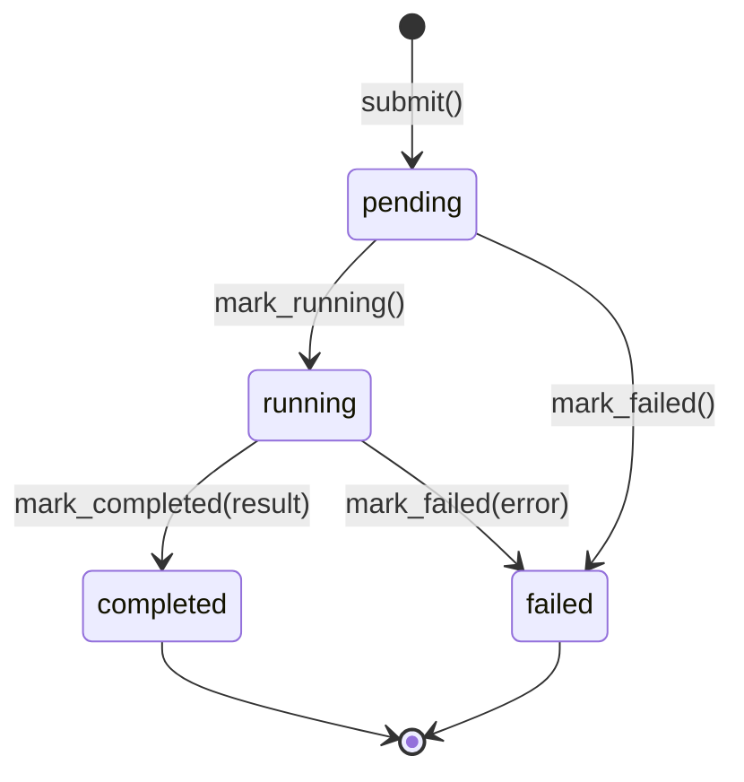

# Research Orchestrator — Component TDD

Parent: [TRADING-SYSTEM-TDD.md](../TRADING-SYSTEM-TDD.md). Subjects: [nats-subjects.md](nats-subjects.md). Single-writer rationale: [cross-cutting.md](cross-cutting.md), [deployment-topology.md](deployment-topology.md).

> **Status — current (implemented skeleton).** This documents the
> Python `research/magpie-research/` service as it exists today.
> It is the surviving half of the old `signal-orchestrator.md`: that
> doc bundled a (now-retired) live signal-tick orchestrator with this
> research / backtest-job orchestrator. The live half is gone (see
> [signal-orchestrator.md](signal-orchestrator.md) for the retirement
> note); the research half ships and is what this doc covers.
>
> The job lifecycle, wire contract, NATS event surface, and the
> single-DuckDB-writer guard are **implemented**. The worker pool is a
> deterministic **stub** — real backtests run in the sibling
> `quant-optimizer` repo, and a future PR swaps the stub for an
> NT-backed `BacktestNode` driver behind the same `WorkerPool`
> interface.

## Overview

The research orchestrator is a small Python (FastAPI / uvicorn) service
that owns **backtest-job submission, dispatch, status, and result
reporting**. A caller (GUI, CLI, or a future NATS submit bridge) posts a
`BacktestRunConfig`, gets back a `job_id`, and polls — or subscribes to
NATS — for status and the final result.

### What it is

- A standalone Python service in the uv research workspace at
  [`research/magpie-research/`](../../research/magpie-research/).
- The single authority on the backtest-job lifecycle (pending → running
  → completed/failed) for jobs it has accepted.
- A pluggable worker-pool layer (`WorkerPool` interface) so the execution
  backend can be swapped (stub today, NT-backed later) without touching
  the API, store, or event surface.
- A NATS event producer: it publishes job status, job result, and a
  `data.write.results` envelope that the TS server consumes to commit
  results to DuckDB.

### What it is not

- It does **not** run real backtests today. The worker pool returns
  deterministic canned results. The real backtest engine lives in the
  sibling `quant-optimizer` repo (see
  [backtest-gate.md](backtest-gate.md)).
- It does **not** write to DuckDB. The TS server is the single DuckDB
  writer; results flow to it over NATS. A startup guard
  (`assert_no_duckdb_writes`) fails the process loudly if `duckdb` is
  ever imported into it.
- It is **not** the retired live signal-tick orchestrator. It does not
  spawn signal subprocesses, manage cron, or check data freshness — that
  subsystem was removed (Architecture B). See
  [signal-orchestrator.md](signal-orchestrator.md).
- It does **not** own durable job state yet. The store is in-process
  memory and resets on restart.

---

## Architecture

```mermaid
flowchart LR
  client[GUI / CLI / future NATS submit bridge] -->|POST /jobs<br/>JobSubmission| api
  subgraph orchestrator["magpie-research (Python, uvicorn)"]
    api[FastAPI routes] --> store[(JobStore<br/>asyncio.Lock<br/>in-memory)]
    api --> pool{WorkerPool}
    pool -->|dispatch| stub[StubWorkerPool<br/>asyncio.Task]
    pool -.future PR.-> nt[NautilusTrader<br/>BacktestNode driver]
    stub -->|mark_running →<br/>stub_run →<br/>mark_completed| store
    stub --> events[EventPublisher]
  end
  api -->|JobAccepted 202| client
  client -->|GET /jobs/{id} poll| api
  events -->|research.jobs.status.<id><br/>research.jobs.result.<id>| nats[(NATS)]
  events -->|data.write.results| nats
  nats -->|results envelope| tsserver[TS server<br/>single DuckDB writer]
```

File layout under
[`research/magpie-research/src/magpie_research/`](../../research/magpie-research/src/magpie_research/):

| Module       | Responsibility                                                                           |
| ------------ | ---------------------------------------------------------------------------------------- |
| `config.py`  | Pydantic v2 wire-contract models (the OpenAPI schema is derived from these).             |
| `jobs.py`    | `JobStore` — the only place job state transitions happen (in-memory, lock-guarded).      |
| `workers.py` | `WorkerPool` interface + `StubWorkerPool` / `SynchronousStubPool` + `stub_run`.          |
| `events.py`  | `EventPublisher` interface + NATS / null / capturing implementations + `ResultEnvelope`. |
| `nats.py`    | `NatsAdapter` interface + real (`nats-py`) / in-memory adapters + subject helpers.       |
| `guards.py`  | `assert_no_duckdb_writes` — fails startup if `duckdb` is imported.                       |
| `routes.py`  | `APIRouter` for `/jobs` (submit / list / poll) with dependency injection.                |
| `app.py`     | FastAPI app factory (`create_app`, `create_default_app`) + `/healthz` + lifespan.        |
| `cli.py`     | `python -m magpie_research serve` — uvicorn launcher.                              |

---

## Wire contract

Pydantic v2 models live in
[`config.py`](../../research/magpie-research/src/magpie_research/config.py);
FastAPI auto-derives the OpenAPI document (`/openapi.json`, Swagger at
`/docs`) from them. `extra="forbid"` is set on every model — unknown
fields are rejected at submit time rather than silently dropped.

| Model               | Used for                                                  | Key fields                                                                                                                                                                           |
| ------------------- | --------------------------------------------------------- | ------------------------------------------------------------------------------------------------------------------------------------------------------------------------------------ |
| `BacktestRunConfig` | One backtest invocation — the smallest unit a worker runs | `strategy_id`, `strategy_version`, `params: dict`, `start_date`, `end_date` (ISO-8601 `YYYY-MM-DD`), `portfolio` (key into `config/portfolios.json`), optional `seed`                |
| `JobSubmission`     | `POST /jobs` request body                                 | `kind: "single" \| "grid" \| "walkforward"` (skeleton accepts `"single"` only), `config`, optional `correlation_id`                                                                  |
| `JobAccepted`       | `POST /jobs` 202 response                                 | `job_id`, `state="pending"`, `submitted_at`                                                                                                                                          |
| `JobStatus`         | `GET /jobs/{id}` response                                 | `job_id`, `state`, `submitted_at`, `started_at?`, `completed_at?`, `correlation_id?`, `error?` (on failure), `result?` (on completion)                                               |
| `JobResult`         | Populated on completion                                   | `job_id`, `run_id`, `strategy_id`, `strategy_version`, date range, `portfolio`, `metrics: dict[str, float]` (sharpe / sortino / total_return / max_drawdown), `trade_count`, `notes` |
| `JobList`           | `GET /jobs` response                                      | `jobs: list[JobStatus]`                                                                                                                                                              |

Grid / walk-forward submissions return `501 Not Implemented` until the
decomposer lands — they decompose into many `BacktestRunConfig`
instances at submit time.

---

## HTTP surface

`routes.py` mounts an `APIRouter` at `/jobs`; the store, worker pool,
and event publisher are injected via FastAPI `Depends` so tests can swap
in a synchronous pool and a fresh store per test.

| Method + path                | Purpose                                                         | Notes                                                                |
| ---------------------------- | --------------------------------------------------------------- | -------------------------------------------------------------------- |
| `POST /jobs`                 | Submit a job; returns `JobAccepted` (202).                      | `kind != "single"` → 501. Stamps a `job_id`, dispatches to the pool. |
| `GET /jobs`                  | List all jobs this process has seen, optional `?state=` filter. | In-memory; resets on restart.                                        |
| `GET /jobs/{id}`             | Poll one job's `JobStatus`.                                     | 404 if unknown.                                                      |
| `GET /healthz`               | Liveness probe.                                                 | Returns `{status, version}`.                                         |
| `GET /openapi.json`, `/docs` | Auto-generated schema + Swagger UI.                             | Authoritative reference for the wire contract.                       |

On `POST /jobs` the route: stores the job (`store.submit`), logs
`job.submitted`, publishes the initial status event, then calls
`pool.dispatch(...)`. Dispatch is non-blocking — the route returns 202
immediately while the pool runs the job on the event loop.

---

## Job store + state machine

`JobState = "pending" | "running" | "completed" | "failed"`.

`JobStore` ([`jobs.py`](../../research/magpie-research/src/magpie_research/jobs.py))
is the **only** place transitions happen, so the rules live in one file.
Every mutation is guarded by an `asyncio.Lock` (no I/O held inside the
lock, so contention is invisible at realistic rates).



Invariants the store enforces:

- `mark_running` rejects transitions out of `completed`/`failed`
  (terminal states are sticky).
- `mark_completed` rejects a job already `failed`.
- `mark_failed` rejects a job already `completed`.
- `get` / `list` / `config_of` never mutate; they snapshot under the
  lock and return immutable Pydantic instances.

The store is **in-memory** — process restart loses state. A future PR
(sequenced with the NT-backed pool) swaps this for a durable backend
(DuckDB or NATS KV; deferred until the real pool exists and we know its
replay model).

---

## Worker pool

`WorkerPool`
([`workers.py`](../../research/magpie-research/src/magpie_research/workers.py))
is the abstract interface every backend implements:
`dispatch(*, job_id, store, events)` takes ownership of a job —
transition to running, execute, write the result via
`store.mark_completed`, publish status + result events, and record any
exception via `store.mark_failed` (emit failures never propagate). The
default `aclose()` is a no-op; pools that own tasks override it.

Two implementations ship in the skeleton:

| Implementation        | Where it runs                                                         | Why                                                                                                    |
| --------------------- | --------------------------------------------------------------------- | ------------------------------------------------------------------------------------------------------ |
| `StubWorkerPool`      | `asyncio.create_task` on the running loop, configurable `run_delay_s` | Exercises pending → running → completed async so the GUI + NATS bridge observe real state transitions. |
| `SynchronousStubPool` | inline inside `dispatch()`                                            | Test helper — returns only when the job is terminal, avoiding `asyncio.sleep` races in unit tests.     |

Both share `stub_run(job_id, config)`: a deterministic LCG seeded from
`SHA-256(job_id)` produces canned-but-plausible metrics, so the same job
always returns the same numbers — reproducibility without
monkey-patching. The real NT worker pool replaces `StubWorkerPool` in a
future PR and is the **only** module that needs to change — `WorkerPool`
is the single point of substitution.

---

## NATS event surface

The orchestrator emits three logical events
([`events.py`](../../research/magpie-research/src/magpie_research/events.py)),
routed to NATS through a minimal `NatsAdapter`
([`nats.py`](../../research/magpie-research/src/magpie_research/nats.py)):

| Event         | Subject                         | Payload                                                                                                                      |
| ------------- | ------------------------------- | ---------------------------------------------------------------------------------------------------------------------------- |
| status        | `research.jobs.status.<job_id>` | `JobStatus` JSON — published on every state transition.                                                                      |
| result        | `research.jobs.result.<job_id>` | `JobResult` JSON — published once, on completion.                                                                            |
| write_results | `data.write.results`            | `ResultEnvelope` (`job_id`, `correlation_id`, `published_at`, `producer`, `result`) — the server-side DuckDB writer's input. |

Publishing is **best-effort / fire-and-forget**: the in-memory
`JobStore` is the authoritative job state, so a NATS publish failure is
logged (`event.publish.failed`) but does **not** fail the job — a
dropped message is a consumer's missed update, not a job error.

Publisher implementations: `NatsEventPublisher` (production),
`NullEventPublisher` (default — drops everything; used by CLI and tests
that don't need NATS), and `CapturingEventPublisher` (test helper).

Adapter implementations: `RealNatsAdapter` (`nats-py`, connects lazily
on first publish, reconnects via the client's own backoff) and
`InMemoryNatsAdapter` (no-broker; routes published messages to in-process
listeners for tests). Consuming subscriptions (e.g. a
`research.jobs.submit` cross-process submit path) are deferred — the
adapter gains `subscribe()` when that lands.

The GUI side of this surface is the TS server's research-event WebSocket
proxy: the server subscribes to `research.jobs.status.*` +
`research.jobs.result.*` and forwards to the browser. See
[`src/lib/research/ws.ts`](../../src/lib/research/ws.ts) and
[`src/lib/research/useResearchEvents.ts`](../../src/lib/research/useResearchEvents.ts).

The `data.write.results` subject is registered in the canonical subject
index — see [nats-subjects.md](nats-subjects.md).

---

## Single-writer guard

The TS server is the **single DuckDB writer**
([cross-cutting.md](cross-cutting.md),
[deployment-topology.md](deployment-topology.md)). The orchestrator must
never open a DuckDB connection — backtest results reach DuckDB only via
the `data.write.results` NATS envelope.

`assert_no_duckdb_writes`
([`guards.py`](../../research/magpie-research/src/magpie_research/guards.py))
enforces this at app startup: if `duckdb` appears in `sys.modules`, the
process raises loudly. This catches both deliberate violations
(`import duckdb` added to a worker) and indirect ones (a transitive dep
that pulls DuckDB in). The check is exposed as a callable taking an
optional `modules` mapping so tests can assert it fires.

---

## App factory + CLI

`app.py` exposes two entry points:

- `create_app(*, store, pool, events=None, nats_adapter=None, enforce_no_duckdb=True)`
  — build a wired app from injected dependencies. Tests and custom hosts
  use this. The lifespan runs the no-DuckDB guard at startup, and on
  shutdown awaits `pool.aclose()` and closes the NATS adapter if the app
  owns it.
- `create_default_app(*, nats_url=None)` — CLI convenience: a fresh
  `JobStore` + `StubWorkerPool`, plus a `NatsEventPublisher` over a
  `RealNatsAdapter` when `nats_url` is set (otherwise a
  `NullEventPublisher`).

`cli.py` is the local-dev runner:

```shell
# Default: bind 127.0.0.1:8080, null event publisher
python -m magpie_research serve

# Bind an interface + port, publish events to NATS
python -m magpie_research serve --host 0.0.0.0 --port 8181 \
  --nats-url nats://localhost:4222

# Reload-on-edit during development
python -m magpie_research serve --reload
```

The NATS URL also reads from `$QF_RESEARCH_NATS_URL`. Under `--reload`,
uvicorn re-executes the factory in a fresh interpreter, so the URL is
plumbed through the env var rather than in-process args.

---

## Relationship to other components

| Component                        | Relationship                                                                                                                                |
| -------------------------------- | ------------------------------------------------------------------------------------------------------------------------------------------- |
| TS server (single DuckDB writer) | Consumes `data.write.results` to commit `JobResult` rows; proxies `research.jobs.*` to the GUI over WebSocket.                              |
| GUI research surface             | [`src/lib/research/`](../../src/lib/research/) opens `/ws/research`; renders live job status + results.                                     |
| `quant-optimizer` (sibling repo) | Owns the real backtest engine + the QF gate evaluator shim ([backtest-gate.md](backtest-gate.md)). The future NT worker pool bridges to it. |
| NATS subject registry            | `data.write.results` + the `research.jobs.*` family are catalogued in [nats-subjects.md](nats-subjects.md).                                 |
| Retired live signal orchestrator | None — separate subsystem, now removed. See [signal-orchestrator.md](signal-orchestrator.md).                                               |

---

## Open items

- **Real worker pool.** Swap `StubWorkerPool` for an NT `BacktestNode`
  driver behind `WorkerPool`. Only `workers.py` changes.
- **Durable store.** Replace the in-memory `JobStore` (DuckDB or NATS
  KV) so job state survives restart. Sequenced with the real pool.
- **Grid / walk-forward.** Implement the decomposer so `kind` other than
  `"single"` stops returning 501.
- **Inbound submit over NATS.** Add `subscribe()` to `NatsAdapter` and a
  `research.jobs.submit` consumer for cross-process submission.
  </content>
  </invoke>
