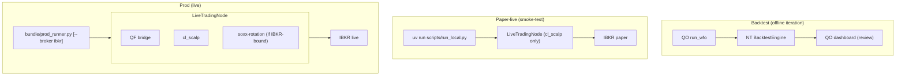

# Strategy Deployment Topology — Component TDD

Parent: [TRADING-SYSTEM-TDD.md](../TRADING-SYSTEM-TDD.md). Companions: [broker-integration.md](broker-integration.md), [observability.md](observability.md), [risk-gate-architecture.md](risk-gate-architecture.md), [nats-subjects.md](nats-subjects.md).

> **Status.** Design intent — not yet implemented end-to-end. Today only the paper-live mode (per-strategy NT processes via `uv run` in `magpie-strategies`) exists. The prod bundle launcher + CI gate + hot-swap support are follow-ups.

---

## 1. Purpose & scope

This doc covers **live strategy deployment**: how the same NT `Strategy` subclass runs in two different live-trading configurations (paper-credentialed for smoke-test, live-credentialed in a shared bundle for prod). The complementary axis — **offline backtest iteration** — is owned entirely by the sibling `quant-optimizer` repo (parameter sweeps, walk-forward folds, the Optuna+WFO dashboard for human review) and runs standalone against the shared MinIO data lake. Strategy authors iterate via QO; once a strategy is parameterized and reviewed, it graduates to paper-live for ground-truth tick-by-tick validation, then prod.

NT supports both live-deployment shapes — multiple strategies inside one TradingNode, or one TradingNode per strategy. This doc declares which shape QF uses where, and the contracts a strategy must satisfy to move between them.

## 2. The two live-deployment modes

| Mode                        | When it runs                                                                                                                                                                                | Process layout                                                                                                                                                                                                                                                                                                                    | Broker connection                                                                                       |
| --------------------------- | ------------------------------------------------------------------------------------------------------------------------------------------------------------------------------------------- | --------------------------------------------------------------------------------------------------------------------------------------------------------------------------------------------------------------------------------------------------------------------------------------------------------------------------------- | ------------------------------------------------------------------------------------------------------- |
| **Paper-live / smoke-test** | Pre-deploy ground-truth validation against real broker semantics with paper money. Also CI integration tests that need a live broker. **Not** the home for parameter iteration — that's QO. | One Python process per strategy via `uv run scripts/run_local.py` from the strategy's own uv project                                                                                                                                                                                                                              | Paper / sandbox credentials; one IB-Gateway client_id or Schwab paper key per process                   |
| **Prod**                    | Operator-managed live trading                                                                                                                                                               | One NT TradingNode per broker. The TradingNode co-hosts the **QF bridge** (which serves OrderPlane's QF-side intent paths: manual entry, manual liquidation, framework-fired exit rules — see [order-execution.md §5](order-execution.md#5-position-exit-controls)) and every enabled NT strategy that trades through that broker | Live credentials; one IB-Gateway client_id or Schwab key per TradingNode — shared across all co-tenants |

The choice between modes is a launcher-level decision; **strategy code is identical across modes** (see §3). The strategy is also identical in backtest (runs under NT's `BacktestEngine` instead of `LiveTradingNode`), and that's where the bulk of iteration happens.

The three axes are orthogonal: backtest is for parameter and risk-adjusted-return iteration; paper-live is for ground-truth behavioral validation; prod is the operational target. Promotion is sequential — a strategy moves backtest → paper-live → prod — but the same code runs in each.

## 3. Strategy contract (mode-agnostic)

Every NT strategy in `magpie-strategies/` must expose:

- A `Strategy` subclass in `<strategy>/<strategy>/strategies/*.py`.
- A factory `def build(config: <Strategy>Config) -> Strategy` so the launcher can instantiate it without strategy-internal knowledge.
- A config schema (pydantic / dataclass) declaring the strategy's required params, the broker it expects, and the instruments it will subscribe to.
- A `pyproject.toml` declaring dependencies and the broker tag (`tool.magpie.broker = "ibkr"` or `"schwab"`) so the bundle launcher knows which TradingNode to load it into.

The strategy never instantiates a `TradingNode` itself. The launcher owns lifecycle.

## 4. Launchers

### 4.1 Paper-live launcher (per strategy)

Lives inside each strategy's repo as `scripts/run_local.py`. Builds a `TradingNodeConfig` with exactly one strategy, paper / sandbox creds from env, and the operator's local config. Restart cost ≈ seconds. This is what `cl_scalp` already does. Used for pre-deploy smoke testing and per-strategy CI integration tests — **not** for parameter iteration, which lives in QO.

### 4.2 Prod bundle launcher (per broker)

Lives at `research/magpie-prod-bundle/` (or similar — not yet created). One launcher per broker. Responsibilities, in startup order:

1. **Resolve the cohort.** Read the enabled-strategies list from QF's lifecycle registry (`server/strategy/lifecycle.ts`) over the HTTP API, and keep only the strategies whose `tool.magpie.broker` pyproject tag (§3) matches this launcher's broker. The HTTP read — not the NATS stream (§4.3) — is the authoritative cohort at boot; NATS is the incremental delta thereafter.
2. **Resolve code.** Import each in-cohort strategy's `build` factory + config schema from the version pinned in the bundle's `uv.lock` (§5.1). The launcher imports only what the lockfile ships; a registry entry for a strategy whose package isn't in the lock is a hard startup error, not a silent skip.
3. **Assemble the node.** Build a single `TradingNodeConfig` with the QF bridge + all in-cohort strategies as co-tenants, honoring each strategy's declared warm-up window (§6, category 4) before allowing trade actions.
4. **Connect.** Start the `LiveTradingNode` against live credentials (one broker client_id / key per node, shared across co-tenants).
5. **Subscribe to lifecycle deltas.** Bind the `lifecycle.>` NATS subject (§4.3) so post-boot transitions hot-swap a single strategy without a process restart.

The bundle's own `pyproject.toml` aggregates strategy dependencies via path-deps to each per-strategy package — the bundle is the single source of truth for the prod transitive-dependency tree.

A launcher is **idempotent against the registry**: at any time its live cohort should equal the registry's enabled-and-broker-matched set. The boot HTTP read (step 1) and the lifecycle deltas (step 5) are two paths to the same invariant; on disagreement (e.g. a missed NATS event), the registry wins and the next restart reconciles. This is the same fail-safe the §6 state contract leans on.

### 4.3 Lifecycle event subscription

The hot-swap path (§8) needs the launcher to learn about registry transitions without polling. The registry publishes each transition over the `lifecycle.<strategy_id>.<action>` subject ([nats-subjects.md §2.5](nats-subjects.md#25-strategy-lifecycle-qf-registry--prod-bundle-launchers)); the publish point is the `onChange` hook the `StrategyStore` already fires on every accepted transition (`server/strategy/lifecycle.ts`), today wired only to the GUI WebSocket diff in `server/index.ts`.

| Registry transition (action → to_state) | Launcher reaction                                                                                          |
| --------------------------------------- | --------------------------------------------------------------------------------------------------------- |
| `start` → `running`                     | `node.add_strategy(build(config))` if the strategy is broker-matched and its package is in the lock; else ignore. |
| `pause` → `paused` / `resume` → `running` | No node-level action. Pause/resume is a gate-evaluator concern (submissions blocked by `strategy_halted`-style reasons), not a co-tenant add/remove. The strategy stays loaded. |
| `halt` → `halted`                       | `node.stop_strategy(strategy_id)` — drain working orders, leave positions. Honored by whichever launcher hosts the strategy; a no-op everywhere else. |
| `disable` / `retire` / `reenable` / `reregister` | No node-level action while not `running`. These never touch a live co-tenant; they only move a strategy through registry states it can be `start`ed from later. |

Only `start` (→ `running`) and `halt` (→ `halted`) change what runs in a `TradingNode`, which is why [nats-subjects.md §2.5](nats-subjects.md#25-strategy-lifecycle-qf-registry--prod-bundle-launchers) restricts the subject's `<action>` token to those two even though the registry has nine `LifecycleAction`s — the registry simply doesn't publish the other seven. The launcher's _reaction_ to a `halt` event is NT's `node.stop_strategy(strategy_id)`; the subject still carries the registry verb (`halt`), not NT's method name, so the subject space and the `LifecycleAction` enum stay one-to-one. The event payload also carries the full `to` state (the `TransitionEvent.to` field) so a launcher can assert the transition is one it expected before acting.

## 5. Dependency policy

### 5.1 Decision: the bundle pins strategy versions in its lockfile

**The prod bundle pins each strategy package to a specific version in `uv.lock`. It does _not_ pull HEAD of each strategy's `main` at bundle-build time.** This was the open question carried from the Phase C walkthrough; it is settled here.

The two candidates were:

| Option                                   | Per-strategy rollback granularity                                  | Version drift                                                             |
| ---------------------------------------- | ------------------------------------------------------------------ | ------------------------------------------------------------------------ |
| **A — pinned lockfile (chosen)**         | Yes — roll back one strategy by re-pinning it; others stay put     | None — the lock is the exact, reproducible prod tree                      |
| B — always pull each strategy's `main` HEAD at build | No — can't roll one strategy back without rolling back its `main` | Yes — a build is only reproducible if every strategy repo is also frozen  |

Why A wins:

- **Per-strategy rollback is the operational primitive.** §8 + [RUNBOOK §12.6 "Per-strategy version pinning"](../RUNBOOK.md#126-strategy-rollback-and-hot-swap) describe rolling back exactly one co-tenant (`uv add --upgrade-package cl-scalp==0.3.2 && uv lock`). That only has meaning if the bundle addresses strategies by version. Under B, "roll back `cl-scalp`" would mean "revert `cl-scalp`'s `main`", which is a different, slower, more disruptive action and couples rollback to source-control history.
- **Reproducibility is non-negotiable for live trading.** §5's first rule ("one reproducible runtime in prod") is incompatible with build-time HEAD-pulls: two builds minutes apart could ship different code with no diff in the bundle repo. A committed lock makes the bundle repo's git history the complete, auditable record of what has ever run live.
- **It matches how the bundle already aggregates deps.** The bundle's `pyproject.toml` path-deps + committed `uv.lock` (§5 rules) already pin the _transitive_ tree; pinning the strategy packages themselves is the same mechanism applied one level up, not a new one.

The cost A accepts: promoting a new strategy version to prod is an explicit bundle PR (`uv add --upgrade-package <strategy>==<ver> && uv lock`), not an automatic consequence of merging to the strategy's `main`. That explicitness is a feature — the bundle PR + CI run is the promotion audit trail, and it's the same gate the §5 CI rule (`uv sync` on every strategy PR) already implies.

Hot-swap interaction: hot-swap (§8) can only swap to a version whose code is _already importable in the running bundle_ — i.e. already in the deployed lock. A version bump that the running process has never imported needs a full-bundle deploy. The lockfile pin is therefore also the boundary between "hot-swappable" and "needs redeploy", which keeps that distinction objective rather than a judgment call.

### 5.2 Bundle vs per-strategy lockfiles

The prod bundle's lockfile is the source of truth for what ships to live trading. Per-strategy `pyproject.toml` files exist for dev/test isolation and must stay loose enough to bundle cleanly.

| Rule                                                                                                                                                   | Reason                                                   |
| ------------------------------------------------------------------------------------------------------------------------------------------------------ | -------------------------------------------------------- |
| The prod bundle's `uv.lock` is committed and pins all transitive deps                                                                                  | One reproducible runtime in prod                         |
| CI gate: every PR to a strategy package must pass `cd research/magpie-prod-bundle && uv sync`                                                    | Surface dependency conflicts at PR time, not deploy time |
| Strategy packages should pin upper bounds only when they need to (e.g. `numpy<2`)                                                                      | Avoids gratuitous lockstep                               |
| If two strategies cannot share a bundle (truly incompatible deps), they go in separate **compat-group bundles** — one TradingNode per group per broker | Last-resort escape hatch; documented per case            |
| The compat-group split is documented in this doc as a table                                                                                            | Operators need to know which bundles exist               |

Companion: [docs/dependency-admission.md](../dependency-admission.md) covers the per-package admission flow; this rule extends the policy to the bundle level.

**Current compat groups:** one group — all strategies share the same bundle. No conflicts identified.

## 6. Strategy state contract

When the prod TradingNode restarts, every co-tenant strategy loses in-memory state simultaneously. Each strategy must declare which of its state is recoverable and how:

| State category                                                                                                       | Persistence rule                                                                                                                                                             |
| -------------------------------------------------------------------------------------------------------------------- | ---------------------------------------------------------------------------------------------------------------------------------------------------------------------------- |
| **Open positions and broker orders**                                                                                 | Never trusted from memory. Rebuilt from broker positions / open-orders queries on startup. The QF audit chain (`audit_orders` / `audit_fills`) is the secondary cross-check. |
| **Strategy-internal decision state** (e.g. cooldown timers, signal half-life clocks, trailing-stop reference levels) | Persisted by the strategy to `data/strategy_state/<strategy_id>.json` (or equivalent) on every state mutation. Restored on startup.                                          |
| **In-flight intent state** (working orders QF has accepted but not yet fully filled)                                 | Owned by OrderPlane; restored via the existing order-plane rehydration. See [portfolio-risk-engine.md §3](portfolio-risk-engine.md) reconciliation flow.                     |
| **Pure in-memory caches** (recent bars, indicator state)                                                             | Rebuilt from market-data history on startup. The strategy declares its warm-up window in its config; the launcher honors it before allowing trade actions.                   |

A strategy that does not implement the persistence/recovery contract for category 2 cannot be promoted to the prod bundle. The dev-mode launcher does not enforce this — restart cost is low and strategy authors rebuild state by re-running.

## 7. Observability

Pointer: [observability.md §"Per-strategy attribution in a shared TradingNode"](observability.md#per-strategy-attribution-in-a-shared-tradingnode). Summary: structured-log `strategy_id` tagging is free via NT's existing `StrategyId`; CPU/memory/handler-latency attribution requires a strategy-watchdog that the bundle launcher installs as middleware on the MessageBus.

In dev mode the OS provides per-process resource accounting for free; no watchdog needed.

## 8. Rollback and hot-swap

Pointer: [RUNBOOK §12.6 "Strategy rollback and hot-swap"](../RUNBOOK.md#126-strategy-rollback-and-hot-swap). Summary:

- **Hot-swap (preferred):** the bundle launcher calls NT's `stop_strategy(strategy_id)` to drain working orders, then `add_strategy(new_version)` to load the new code, without restarting the TradingNode. Other co-tenants are unaffected. Driven by the lifecycle events of §4.3 (the operator's registry transition is what the launcher reacts to). Requires the new version's import to already be available in the running bundle — i.e. already in the deployed `uv.lock` (§5.1); a version the process has never imported needs the full-restart path below.
- **Full bundle restart (fallback):** rebuild the bundle image with new versions, redeploy, accept that all co-tenants restart together. Each strategy's §6 state contract makes this safe but disruptive.

See [broker-integration.md §1](broker-integration.md#1-runtime-topology) for the bundle-process picture this details — the QF bridge co-locates with strategies inside each broker's TradingNode.
