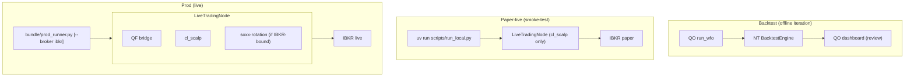

# Strategy Deployment Topology — Component TDD

Parent: [TRADING-SYSTEM-TDD.md](../TRADING-SYSTEM-TDD.md). Companions: [broker-integration.md](broker-integration.md), [observability.md](observability.md), [risk-gate-architecture.md](risk-gate-architecture.md).

> **Status.** Design intent — not yet implemented end-to-end. Today only the paper-live mode (per-strategy NT processes via `uv run` in `quantfoundry-strategies`) exists. The prod bundle launcher + CI gate + hot-swap support are follow-ups.

---

## 1. Purpose & scope

This doc covers **live strategy deployment**: how the same NT `Strategy` subclass runs in two different live-trading configurations (paper-credentialed for smoke-test, live-credentialed in a shared bundle for prod). The complementary axis — **offline backtest iteration** — is owned entirely by the sibling `quant-optimizer` repo (parameter sweeps, walk-forward folds, the Optuna+WFO dashboard for human review) and runs standalone against the shared MinIO data lake. Strategy authors iterate via QO; once a strategy is parameterized and reviewed, it graduates to paper-live for ground-truth tick-by-tick validation, then prod.

NT supports both live-deployment shapes — multiple strategies inside one TradingNode, or one TradingNode per strategy. This doc declares which shape QF uses where, and the contracts a strategy must satisfy to move between them.

## 2. The two live-deployment modes

| Mode                        | When it runs                                                                                                                                                                                | Process layout                                                                                                                                                                                                                                                                                                                    | Broker connection                                                                                       |
| --------------------------- | ------------------------------------------------------------------------------------------------------------------------------------------------------------------------------------------- | --------------------------------------------------------------------------------------------------------------------------------------------------------------------------------------------------------------------------------------------------------------------------------------------------------------------------------- | ------------------------------------------------------------------------------------------------------- |
| **Paper-live / smoke-test** | Pre-deploy ground-truth validation against real broker semantics with paper money. Also CI integration tests that need a live broker. **Not** the home for parameter iteration — that's QO. | One Python process per strategy via `uv run scripts/run_local.py` from the strategy's own uv project                                                                                                                                                                                                                              | Paper / sandbox credentials; one IB-Gateway client_id or Schwab paper key per process                   |
| **Prod**                    | Operator-managed live trading                                                                                                                                                               | One NT TradingNode per broker. The TradingNode co-hosts the **QF bridge** (which serves OrderPlane's QF-side intent paths: manual entry, manual liquidation, framework-fired exit rules — see [order-execution.md §5](order-execution.md#5-position-exit-controls)) and every enabled NT strategy that trades through that broker | Live credentials; one IB-Gateway client_id or Schwab key per TradingNode — shared across all co-tenants |

The choice between modes is a launcher-level decision; **strategy code is identical across modes** (see §3). The strategy is also identical in backtest (runs under NT's `BacktestEngine` instead of `LiveTradingNode`), and that's where the bulk of iteration happens.

The three axes are orthogonal: backtest is for parameter and risk-adjusted-return iteration; paper-live is for ground-truth behavioral validation; prod is the operational target. Promotion is sequential — a strategy moves backtest → paper-live → prod — but the same code runs in each.

## 3. Strategy contract (mode-agnostic)

Every NT strategy in `quantfoundry-strategies/` must expose:

- A `Strategy` subclass in `<strategy>/<strategy>/strategies/*.py`.
- A factory `def build(config: <Strategy>Config) -> Strategy` so the launcher can instantiate it without strategy-internal knowledge.
- A config schema (pydantic / dataclass) declaring the strategy's required params, the broker it expects, and the instruments it will subscribe to.
- A `pyproject.toml` declaring dependencies and the broker tag (`tool.quantfoundry.broker = "ibkr"` or `"schwab"`) so the bundle launcher knows which TradingNode to load it into.

The strategy never instantiates a `TradingNode` itself. The launcher owns lifecycle.

## 4. Launchers

### 4.1 Paper-live launcher (per strategy)

Lives inside each strategy's repo as `scripts/run_local.py`. Builds a `TradingNodeConfig` with exactly one strategy, paper / sandbox creds from env, and the operator's local config. Restart cost ≈ seconds. This is what `cl_scalp` already does. Used for pre-deploy smoke testing and per-strategy CI integration tests — **not** for parameter iteration, which lives in QO.

### 4.2 Prod bundle launcher (per broker)

Lives at `research/quantfoundry-prod-bundle/` (or similar — not yet created). One launcher per broker. Responsibilities:

1. Read the enabled-strategies list from QF's `server/strategy/lifecycle.ts` registry (HTTP API).
2. Import each enabled strategy's factory + config schema.
3. Build a single `TradingNodeConfig` with the QF bridge + all enabled strategies as co-tenants.
4. Start the TradingNode against live credentials.
5. Subscribe to QF's lifecycle change events over NATS so `add_strategy()` / `stop_strategy()` calls can be made without a process restart (see [RUNBOOK §12.6](../RUNBOOK.md)).

The bundle's own `pyproject.toml` aggregates strategy dependencies via path-deps to each per-strategy package — the bundle is the single source of truth for the prod transitive-dependency tree.

## 5. Dependency policy

The prod bundle's lockfile is the source of truth for what ships to live trading. Per-strategy `pyproject.toml` files exist for dev/test isolation and must stay loose enough to bundle cleanly.

| Rule                                                                                                                                                   | Reason                                                   |
| ------------------------------------------------------------------------------------------------------------------------------------------------------ | -------------------------------------------------------- |
| The prod bundle's `uv.lock` is committed and pins all transitive deps                                                                                  | One reproducible runtime in prod                         |
| CI gate: every PR to a strategy package must pass `cd research/quantfoundry-prod-bundle && uv sync`                                                    | Surface dependency conflicts at PR time, not deploy time |
| Strategy packages should pin upper bounds only when they need to (e.g. `numpy<2`)                                                                      | Avoids gratuitous lockstep                               |
| If two strategies cannot share a bundle (truly incompatible deps), they go in separate **compat-group bundles** — one TradingNode per group per broker | Last-resort escape hatch; documented per case            |
| The compat-group split is documented in this doc as a table                                                                                            | Operators need to know which bundles exist               |

Companion: [docs/dependency-admission.md](../dependency-admission.md) covers the per-package admission flow; this rule extends the policy to the bundle level.

**Current compat groups:** one group — all strategies share the same bundle. No conflicts identified.

## 6. Strategy state contract

When the prod TradingNode restarts, every co-tenant strategy loses in-memory state simultaneously. Each strategy must declare which of its state is recoverable and how:

| State category                                                                                                       | Persistence rule                                                                                                                                                             |
| -------------------------------------------------------------------------------------------------------------------- | ---------------------------------------------------------------------------------------------------------------------------------------------------------------------------- |
| **Open positions and broker orders**                                                                                 | Never trusted from memory. Rebuilt from broker positions / open-orders queries on startup. The QF audit chain (`audit_orders` / `audit_fills`) is the secondary cross-check. |
| **Strategy-internal decision state** (e.g. cooldown timers, signal half-life clocks, trailing-stop reference levels) | Persisted by the strategy to `data/strategy_state/<strategy_id>.json` (or equivalent) on every state mutation. Restored on startup.                                          |
| **In-flight intent state** (working orders QF has accepted but not yet fully filled)                                 | Owned by OrderPlane; restored via the existing order-plane rehydration. See [portfolio-risk-engine.md §3](portfolio-risk-engine.md) reconciliation flow.                     |
| **Pure in-memory caches** (recent bars, indicator state)                                                             | Rebuilt from market-data history on startup. The strategy declares its warm-up window in its config; the launcher honors it before allowing trade actions.                   |

A strategy that does not implement the persistence/recovery contract for category 2 cannot be promoted to the prod bundle. The dev-mode launcher does not enforce this — restart cost is low and strategy authors rebuild state by re-running.

## 7. Observability

Pointer: [observability.md §"Per-strategy attribution in a shared TradingNode"](observability.md#per-strategy-attribution-in-a-shared-tradingnode). Summary: structured-log `strategy_id` tagging is free via NT's existing `StrategyId`; CPU/memory/handler-latency attribution requires a strategy-watchdog that the bundle launcher installs as middleware on the MessageBus.

In dev mode the OS provides per-process resource accounting for free; no watchdog needed.

## 8. Rollback and hot-swap

Pointer: [RUNBOOK §12.6 "Strategy rollback and hot-swap"](../RUNBOOK.md#126-strategy-rollback-and-hot-swap). Summary:

- **Hot-swap (preferred):** the bundle launcher calls NT's `stop_strategy(strategy_id)` to drain working orders, then `add_strategy(new_version)` to load the new code, without restarting the TradingNode. Other co-tenants are unaffected. Requires the bundle to have the new version's import already available.
- **Full bundle restart (fallback):** rebuild the bundle image with new versions, redeploy, accept that all co-tenants restart together. Each strategy's §6 state contract makes this safe but disruptive.

See [broker-integration.md §1](broker-integration.md#1-runtime-topology) for the bundle-process picture this details — the QF bridge co-locates with strategies inside each broker's TradingNode.
