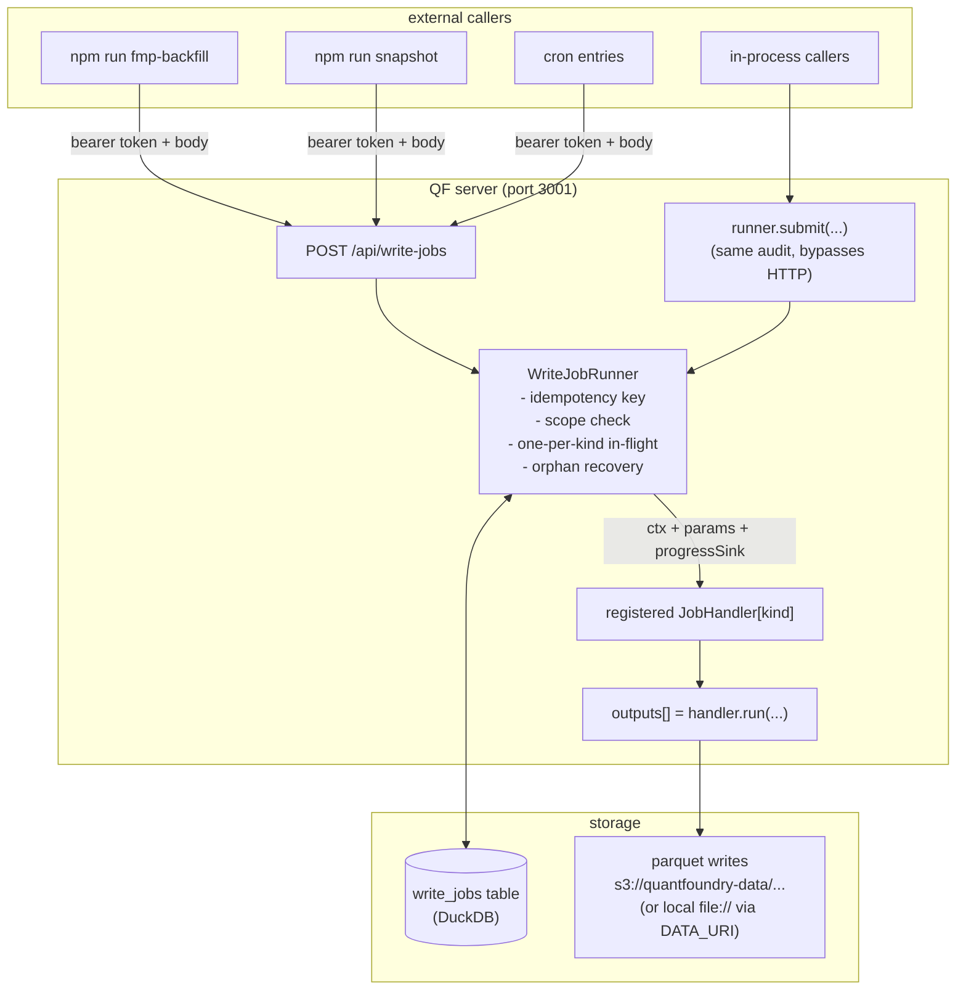

# Write-Jobs — Component TDD

Parent: [TRADING-SYSTEM-TDD.md](../TRADING-SYSTEM-TDD.md). Sibling: [observability.md](observability.md), [cross-cutting.md](cross-cutting.md).

## 1. Purpose

The write-jobs queue is the **single funnel for long-running data writes** in Magpie. Write authority lives on the QF server, and the queue is the only path through which external callers (and most server-side callers) commit writes. Seven handlers register at boot.

The queue exists for two reasons that overlap but are separable:

1. **Lifetime decoupling.** Long-running ingestion (FMP backfill, IBKR bulk pulls, S3 sync, Databento history, chain backfill) can't be tied to an HTTP request lifetime. The queue gives callers a `job_id` immediately, runs handlers asynchronously, and survives process restarts via DuckDB persistence.
2. **Authorization and audit.** Every write is authenticated by a per-actor bearer token with `kind`-level scopes; every job is recorded in the `write_jobs` table with `actor`, `kind`, `params`, `status`, timestamps, and output object-store URIs. The MinIO IAM topology makes this the only path that holds write creds, so the audit trail is also the actual access record.

## 2. Architecture



The runner is the single execution surface. HTTP callers go through `POST /api/write-jobs` → auth → `runner.submit(...)`. In-process server-side callers go directly through `runner.submit(...)` with the same audit semantics.

## 3. Schema

### 3.1 `WriteJob`

```ts
type WriteJobStatus = "queued" | "running" | "completed" | "failed" | "cancelled";

interface WriteJob {
  job_id: string; // ULID, primary key
  kind: string; // handler identifier (e.g. "fmp-backfill")
  source: string | null; // upstream source identifier when applicable
  // (e.g. "fred", "eia", "fmp"); derived from
  // params by the handler so the freshness view
  // can group by source without parsing params_json
  params: unknown; // handler-validated; JSON-serialized at rest
  idempotency_key: string; // sha256(kind || canonical_json(params))
  status: WriteJobStatus;
  actor: string; // from token; persisted on every job
  submitted_at: string;
  started_at: string | null;
  completed_at: string | null;
  error: string | null; // populated on `failed`
  progress: number; // handler-reported running count
  total: number | null; // total work units if known; null = open-ended
  output_paths: string[]; // object-store URIs the job wrote
  data_through: string | null; // newest data row date in the job's output
  // (YYYY-MM-DD); reported by the handler's
  // DataResult.dataThrough, persisted at completion.
  // Drives the freshness view in [data-plane.md §5].
}
```

### 3.2 `write_jobs` table DDL

Created by `server/writeJobs/store.ts → init()`:

```sql
CREATE TABLE IF NOT EXISTS write_jobs (
  job_id            VARCHAR PRIMARY KEY,
  kind              VARCHAR NOT NULL,
  source            VARCHAR,            -- upstream source slug; nullable for non-ingest kinds
  params_json       VARCHAR NOT NULL,
  idempotency_key   VARCHAR NOT NULL,
  status            VARCHAR NOT NULL,
  actor             VARCHAR NOT NULL,
  submitted_at      TIMESTAMP NOT NULL,
  started_at        TIMESTAMP,
  completed_at      TIMESTAMP,
  error             VARCHAR,
  progress          BIGINT NOT NULL DEFAULT 0,
  total             BIGINT,
  output_paths_json VARCHAR NOT NULL DEFAULT '[]',
  data_through      DATE                -- newest data row's date; populated at completion
)
```

The `source` and `data_through` columns together support the per-source freshness derived view exposed at `GET /api/catalog/freshness` (see [data-plane.md §5](../data/data-plane.md#5-quality-and-freshness-across-both-flows)). Handlers populate `source` at submit time from their params (e.g. the `ingest` handler reads `params.source`); `data_through` is written by the runner at completion from the handler's `DataResult.dataThrough` (per [data-plane.md §3.1](../data/data-plane.md)).

`idempotency_key` is not `UNIQUE` at the DDL level — DuckDB's UNIQUE is weak under concurrent writers and the runner serializes submits anyway. Dedup is enforced by the runner via SELECT-then-INSERT inside the runner's submit critical section.

### 3.3 `HandlerContext` and `ProgressSink`

```ts
interface HandlerContext {
  actor: string; // from the token; available to handlers for downstream auth (e.g. MinIO STS scoping)
  jobId: string; // for log correlation
  logger: Logger; // scoped child logger ({writeJob: {kind, jobId, actor}})
}

interface ProgressSink {
  (done: number, total: number | null, note?: string): void;
}
```

### 3.4 `JobHandler<P>`

```ts
interface JobHandler<P = unknown> {
  kind: string;
  validate?: (params: unknown) => string[]; // empty array = ok
  run: (
    params: P,
    progress: ProgressSink,
    ctx: HandlerContext,
  ) => Promise<{ output_paths: string[] }>;
}
```

Validation is optional but recommended — returning a non-empty error array rejects the submit with 400 before the job ever queues, so bad inputs don't pollute the table.

## 4. Submit flow

1. `runner.submit({kind, params}, {actor})` is called (from HTTP handler or in-process caller).
2. Handler registry lookup — unknown `kind` → throw `ValidationError("unknown kind")` → HTTP 400.
3. Handler's `validate(params)` runs — non-empty error array → throw `ValidationError(errors.join("; "))` → HTTP 400.
4. Idempotency key computed: `sha256(kind || canonicalJson(params))`. `canonicalJson` sorts object keys at every level so logically equal params hash equal regardless of key order.
5. Existing job lookup by `idempotency_key`:
   - If a `queued` or `running` job with the same key exists, return `{job_id, status, deduped: true}` — caller shares the prior submission.
   - Completed / failed / cancelled jobs do **not** dedup — re-running a backfill from scratch is intentional after a failure.
6. New job ULID minted, row INSERTed with `status: "queued"`, `actor` from the token entry.
7. If no in-flight job exists for that `kind`, the runner immediately transitions to `running` and starts the handler in a microtask. Otherwise the job stays `queued` and is picked up when the predecessor completes.
8. Result returned to caller: `{job_id, status, deduped}`.

## 5. Concurrency model

- **One in-flight job per `kind`.** Different kinds run in parallel (a long FMP backfill doesn't block a chain-store call). Same kind serializes — a second `fmp-backfill` submitted while the first runs queues behind it.
- **No cancellation of running jobs in v1.** A `cancelled` status exists in the enum but is reserved for queued jobs that get pre-empted. Running jobs run to completion; the only way to stop one is `kill` the server (and orphan recovery picks them up as `failed` next boot).
- **Handler isolation.** Each handler runs in its own microtask; an exception inside the handler is caught by the runner, the job transitions to `failed` with `error` populated, and the queue moves on.

## 6. Orphan recovery

On runner init, any rows in `running` status (from a prior process that exited mid-job) are transitioned to `failed` with `error = "orphaned at startup"`. Handlers are **not** crash-resilient in v1 — the dispatcher does not attempt to resume an in-flight job. Re-submission with the same params dedups against the new-but-failed row's `idempotency_key`? **No** — only `queued` and `running` jobs dedup, so re-submission produces a fresh job. This is the intentional shape for v1: orphaned jobs require explicit operator re-trigger.

## 7. Authentication

The write-jobs runner is a consumer of the system-wide bearer-token + scope catalog specified in [cross-cutting.md §1](cross-cutting.md). There is no separate write-jobs token store, no separate auth code path, and no separate issuance CLI — the same `npm run issue-token` mints a token with whatever scopes the holder needs.

### 7.1 Required scopes

| Surface                      | Required scope                                                                                                                      |
| ---------------------------- | ----------------------------------------------------------------------------------------------------------------------------------- |
| `POST /api/write-jobs`       | `submit:write-job` (or `*`)                                                                                                         |
| `GET /api/write-jobs`        | `read:catalog`                                                                                                                      |
| `GET /api/write-jobs/:id`    | `read:catalog`                                                                                                                      |
| In-process `runner.submit()` | No auth check. Caller passes `{actor: "..."}` explicitly; convention is `"server:<component>"` (e.g. `"server:freshness-monitor"`). |

Failure modes (`401` missing/invalid, `403` scope-missing) are per [cross-cutting.md §1.4](cross-cutting.md).

Typical holders:

- **Operator** — `submit:write-job` is part of the standard operator scope bundle, so the same GUI token that lets the operator submit orders also lets them trigger Run-now backfills from the freshness screen.
- **Scheduler container** (`quantfoundry-scheduler`) — `submit:write-job` is its only scope. Token issued via `npm run issue-token --actor scheduler-container --scopes submit:write-job`.
- **CLI scripts** (`npm run fmp-backfill` etc.) — same operator token from the operator's environment, or a dedicated `cli:<name>` token with `submit:write-job` for unattended runs.

Per-kind sub-scoping (e.g. `submit:write-job:fmp-backfill`) is a future option per [cross-cutting.md §1.2](cross-cutting.md); today the single scope is the only granularity.

### 7.1 Token-store reconciliation status

**Current state.** Code on `main` still has a parallel write-jobs token store at [`server/writeJobs/tokens.ts`](../../server/writeJobs/tokens.ts) that predates the unified bearer-token model in [cross-cutting.md §1](cross-cutting.md). That code uses per-job-kind scope strings (e.g. `["fmp-backfill", "sync-to-s3"]`) instead of the unified catalog's `submit:write-job`. Tokens are issued by `scripts/issue-write-token.ts`, separate from `npm run issue-token`.

**Why this isn't immediately broken.** The parallel store is in-process behind the same `POST /api/write-jobs` endpoint. Whichever middleware fires first either accepts or rejects; the rest of the audit chain (`write_jobs.actor`, idempotency) is identical regardless of which token shape gave admittance. Operators using `npm run issue-token --scopes "submit:write-job"` are taking the unified path; operators using `scripts/issue-write-token.ts` are taking the legacy path. Both work.

**Why this _is_ a doc-vs-code divergence.** This doc + [cross-cutting.md §1.2](cross-cutting.md#12-scope-catalog) describe a single unified scope catalog. The parallel store contradicts that. A reader who only reads the docs would not know to look at `scripts/issue-write-token.ts`.

**Resolution plan.** The Critical fix-batch from the 2026-05-27 /angel review (QF-299 follow-up) included a code-side reconciliation ticket:

1. Migrate `server/writeJobs/auth.ts` + `server/writeJobs/tokens.ts` to consume the unified `data/secrets/tokens.json` store.
2. Translate any extant write-jobs tokens to the unified shape (a per-token migration script).
3. Replace `scripts/issue-write-token.ts` with a thin wrapper that calls `issue-token` with `--scopes submit:write-job` plus any legacy job-kind that was on the source token.
4. Drop the parallel `WriteJobTokenEntry` shape.

Until the implementation ticket lands, this section is the single doc record that the parallel store exists. Don't extend it with new features; don't issue new tokens through `scripts/issue-write-token.ts` for new actors.

## 8. Registered handlers

All register at boot in `server/writeJobs/init.ts` → `runner.registerHandler(...)`. Duplicate `kind` throws on register, so handlers can't shadow each other.

Each handler declares (a) what it does, (b) the **`source` value** it threads onto `write_jobs.source` at submit time (drives the per-source freshness aggregate at `GET /api/catalog/freshness` per [data-plane.md §5](../data/data-plane.md#5-quality-and-freshness-across-both-flows)), and (c) any subprocess sanitization contract for handlers that spawn `aws` / `databento` / `bash` subprocesses.

| Kind                  | `source` thread                                   | What it does                                                                                                                                                                                                                                                                                                                                                                                                                          |
| --------------------- | ------------------------------------------------- | ------------------------------------------------------------------------------------------------------------------------------------------------------------------------------------------------------------------------------------------------------------------------------------------------------------------------------------------------------------------------------------------------------------------------------------- | ------- | --------- | ------ | ------- | --------- | ---------------------------------------------------------------------------------------------------------------------------------------------------------------------- |
| `fmp-backfill`        | `"fmp"` (constant per handler)                    | Pulls 7 FMP historical endpoints per ticker into `${DATA_URI}/fundamentals/fmp/historical_*.parquet`. Resumability via `mergeAndWriteParquet`'s upsert semantics.                                                                                                                                                                                                                                                                     |
| `collect-bulk`        | `"marketdata"` (constant per handler)             | Spawns `scripts/_collect-bulk-impl.ts` (~650 lines). Subprocess invocation uses **argv-array form** (Node `child_process.spawn(cmd, args, opts)`), not shell-string interpolation. Symbol-list params validated against the canonical-symbol regex (`server/symbols/convert.ts`) before spawn.                                                                                                                                        |
| `ingest`              | `params.source` (e.g. `"fred"`, `"eia"`, `"fmp"`) | In-process batch ingest over the adapter registry — same surface as `scripts/ingest.ts`. Optional `source` filter scopes to one adapter. Adapters bootstrap lazily on first call.                                                                                                                                                                                                                                                     |
| `sync-to-s3`          | `"sync"` (constant per handler)                   | Spawns `scripts/_sync-to-s3-impl.ts` which calls `aws s3 sync`. Subprocess invocation uses argv-array form. `params.only` is validated against a **strict enum allowlist** (`'chains'                                                                                                                                                                                                                                                 | 'macro' | 'futures' | 'etfs' | 'fills' | 'results' | 'databento'`) **before** the spawn — any other value rejects with `validate`error at submit time. Shell metacharacters in`only` therefore cannot reach the subprocess. |
| `chain-store`         | `"marketdata"` (constant per handler)             | Persists a chain snapshot via `Storage.storeChain`. **Not** for the hot chain-fetch path; for backfilling holes or replaying a stored payload from the operator surface.                                                                                                                                                                                                                                                              |
| `orchestrate-refresh` | `params.source` (one adapter call per submission) | One adapter call per submission — `(source, args, output)` tuple. Complements the per-`source` `ingest` kind for fine-grained cron entries.                                                                                                                                                                                                                                                                                           |
| `databento-pull`      | `"databento"` (constant per handler)              | Spawns `scripts/_databento-pull-impl.ts` (subprocess). Subprocess invocation uses argv-array form. Dataset / schema / symbol params validated against the regex set in `config/databento-futures.json` at submit time — params not matching the config's declared shape reject at `validate`.                                                                                                                                         |
| `backup-audit-chain`  | `"audit-backup"` (constant per handler)           | Produces a consistent DuckDB checkpoint of `data/portfolio.duckdb` (the audit chain + portfolio*snapshots system of record) and uploads to MinIO/S3 at `${BACKUPS_URI}/audit/portfolio*<YYYYMMDD>\_<HHMMSS>.duckdb`. Cadence: nightly via scheduler container. Retention: rolling 30 daily + 12 monthly. Restore: [cross-cutting.md §7](cross-cutting.md#audit-chain-backup-and-restore). Mirrors the `backup-observability` pattern. |

### 8.1 Subprocess sanitization contract

Handlers that spawn subprocesses (`collect-bulk`, `sync-to-s3`, `databento-pull`) are bound by these rules:

1. **Argv-array form, never shell-string.** Invoke via `child_process.spawn(cmd, argv[], opts)` or `execFile(cmd, argv[], opts)` — never `exec(stringWithInterpolation)` or `spawn(cmd, { shell: true })`. This eliminates shell-metacharacter injection from `params` at the language level.
2. **Validate params at `handler.validate(params)` before spawn.** Each handler's `validate` must call into a shared set of param-sanitizers (`server/writeJobs/sanitize.ts`): allowlist enums for fixed-value fields, regex for canonical symbols, ISO-8601 date format for date fields, max-length on free-text. Validation failures return `400` with the error list — the job never queues, the subprocess never spawns.
3. **No env-var inheritance into the subprocess beyond the documented allowlist.** Each subprocess wrapper script declares its expected env vars; the runner passes only those. Eliminates `LD_PRELOAD`-style cross-process injection.
4. **Subprocess output bounded.** Stdout / stderr captured to a tmp file, capped at 10 MiB. Beyond cap, the runner kills the subprocess with `failed: "output_exceeded_cap"`.

These rules are enforced by the runner (not the handlers) — a handler can't opt out by spawning a subprocess outside the `spawnHandlerSubprocess` wrapper without it being obvious in code review.

## 9. HTTP API

| Method | Path                      | Auth                  | Effect                                                               |
| ------ | ------------------------- | --------------------- | -------------------------------------------------------------------- |
| `POST` | `/api/write-jobs`         | bearer + `kind` scope | Submit. Body: `{kind, params}`. Returns `{job_id, status, deduped}`. |
| `GET`  | `/api/write-jobs/:job_id` | bearer                | Poll status. Returns full `WriteJob`.                                |
| `GET`  | `/api/write-jobs`         | bearer                | List recent. Query: `limit`, `kind`, `status`, `actor`.              |

Submission body validation runs at the handler boundary; the API only parses JSON + extracts `kind`. Handler-level `validate(params)` runs inside the runner, so its errors return 400 with the handler's error list.

## 10. In-process invocation

Server-side callers can submit jobs without going through HTTP. The path is the same — `runner.submit({kind, params}, {actor: "server:<component>"})` — and the audit row is identical to an HTTP-submitted job. The `actor` convention `"server:<component>"` distinguishes in-process callers from external operators in queries and logs.

This is used today for operator-triggered surfaces in the GUI that fan out into the same handlers (e.g. Settings → Activity → Backfills posting via the runner instead of forking the script).

## 11. Cron and scheduler integration

The live ingest scheduler (`scripts/scheduler.ts`, the `quantfoundry-scheduler` container; schedule + ops in [`data/CRON.md`](../../data/CRON.md)) submits jobs through the runner using a server-host token. Adapters used by the ingest jobs live in `server/orchestrator/adapters/`.

## 12. Metrics emitted

Per [observability.md §6 — Metrics]:

- `write_jobs_submitted_total{kind, actor, deduped}` — counter
- `write_jobs_completed_total{kind, actor}` — counter
- `write_jobs_failed_total{kind, actor, reason}` — counter (`reason` = `validation` | `handler_error` | `orphaned`)
- `write_job_duration_seconds{kind}` — histogram
- `write_jobs_inflight{kind}` — gauge (always 0 or 1 today)
- `write_jobs_queue_depth{kind}` — gauge

The Settings → Jobs screen polls `/api/write-jobs` directly for the operator-facing view; Prometheus is for system-health alerting (queue depth growing, repeated failures of a kind, etc.).

## 13. Deferred / out of scope (v1)

- **Cancellation of running jobs** — `cancelled` status exists in the enum but is reserved for queued-then-pre-empted jobs. Cancelling a running handler mid-flight is intentionally out of scope (handlers aren't structured for safe interruption today).
- **Crash-resilient handler resume** — orphans become `failed` on next boot; re-submission produces a fresh job. Resumability that survives crashes mid-job requires per-handler state-machine support and is out of scope.
- **Priority / preemption between kinds** — all kinds run with equal priority. A higher-priority `chain-store` doesn't pre-empt a slow `fmp-backfill`.
- **Multi-host workers** — the runner is single-process. Phase 2 k8s would scale this; today the runner is in-process inside `server/index.js`.
- **Soft-delete / TTL on completed rows** — the table grows unbounded. Retention/cleanup is operator-managed for now.

## 14. Cross-references

- [cross-cutting.md §3](cross-cutting.md) — audit-chain layout. Write-jobs is an audit trail of writes; the trading audit chain (`audit_intents → audit_orders → audit_fills`) is separate.
- [`data/CRON.md`](../../data/CRON.md) — live cron schedule (ingest jobs that submit `orchestrate-refresh` etc. to the runner).
- [data/sources.md](../data/sources.md) — per-source rate limits enforced by the handlers (e.g. `FMP_RATE_LIMIT_PER_SEC`).
- [observability.md §6](observability.md) — metrics catalog.

## 15. References

- `server/writeJobs/init.ts` — handler registration site.
- `server/writeJobs/runner.ts` — the dispatcher.
- `server/writeJobs/store.ts` — DuckDB CRUD wrapper.
- `server/writeJobs/auth.ts` + `tokens.ts` — bearer + scope auth.
- `server/writeJobs/handlers/*.ts` — the seven shipped handlers.
- `scripts/issue-write-token.ts` — token issuance CLI.
